```{r gset, echo = FALSE, include = FALSE}
library(knitr)
library(ggplot2)
library(grDevices)
library(flextable)

knitr::opts_chunk$set(tidy.opts = list(width.cutoff = 80),tidy = TRUE, warning = FALSE, message = FALSE, cache = TRUE, echo = FALSE, fig.align = 'center', fig.topcaption = TRUE, options(scipen = 999, OutDec = "."))

#windowsFonts(times = windowsFont("Times New Roman"))

knitr::knit_hooks$set(inline = function(x)
  {if (!is.numeric(x)) {x}else{prettyNum(round(x, 2), big.mark = ".", decimal.mark = ",")}
  })


set_flextable_defaults(
  digits = 2, decimal.mark = ",", big.mark = ".", font.size = 9)

# automatically create a bib database for R packages
knitr::write_bib(c(
  .packages(), 'bookdown', 'knitr', 'rmarkdown'
), 'bib/packages.bib')


```

# Prefacio {.unnumbered}

La literatura sobre las clases sociales en Argentina posee ya una larga tradición y una amplia gama de abordajes. La relevancia de este tema reside en las transformaciones recientes de la estructura social, pero también, en los desafíos, tanto teóricos como metodológicos, que el tema posee. Estudiantxs, investigadorxs y profesionalxs, en fin, aquellxs interesadxs en su estudio, se encuentran de forma frecuente con la paralizante tarea de afrontar la infinita literatura y discusión teórica sobre la cuestión, la construcción de información, o bien con el oscuro privilegio de acceso a ciertas bases de datos, en el caso de los estudios con datos cuantitativos secundarios; en definitiva, en la posibilidad de caer en las trampas de la ciencia cerrada o no-reproducible, todavía bastante frecuente.

A modo de aporte para cubrir parte de estos problemas, este manual, abierto a la comunidad para su consulta, ofrece a través de "recetas" prácticas situar a les lectores en la "cocina" de la investigación social para el estudio de las clases sociales, en particular, en el abordaje de la problemática de la construcción y análisis estadístico de datos para su estudio en la Argentina contemporánea, con un enfoque global y de largo plazo, en base a datos cuantitativos secundarios.

Compartiendo información compilada y herramientas usualmente dispersas tanto en la literatura, como en bibliotecas o bases de datos de acceso exclusivo, este libro condensa algunas lecciones aprendidas y experiencias de investigación, apoyados en el lenguaje de programación **`R`** y con la interfaz **`RStudio`**. Siguiendo el criterio general de ciencia abierta y reproducible, **`R`** permite ejemplificar el procedimiento de gestión de bases de datos y de procesamientos estadísticos, ya que se trata de una poderosa herramienta para la estadística, presentación gráfica, y programación, utilizada por miles de usuarixs. Pero a la vez, el uso de **`R`** puede ser desalentador. Por ello, en este libro ofrecemos soluciones de programación para problemas específicos.

Esta iniciativa se orientó, en ese sentido, al desarrollo de un conjunto básico de contenidos e instrumentos actualizados para la gestión de datos y análisis de las clases sociales. Este manual incluye su socialización en un formato también plano, y la presentación de herramientas computacionales que permiten apoyar la aplicación de los métodos presentados.

A partir del relevamiento, evaluación, ajuste y procesamiento de datos secundarios, les lectores serán expuestos a los desafíos empíricos y metodológicos de encarar la construcción de datos en un campo de estudio donde no predomina información para largos periodos históricos que involucran a la población de hecho en Argentina. Utilizando principalmente como fuentes de datos a los censos de población modernos (1970-2010) pero, sobre todo, a la Encuesta Permanente de Hogares (1974-2020) del Instituto Nacional de Estadística y Censos (INDEC), en los capítulos que siguen se retoman algunos debates actuales sobre la estratificación social y la literatura sobre el tema, y sus vertientes en América Latina y Argentina, pero el manual enfatiza en el trabajo empírico con datos secundarios, la construcción de información, su análisis estadístico y sus posibilidades explicativas para interpretar cambios sociales recientes en Argentina, tanto desde un punto de vista global y regional, como también local.

El [Capítulo 1](#analisis1) retoma algunos de los debates y conceptos en torno al estudio de la desigualdad y de la estructura social. Ya que una gran cantidad de publicaciones se dedican a este tema, se decidió dejarlo como introducción general conceptual, para pasar a los capítulos enfocados en los datos. El [Capítulo 2](#fuentes) presenta las características generales de la **Encuesta Permanente de Hogares** (EPH), en tanto herramienta central para el estudio de la estructura de clases en Argentina, mientras que el [Capítulo 3](#fuentes2) ofrece algo similar pero con los censos de población. El [Capítulo 4](#ocupacion) se focaliza en "las variables económicas" de las fuentes descritas en los capítulo previos, y ya en [Capítulo 5](#clases5) se presentan los diversos abordajes teórico-empíricos más utilizados en el estudio de la estratificación social, a nivel internacional y nacional, desde un abordaje operacional. El [Capítulo 6](#independiente) presenta a las clases sociales como uno de los factores estructuradores de la desigualdad social. El [Capítulo 7](#dependiente), en cambio, retoma una de las posibles aproximaciones al estudio de la estructura de clases en tanto variable dependiente. Dentro de este tipo de abordajes se interroga acerca de aquellos factores que explican, condicionan o intervienen en el proceso de formación y acción de las clases sociales. Finalmente, en el [Capítulo 8](#tiempo) se explora la dimensión temporal y la dimensión espacial como los procesos sociales más importantes para evaluar los cambios que se producen en la estructura de clases y en la desigualdad que desde la misma genera. En el [Anexo](#recetas), se incluye una breve introducción a **`R`** y su interfaz **`RStudio`**, centrada en las funciones puntuales que permiten realizar los ejercicios de los capítulos.

Al socializar este trabajo, el anhelo es construir una comunidad de usuarios y que la información derivada del material presentado pueda llegar a contribuir al desarrollo de futuras investigaciones en profundidad por parte de les interesados. Aprovechando las ventajas de la publicación en línea, este escrito mantiene un formato "vivo", que se irá modificando con el tiempo y, si se da la posibilidad de la interacción con sus lectores, sus aportes serán felizmente bienvenidos. Porque pretender un manual omnicomprensivo y acabado de la **estructura social argentina** es un objetivo bastante utópico dada la enormidad de la literatura sobre el tema.

Esperamos que les sea de utilidad.

Nicolás, José y Sofía

# Agradecimientos {.unnumbered}

La idea de este manual fue tomando forma durante la pandemia de COVID-19 a mediados del año 2020, a partir de una invitación por parte de la [Universidad Nacional de Tres de Febrero (UNTreF)](https://untref.edu.ar) para elaborar un curso de posgrado, en particular, de Jorge Fernández Bussy, Director de la Maestría en Generación y Análisis de Información Estadística, en el marco del Ciclo de Seminarios y Cursos extracurriculares en Estadística y el Programa de Actualización Permanente de las Orientaciones de Estadísticas Económicas, Estadísticas Sociodemográficas y Estadísticas de Opinión y Mercado, en coordinación con la Secretaría de Extensión Universitaria y la Dirección de Posgrado. El curso "Taller de Análisis de la Estructura Social en la Argentina Contemporánea" fue ofrecido por les autores de este libro de formato a distancia híbrdo (a-sincrónico y sincrónico) durante el segundo semestre del 2020. Queremos por ello agradecer a Jorge y al personal de la UNTreF por todo su apoyo, quienes permitieron llevar a cabo con éxito esta experiencia. También de forma especial a les estudiantes que participaron durante esos tiempos tan difíciles, que con su trabajo y aportes fueron nuestra primera audiencia. Muchas gracias tambín a Gabriela Benza, Ezequiel Adamovsky y Eduardo Chávez Molina, quienes participaron como entrevistados especialistas del tema en un módulo del curso.

<!--chapter:end:index.Rmd-->

# (PART) Introducción {.unnumbered}

# Las recetas {-}

La mayor parte de los ejercicios expuestos a lo largo de este Manual utilizan una o más funciones de **``R``** para resolver un problema específico. Se destaca que no se describen las funciones en detalle, ya que ellas pueden ser consultadas en otras publicaciones. En el [Anexo](#anexo), se presenta una introducción básica a la programación en `R` con `RStudio` y una selección de recursos disponibles para profundizar en su práctica.

Cada ejercicio da solución a un problema en particular que sin duda, dan una de otras posibles soluciones.

# (PART) Aspectos teóricos {.unnumbered}

# La estructura social en la Argentina actual {#estructura1}

```{r include=FALSE}
library(tidyverse)
library(kableExtra)
options(scipen=999)
```

<!-- No me copa mucho este capítulo, quizås lo podemos sacar directamente, es bastante aburrido para mí actual gusto -->

Este capítulo propone acercamiento introductorio al tema de las clases sociales, a través del abordaje de algunos conceptos básicos del estudio de la desigualdad social y de la estructura social, las tendencias actuales y cómo ésta subdisciplina ha evolucionado a través del tiempo.

Optamos por organizar un capítulo introductorio a modo de repaso de algunos conceptos básicos, resaltando que todo contenido empírico tiene un trasfondo teórico que es necesario conocer y para ello recomendamos profundizarlos a través de cursos, talleres o lecturas específicas. Si bien este manual no se recuesta sobre estos aspectos, consideramos imprescindible tenerlos en cuenta tanto al momento de construcción como en el análisis de los datos, ya que si no, se corre el riesgo de hacer "investigación social en un termo", como dicen por ahí.

El objetivo de este primer capítulo es exponer los principales debates teóricos de "estructura social" a manera de ir delineando definiciones teóricas y operacionales de clases sociales. Las preguntas guías remiten a considerar: ¿Cómo distinguir la clase? ¿Cómo encajan distintas definiciones en el debate actual de las clases sociales? La idea es también ver cómo en las formulaciones clásicas sobre la temática se puede volver a abrir el debate sobre "la muerte de las clases" y cuáles son las implicaciones de esta problemática para la investigación empírica de la sociedad argentina. Se muestra asimismo cómo el cuestionamiento de la estratificación social es un problema no tan nuevo pero inagotable y se esforzará por describir porqué la investigación social sobre clases está lejos de haber perdido su relevancia.

El capítulo se divide en cinco partes. En la primera se trazan a grandes rasgos los principales debates sobre las clases sociales y su eco en América Latina. Luego distinguimos algunos de los marcos teóricos posibles de aplicar para la construcción de preguntas acerca de la desigualdad social. En tercer lugar, buscamos explicar la importancia del estudio de la composición y estructura de la población según clases sociales y sus implicaciones para las políticas públicas, para luego pasar a identificar las tendencias históricas de su estudio en Argentina.

## Del análisis de las clases sociales a la teoría de la estratificación social {#analisis1}

¿Cuáles son las dimensiones de la estructura social? ¿Qué son las clases sociales? Los criterios empleados para la definición metodológica y operacional de las clases sociales y las interpretaciones actuales sobre estructura social en la Argentina reconocen como referencia aportes de diversos enfoques teóricos. Aquí se repasan aquellos que han sido revisados ampliamente en diferentes publicaciones, ya que la acumulación de literatura sobre el tema es extensa. Si bien se hace un recorrido histórico por la cuestión, estos debates pueden esquemáticamente reunirse en:

-   los postulados teóricos del materialismo histórico y el neomarxismo;
-   los planteamientos sociológicos de Weber y de los neoweberianos;
-   el enfoque estructural-funcionalista;
-   el enfoque empirista-estadístico o pragmático y
-   los enfoques de ingresos.

Esta reconstrucción, comprensiblemente, no es sencilla ya que la herencia teórica de ciento cincuenta años de sociología deja muchas propuestas y variaciones en torno a un tema común y una bibliografía extraordinaria. El resumen sin duda no excluye la existencia de otros diseños y sería en vano enunciar todos como así buscar la formulación definitiva sobre esta cuestión.

Existe una amplia literatura dedicada al análisis de la estructura social, de la cual destacamos dos puntos en común, que nos ayudan a establecer un punto de partida para su definición [@FeitoAlonso1995]. El primer punto alude al *carácter temporal* de la estructura social, ya que hace referencia a las relaciones estables de la sociedad, es decir, que describe las regularidades de sus elementos constituyentes. El segundo punto refiere a su *aspecto plural*, que designa los rasgos de grupos y sociedades, en otras palabras, que excede a los aspectos individuales.

De alguna manera existe una especie de conocimiento "natural" sobre la estratificación social que en general constituye una cuestión en la que reside una buena parte de la dificultad de su análisis. No es el objetivo de este manual hacer una historia de la lectura sociológica sobre las clases sociales, y menos sobre la estratificación social. Esa tarea es demasiado ambiciosa para un objetivo que está puesto en otro lado. Las preguntas-guía señaladas anteriormente remiten a delimitar los términos que habitualmente que se utilizan en el análisis de las clases sociales y la estratificación para entender su relación con el resto de los capítulos de este libro.

En este sentido, tres son las dimensiones relevantes de la estructura social [@Carabana1997]: la económica, la social y la cívica-política. En este libro, al referirnos a las clases sociales, apuntaremos al abordaje de la dimensión socio-económica de la estructura social. De esta forma, estructura social y estructura de clases, si bien muchas veces son utilizados como sinónimos, no son términos intercambiables entre sí. De forma resumida, partiendo del supuesto de que la sociedad es desigual, se entiende a la estructura social como el concepto que designa a las estructuras que conforman la sociedad. La estructura de clases es una forma específica de estratificación social. A continuación proponemos una guía resumen de los principales enfoques que han contribuido al análisis de las clases sociales.

## Marx, Weber y el funcionalismo {#marx}

Tres grandes tradiciones se inscriben en el debate sociológico actual sobre la definición, medición y operacionalización del concepto de "clase": son los desarrollos teóricos de los "clásicos" de la disciplina, Marx y Weber, y la teoría funcionalista de la estratificación social [@Crompton2008]. La concepción marxista sobre las clases sociales fue influenciada por importantes perspectivas teóricas: la filosofía alemana, la economía política inglesa y el socialismo utópico alemán [@Ossowski1972]. Crompton [-@Crompton2008, p. 11] ubicando al concepto de "clase" como herramienta de análisis social ligado al desarrollo del capitalismo y a la transición a la modernidad, señaló que Marx fue el primer teórico en considerar la naturaleza económica (o "materialista") de la desigualdad social.

En efecto, Marx fue quien vinculó el concepto de clase social con el de modo de producción y a las clases sociales con etapas históricas de los modos de la producción. Según esta corriente de pensamiento las clases sociales se constituyen a partir de la estructura económica del modo de producción capitalista, y el lugar que ocupan las personas en el proceso de producción y su relación con los medios de producción el determinante de su posición social.

Al situar a la lucha de clases como motor de la historia, Marx concedía al concepto de clase una distinción científica y, paralelamente, le asignaba un rol explicativo de la sociedad y la historia. El término de **clase** en su obra puede encontrarse tanto de forma analítica como descriptiva, es decir, como un concepto históricamente determinado. Wright [-@Wright1997] señaló que Marx enfrentó el problema abstracto de las clases y, al mismo tiempo, se dedicó al análisis concreto de las clases como actores, es decir, en distintos niveles de análisis. Las nociones de "clase en sí" y "clase para sí" —por un lado, entre la existencia de la clase como una realidad histórica y, por el otro, la clase como consciente de su identidad y de capacidad de actuar— motivaron un extenso debate sobre el cual, a lo largo del siglo XX, el materialismo histórico se desenvolvió en diversas corrientes: la "humanista", que enfatizó la significancia de la acción en las explicaciones sobre las instituciones y el comportamiento (Gramsci) y la "científica" o "estructuralista" (Althusser, Poulantzas) que resaltó la descripción de "estructuras" de clase [@Crompton2008, p. 31].

La premisa que considera a las clases como la variable explicativa del fenómeno de las desigualdades sociales tuvo en Marx el eje sobre el cual giró su discusión teórica, incluso hasta el presente. Su obra fue puesta en "diálogo" por Weber, quien criticó el principio de propiedad determinante de la clase social. Weber [-@Weber2002, pp. 682-694] propuso la existencia de una multiplicidad de factores que van más allá de la propiedad: estatus, relaciones de mercado, habilidades, prestigio, extendiendo de esta manera la dimensión "única" de clase. Considerando las ideas de Weber una extensión de las de Marx, a pesar de sus diferencias, el contraste entre estos dos autores puede, a veces, parecer exagerado. Weber no dejó de problematizar la visión materialista de la historia en Marx, ampliando esa visión "económica" y elaborando una propuesta multidimensional para el análisis del fenómeno de la estratificación social, distinguiendo a las clases, los estamentos y los partidos, donde la acción social predomina sobre una estructura objetiva, como el modo de producción [@Burris1995, p. 130].

Para Kerbo [-@Kerbo2003] —quien distinguió de las teorías de la estratificación social las "teorías del conflicto" y "teorías funcionales de la sociedad" (resumidas en el Diagrama 1)— en lugar "de los supuestos críticos del conflicto en Marx, en Weber encontramos un conjunto de supuestos paradigmáticos que hemos denominado no críticos del conflicto" (p. 95). Si bien "Weber creía que el conflicto estaba más extendido y se encontraba en el núcleo mismo de la organización social compleja, no albergaba, a diferencia de Marx, la esperanza de que este conflicto humano se pudiera eliminar por completo algún día" (p. 107).

```{r, message=FALSE, warning=FALSE, echo=FALSE}
text_kerbo <- data.frame(
	modelo1 = c("Modelo de sociedad"),
  modelo2 = c("Orden", "Conflicto"),
  criticos = c("Paradigma crítico del orden", "Paradigma crítico del conflicto - Teoría de la clase dominante (Marx)"),
  no_criticos = c("Paradigma no crítico - Teoría funcional (Durkheim)", "Paradigma no crítico - Teoría del conflicto (Weber)")
)
```

```{r, message=FALSE, warning=FALSE, echo=FALSE, eval = knitr::is_html_output()}
kable(text_kerbo, 
			col.names = c("", "", "Críticos", "No críticos"),
			caption = "Tipología de paradigmas de la estratificación social") %>%
	kable_styling("striped") %>% 
	add_header_above(c(" " = 1, " " = 1, "Supuestos valorativos" = 2)) %>% 
	collapse_rows(columns = 1, valign = "middle") %>% 
	footnote(general = "Kerbo (2003, p. 83)", general_title = "Fuente: ", footnote_as_chunk = T)
```

```{r, echo=FALSE, warning=FALSE, message=FALSE, eval = !knitr::is_html_output()}
library(flextable)

text_kerbo %>% 
  flextable() %>% 
  set_table_properties(width = 1, layout = "autofit") %>% 
  bold(part = "header") %>% 
  set_header_labels(modelo1 = "", modelo2 = "", criticos = "Críticos", 
                    no_criticos = "No críticos") %>% 
  merge_v(j = ~ modelo1) %>% 
  set_caption("Tipología de paradigmas de la estratificación social") %>% 
  add_footer_row(values = "Fuente: Kerbo (2003, p. 83)", colwidths = 4) %>% 
  fontsize(part = "all", size = 10)
```

Dentro del paradigma no crítico y pese al poco desarrollo teórico acerca de la problemática de las clases sociales, como antecedente del funcionalismo en sociología, las ideas de Durkheim se ubicaron en contraste con la teoría del conflicto de Marx o Weber. Sus propuestas fueron de enorme ayuda para los teóricos funcionalistas y su interpretación de las clases sociales, ya que \>"calificó la existencia de la clase y el conflicto de clase de no naturales[...] esta condición patológica del conflicto existía porque los grupos ocupacionales no cumplían adecuadamente la función de proporcionar orden moral y porque los intereses egoístas de individuos y grupos amenazaban a la sociedad. Pero a Durkheim nunca se le pasó por la mente que todo un sistema de división del trabajo en la sociedad industrial pudiera ser una estructura de poder al servicio de la dominación de una clase por otra (como mantienen los teóricos del conflicto)" [...] [@Kerbo2003, p. 106].

La obra estructural-funcionalista de Parsons, que predominó en la teoría sociológica después de la II Guerra Mundial, reflejó ciertos elementos del análisis de Durkheim sobre las consecuencias de la división del trabajo en la "sociedad industrial". En base a ella, las teorías funcionales -como por ejemplo las de Davis & Moore [@Levine2006]- de la estratificación propusieron que las desigualdades en las sociedades complejas se imponen como legítimas a través de un consenso de valores relacionados con la importancia social de funciones particulares [@Crompton2008, p. 13].

## La esperanza de vida de la teoría: debates contemporáneos {#esperanza}

Después del *big bang* teórico de clásicos, en la década del cuarenta y el cincuenta del siglo XX predominó lo que algunos autores llamaron el "consenso ortodoxo" del análisis estructural-funcionalismo de la estratificación social, de fuerte tradición estadounidense y en las antípodas de la "teorías del conflicto" [@Martinez2005, p.47]. Relacionados, en parte, con los conflictos sociales y políticos de la década del sesenta, surgieron diversos enfoques analíticos en la sociología norteamericana cuyo cuestionamiento alcanzó a la academia. En particular, estas propuestas ponían en duda la capacidad del funcionalismo para comprender esos fenómenos sociales y ello contribuyó a fundamentar los planteos críticos no solo a sus debilidades teóricas, sino también a sus implicaciones políticas e ideológicas. Ante las propuestas de Parsons, Merton y discípulos, distintos autores contribuyeron a minar ese "consenso ortodoxo".

Gouldner [-@Gouldner2000] caracterizó esa etapa como la de una situación de crisis de la sociología. Ante la propagación de enfoques alternativos y material empírico que socavaba las bases teóricas del funcionalismo, la fragmentación de perspectivas no dio lugar —en el mediano plazo— a un marco teórico amplio capaz de cubrir los vacíos dejados por "la gran teoría". Estos debates tuvieron influencia en el desarrollo teórico de la estratificación social.

Si bien luego de la segunda posguerra no abundó en el materialismo histórico una reflexión sustantiva que aportara nuevos aspectos al concepto de clase [@FeitoAlonso1995, p.55], a comienzos de los sesenta el panorama cambió. Hubo una respuesta "a la europea" al funcionalismo de parte de autores como Lockwood [-@Lockwood1962] y Dahrendorf [-@Dahrendorf1979], quienes se esforzaron por relacionar el legado de Marx y Weber [@FeitoAlonso1995, pp. 50-51] en los estudios de estratificación social, mientras que desde Francia comenzaban las relecturas del marxismo de Althusser [-@Althusser1968]. Para Parkin

> "...inesperadamente el marxismo contemporáneo se ha aproximado a la posición sociológica. Este deslizamiento sobrevino como parte de un intento más general de los marxistas occidentales en procura de reconsiderar el modelo clásico u ortodoxo de las clases bajo las nuevas condiciones del capitalismo monopolista..." [-@Parkin1968, pp. 696-697].

Fue también a mediados de los setenta del siglo XX cuando el revisionismo "neomarxista" de Poulantzas [-@Poulantzas2005] abrió un intenso debate en las ciencias sociales. Su esfuerzo teórico intentó definir los conceptos claves para el análisis de las clases sociales desde la perspectiva del materialismo histórico. Poulantzas sostuvo que dentro del proceso de producción, la dimensión económica distingue al trabajo productivo del improductivo, la dimensión política refiere al grado de control sobre el proceso de trabajo, mientras que la dimensión ideológica manifiesta el grado de conciencia y participación, o no, de la organización del proceso de trabajo [@Parkin1968].

### La grieta de los ochenta

Para principios de los '80, el debate sobre las clases sociales continuó dentro del materialismo histórico, si bien su perspectiva "estructuralista" no tuvo mayor influencia; el colapso del bloque socialista y la llegada del neoconservadurismo al poder en los países centrales minó de cierta manera el optimismo de izquierda de los sesenta y setenta y la discusión giró en torno a las posibilidad del socialismo en ese contexto —por ejemplo, Laclau [-@Laclau1987]—. Este diálogo, si bien no estaba directamente relacionado con la investigación en estratificación social en la sociología académica, impactó en los debates de ese momento.

Es que, paradójicamente, es en la década de 1980 cuando el enfoque del análisis de clase asistió a un momento de gran creación, tanto en cuestiones conceptuales como de análisis empírico. Producto del "retorno" a los clásicos, el desarrollo de las propuestas de Wright y Goldthorpe se produjo en paralelo con una sofisticación de las técnicas de investigación (sobre todo en lo que refiere al procesamiento de datos y al análisis estadístico). Los enfoques teóricos y las propuestas de aplicación de investigación de Wright y Goldthorpe fueron descritos por Crompton [-@Crompton2008, p. 50] como el enfoque "ocupacional-agregado " al que considera una orientación especializada del análisis de clase en el campo de la sociología. Para Crompton las distintas clasificaciones y estrategias para el estudio empírico de la estructura de clase u ocupacional pueden dividirse en tres:

i.  esquemas de "sentido común" con pocas pretensiones teóricas, que agrupan ocupaciones en un orden jerárquico con líneas de corte "objetivas";
ii. índices de prestigio ocupacional o *status*, que buscan medir el ranking social de distintas ocupaciones (frecuente, sobre todo, en las investigaciones sobre movilidad social);
iii. esquemas "relacionales" o "formas teóricas de esquemas de clases", que poseen explícitas referencias a las propuestas teóricas de Marx y Weber.

Los esquemas i) y ii), Crompton los denominó "índices descriptivos" que incluyen los "gradacionales" o "jerárquicos" donde las clases difieren por el grado cuantitativo de algún atributo o basados en una cualidad particular (ingresos, prestigio, status, etc.) . Los agrupados iii) persiguen, en líneas generales, la descripción de la desigualdad ocupacional, determinando teóricamente las "clases" y a nivel empírico, observando las relaciones de clase —refiriendo con ello el proceso por el cual esas desigualdades se producen— [-@Crompton2008, p. 49]. Se incluyen aquí los dos grandes proyectos que dominaron el debate en el campo del análisis de clase durante los ochenta y los noventa: el _Compartive Class Project_ "neo-marxista" de Wright y el _CASMIN_[^u-1] "neo-weberiano" de Goldthorpe.

[^u-1]: Comparative Analysis of Social Mobility in Industrializad Countries.

Así como es frecuente comentar que Weber "dialoga" con la obra de Marx, Burris [-@Burris1995] sugirió que la literatura marxista contemporánea "dialoga" con Weber. Por ejemplo, Wright insistió en formalizar un desarrollo teórico manteniendo a la vez un esfuerzo de aplicación, empírico, bajo el objetivo general de "construir, dentro de un marco teórico marxista en sentido amplio, un concepto de estructura de clases susceptible de ser usado en el análisis de procesos micro a un nivel relativamente bajo de abstracción" (1995:21). En base a ello elaboró dos estrategias metodológicas:

> "he explorado dos enfoques generales diferentes de este problema [estructura de clases], a los que podríamos denominar respectivamente enfoque de las posiciones contradictorias y enfoque de la exploración multidimensional. Ambas estrategias constituyen intentos de proporcionar una teorización positiva a la categoría "clase media" dentro de un marco esencialmente basado en los intereses." [@Wright1995a, p. 59].

La primera solución de Wright para ubicar a la clase media fue considerarla entre la clase obrera y la pequeña burguesía, simultáneamente, tomando este concepto de posición contradictoria. La segunda solución consideraba que

> "los diferentes 'modos de producción' se basan en mecanismos específicos de explotación que pueden diferenciarse según el tipo de recurso productivo, cuya desigual propiedad (o control) permite a la clase explotadora apropiarse parte del excedente socialmente producido. Basándome en la obra de Roemer, distinguía yo cuatro tipos de recursos, la desigual propiedad o control de los cuales constituía la base de las distintas formas de explotación: los bienes de fuerza de trabajo (explotación feudal), los bienes de capital (explotación capitalista), los bienes de organización (explotación estatista) y los bienes de cualificación o credenciales (explotación socialista). Aunque los modos puros de producción pueden identificarse con las formas simples de explotación, las sociedades reales siempre constan de diferentes formas de combinación de los diferentes mecanismos de explotación. Esto abre la posibilidad de que ciertas posiciones en la estructura de clases estén simultáneamente explotadas a través de un mecanismo de explotación pero sean explotadoras a través de otro mecanismo". Dichas posiciones...constituyen la 'clase media' de una sociedad dada" [@Wright1995a, pp. 65-66].

### Nuevos debates...¿Hacia una operacionalización más refinada de los conceptos?

Este modelo, durante buena parte de la década del noventa, estuvo un tiempo "encontrado" a las líneas de pensamiento "neoweberianas" de los cuales resalta el trabajo de Goldthorpe y que incluyen los de Giddens y Parkin. Con una influencia importante en los estudios sobre estratificación social en América Latina, Goldthorpe retomó la definición de clase desde la estructura ocupacional, diferenciando la "situación de trabajo" y la "situación de mercado", utilizando la ocupación a partir de una escala de prestigio ocupacional. El autor trató de encontrar la "identidad demográfica" de clase y el "grado de formación sociopolítica de la clase" [@Martinez2005, p. 74]. Trabajó en el análisis de la "clase de servicio" —profesionales, por un lado, administrativos y directivos por el otro— que, una vez despejados sus rasgos estructurales (económicos), intentó delinear su paso de las "clases económicas" a las clases sociales.

Crompton también ubicó dentro del enfoque "ocupacional-agregado" al _Clasificador Estadístico Socio-Económico Nacional_(NS-SEC) de la Oficina de Estadística del Reino Unido, derivado, en mayor parte, del esquema clasificatorio de Goldthorpe, que combina el *status* en el empleo con características del trabajo. Se trata de un sistema clasificatorio que utiliza el sistema estadístico inglés y que se incluye dentro del programa de desarrollo de un "sistema de clasificación socio-económico europeo" [@Rose2007]. Es que, en efecto, el más frecuente uso "dado por hecho" en el análisis contemporáneo de clases sociales en sociología es aquel que divide grupos ordinales de ocupaciones en "clases" [@Crompton2008, p. 49] y la división de la población en posiciones desiguales de recompensas es comúnmente descripta como "estructura de clase". Noción que, en la actualidad, se focaliza usualmente en la estructura del empleo.

La cuestión acerca de cómo se utiliza a la variable ocupación en términos de clasificación tiene distintas respuestas [@Desrosieres2000]. Ganzeboom [-@Ganzeboom1992], por ejemplo, distingue dos corrientes entre los científicos sociales: los que utilizan aproximaciones a la clasificación de categorías de clase socioeconómica y los que prefieren medidas continuas. El uso de la variable ocupación es columna vertebral de este tipo de orientación. Para los sociólogos —y también para las agencias comerciales y organismos del gobierno— la ocupación se incorporó como variable principal para el análisis de clase ya sea porque era el indicador más poderoso de recompensas materiales o por la disponibilidad de información con la que se contaba para realizar investigaciones con fundamento empírico.

Como señala Barozet [-@Barozet2007] los datos de ocupación fueron los predilectos para los estudios de estratificación social según este enfoque, abordado desde distintos puntos de vista teóricos y metodológicos. Esta autora, haciendo un recorrido por las escalas académicas internacionales que utilizaron esta variable —la _ISCO_(International Standard Classification of Occupations); la de Goldthorpe y Erikson; la ya mencionada de Eric Olin Wright; la escala de ocupación francesa y por aquellas que trabajaron en base al prestigio ocupacional, como las de la de Treiman (_Standard International Occupational Prestige Scale_) [@Treiman1977]-- mencionó que:

> "La variable ocupación es central para los estudios de estratificación social, pero cabe tener mucho cuidado de que el uso que se le da no aparte los estudios de una posible comparación. En efecto, siguiendo la advertencia de Ganzeboom y Treiman (1996), es importante tomar como piso la clasificación ISCO, con el fin de establecer ocupaciones que se puedan subsumir a categorizaciones internacionales. Sin embargo, el uso de la variable ocupación se enfrenta al mismo problema que otras variables: las ocupaciones, sus nombres y sus contenidos cambian, por lo cual se requiere de una adaptación en cada nueva aplicación de encuesta" [@Barozet2007, p. 45).

#### No tan distintos

Con varios puntos en común y, llamativamente, a pesar del disenso teórico, con resultados empíricos homologables al menor nivel de apertura de sus esquemas [@Crompton2008], las propuestas teóricas Goldthorpe y Wright relacionan, por un lado, la clase como principio estructural de desigualdad social y, por el otro, la clase como origen de identidad social y política, conciencia y acción, cuestión en la que reside una gran fuente de debates.

Desde la "etnografía de clase" se defendió la idea que la estructura y la acción, la economía y la cultura, tienen roles importantes —e intervienen— en el mantenimiento y la reproducción de clases sociales. Este punto de vista argumentó que no sólo las diferencias económicas sino también mecanismos no-económicos se vinculan con las desigualdades sociales y la cultura, es decir, que al observar la estructura social no se trata solamente de separar el efecto de la localización en clases sociales sino también hay que tener en cuenta los mecanismos por los cuales las mismas clases se constituyen. En este segundo tipo de interpretación se puede ubicar la teoría de la estructuración de Giddens y el trabajo de Bourdieu. Es que las críticas al análisis de clase dentro de la sociología transitaron por diversos andariveles: se suele problematizar una supuesta poca capacidad para explicar la acción de clase y su "sobredeterminación economicista". Al mismo tiempo, dentro de las posibles definiciones de clase que pueden ser identificadas en la literatura especializada, se observó un creciente interés general por su dimensión cultural [@Crompton2008, p. 16] con un "giro" de perspectiva sobre el abordaje más tradicional de estructura de clase en base a la ocupación.

Por un lado, Giddens [-@Giddens1998] propuso relacionar las trayectorias conceptuales provenientes de Europa y Estados Unidos. En su "teoría de la estructuración" debatió la "concepción utópica" y el "evolucionismo de la historia" en el marxismo, la poca importancia concedida al Estado en el ejercicio del poder y la desatención a formas no económicas de desigualdad social. En su crítica al "objetivismo determinista" del funcionalismo y del marxismo reclamó un enfoque que dejara las intenciones de los actores en el mismo nivel que el de las estructuras. Por otro lado Bourdieu, en cambio, enfatizó en los aspectos económicos y culturales de la diferenciación social, influido tanto por una visión marxista como por la weberiana. En *La distinción* [-@Bourdieu2012] no redujo el análisis de clase a su dimensión económica sino que, al mismo tiempo, analizó relaciones sociales simbólicas. Para este autor la clase social

> "no se define por una propiedad [...] ni por una suma de propiedades [...] ni mucho menos por una cadena de propiedades ordenadas a partir de una propiedad fundamental (la posición en las relaciones de producción) en una relación de causa a efecto, de condicionante a condicionado, sino por la estructura de las relaciones entre todas las propiedades pertinentes, que confiere su propio valor a cada una de ellas y a los efectos que ejerce sobre las prácticas..." [@Bourdieu2012, p. 121].

Distintas combinaciones de capital (económico, social, cultural o simbólico) constituyen el *habitus*, que \>"es a la vez, en efecto, el *principio generador* de prácticas objetivamente enclasables y el *sistema de enclasamiento (principium divisionis)* de esas prácticas." [@Bourdieu2012, p. 200].

En paralelo, desde el paradigma weberiano contemporáneo algunos autores se empeñaron en cuestionar la dimensión estructuralista del materialismo histórico, que deja de lado el rol de la acción social y la primacía de clase por sobre otras formas no clasistas de dominación. Según señaló Burris [-@Burris1995, p. 131], Giddens y Parkin ignoraron una parte del debate marxista contemporáneo cuando argumentaron que los fundamentos marxistas sostenidos en la lógica de los modos de producción son una forma de funcionalismo y que el marxismo reduce a los actores a espectadores pasivos de sus relaciones sociales. Es que en el materialismo histórico ha "corrido mucha agua bajo el puente" desde las explicaciones clásicas de Marx para comprender los mecanismos de las instituciones o de las prácticas que operan sobre la estructura social.

En buena parte de la literatura marxista contemporánea se asignó un papel significativo a la acción humana en las explicaciones y en el análisis de clase. Incluso, como bien señala Burris, pueden encontrarse marxistas como Thompson [-@Thompson1968] o Przeworski [-@Przeworski1977], que, aunque sitúen la primacía de las estructuras por sobre la acción, no implica que la dejen de lado [@Burris1995, p. 133]. De hecho, Thompson analizó las clases sociales en términos de acción humana casi exclusivamente, en su clásico estudio sobre la formación histórica de la clase obrera en Inglaterra. Su concepción de clase como proceso y relación —si bien nunca detalló una teoría sistemática de clase— se contrapone al de clase como ubicación estructural:

> "Por clase entiendo un fenómeno histórico que unifica a un número de sucesos dispares y aparentemente desconectados, tanto en la materia prima de la experiencia como en la consciencia. No veo a la clase como una "estructura", ni siquiera como una "categoría", sino como algo que de hecho acontece (y puede demostrarse que ha acontecido) en las relaciones humanas [...]. La clase se define por cómo viven los hombres su propia historia y, en última instancia, ésta es su única definición" [@Thompson1968, pp. 9-11].

Przeworski equiparó la importancia de la estructura objetiva y la acción como mutuamente dependientes cuando "analiza las clases como el resultado de las luchas históricas concretas condicionadas por estructuras sociales que, a su vez, retroactúan sobre esas estructuras y las transforman" [@Burris1995, p. 133].

### La muerte de la clases

Durante buena parte del siglo XX, los puntos de vista sobre las clases tuvieron una fuerte influencia en los debates de las ciencias sociales. Los postulados de Marx fueron cuestionados porque, supuestamente, la importancia relativa de la clase obrera disminuía con el tiempo en tanto que las clases medias —sobre todo, durante los "años felices" del Estado de Bienestar 'a la europea'v se incrementaban y convivían con la considerable expansión de las diferencias basadas en nuevas categorías de análisis tales como género, edad o etnia. Y si bien la acción asume un rol importante en las explicaciones marxistas de la actualidad, por el contrario, hay reticencias a la incorporación de formas de explicación estructural por parte de los weberianos [@Burris1995, p. 136].

El rápido cambio social, económico y político, a nivel mundial, durante los noventa (dominado por el Consenso de Washington) comenzó a minar una parte de las presunciones y preocupaciones del análisis empírico de las clases sociales, en gran medida como consecuencia de los cambios en la estructura ocupacional y la declinación de la clase obrera tradicional en los países industrializados, con el correlato decrecimiento de ocupaciones no-manuales -que convencionalmente se las ubicó en la clase media-.

El cambio tecnológico, los cambios en la división internacional del trabajo, el impacto de la crisis del petróleo, la disminución en importancia y en número de industrias tradicionalmente reclutadores de clase obrera, el aumento paralelo de la denominada "economía de servicios"; los mayores niveles del bienestar y la ampliación de las clases medias, la emergencia de nuevas categorías de análisis, como el género y la etnia se han tomado como algunos de los factores de la declinación de empleos industriales.

Este cambio técnico, el mayor dinamismo del sector terciario, la pérdida de liderazgo de la industria de "modelo fordista", la caída de salarios, el aumento del empleo femenino y nuevas configuraciones en el mundo del trabajo, fueron algunos de los puntos señalados para mostrar la captación de estas nuevas realidades utilizando las variables tradicionales del análisis de la estructura social. Muchos críticos de la noción de clase cuestionaron que el empleo, debido a su debilitada importancia a fines del siglo XX, pueda ser el punto partida para la identidad social, desde al menos, la segunda mitad del siglo XX.

Previo a los cuestionamientos sobre el cambio el cambio técnico, algunos autores se cuestionaban acerca de la "muerte" del concepto de clases sociales. Nisbet [-@Nisbet1959] y sus continuadores justificaron la eventual desaparición de la noción de clase. Lo fundamentaban en que el ámbito político se distinguía una difusión del poder en todos los segmentos de la población y una ruptura del comportamiento político de acuerdo al estrato social; en el ámbito económico, aumentaba en el sector terciario, cuyos puestos de trabajo no coincidían con la mayoría de cualquier sistema de clase, y por la distribución de la propiedad en todos los estratos sociales y los niveles de vida y consumo que llevaron a la desaparición de los estratos claramente identificables de consumo.

Otra corriente teórica que se oponía al uso del concepto de clase fue la denominada teoría de la "sociedad post-industrial" en la que destacan autores tales como Bell y Touraine. Planteaban la convergencia en todas las sociedades hacia un aumento de los requisitos de conocimiento en el lugar de trabajo, menor desigualdad social y desgaste de la burguesía como clase dominante. Bell [-@Bell2006] tomó en cuenta tres dimensiones analíticas de la sociedad: **la estructura social**, en la que incluye la economía, la tecnología y el sistema de trabajo; la **política**, que regula la distribución del poder y la **cultura**, lugar del simbolismo y los significados.

Muchas de las interpretaciones que cuestionan el concepto de clase sostienen que la clase obrera perdió su centralidad en la teoría y que el desarrollo económico se traduce en una decreciente importancia de la clase social como base de la acción política. Otorgan su lugar a los nuevos movimientos sociales, como la corrientes "postmaterialismo" [@Inglehart1990] que sostiene la idea de que a medida que aumenta el bienestar económico de una sociedad, los valores que conforman a sus individuos no son guiados por pautas materialistas.

Clark y Lipset [-@Clark1991] preguntaban a comienzos de la última década del siglo XX si las clases se estaban "muriendo". Esta vieja posición, favorable a la desaparición de las clases, consideraba que la transformación de la estructura ocupacional junto con el desarrollo del Estado Benefactor se tradujo en un mayor nivel de riqueza y bienestar en la población y en nuevas formas de comportamiento político (tales como la ecología o las libertades civiles). La declinación de la dinámica tradicional de izquierda-derecha de los partidos políticos y la emergencia de divisiones sociales no ancladas en las clases, tales como el aumento de las credenciales educativas, nuevas formas en el mercado de trabajo, o las desigualdades geográficas y locales, lograron un declive de la política de clase, que se manifestaba por un lado en una inexistencia de correlación entre voto y clase, la declinación de los partidos políticos tradicionales, la ampliación de las clases medias y el "reciclaje" de partidos tradicionales de izquierda.

Hout y otros [-@Hout1993], siguiendo el debate, argumentaron que el concepto de clase es fundamental en sociología ya que es indispensable para determinar intereses materiales. Las clases definidas "estructuralmente" pueden dar lugar a la emergencia de acción colectiva y la pertenencia a una clase incide sobre las oportunidades de vida y diversos aspectos relevantes de la vida social. La propiedad, las diferencias de renta y riqueza siguen estando de forma persistente asociadas a la clase social.

Al respecto, es interesante el razonamiento que propone Filgueira cuando considera que

> "Si uno de los problemas del paradigma clásico es su excesiva atadura a la dimensión empleo, la consideración de las diversas formas de capital abren el camino para la discusión de otros principios ordenadores de la diferenciación social. En particular, la cuestión actualmente en debate acerca de la relevancia de los estilos de vida y consumo como alternativa estructuradora de la diversidad del orden social en oposición o en paralelo con la determinación del empleo, o si se quiere, acerca de la pregunta sobre la vigencia actual del "paradigma productivista". Naturalmente, ello conduce a la pregunta acerca de qué ha cambiado para que la necesidad de revisar el paradigma clásico se haga evidente. No parece haber una respuesta definitiva acerca del punto aunque las razones que se aducen se remiten a la incapacidad de la teoría sociológica contemporánea de dar respuestas idóneas a las recientes transformaciones macroestructurales. En principio, tal hipótesis no parece del todo plausible o por lo menos está mal formulada. La carencia explicativa del paradigma clásico existió con independencia de los "cambios objetivos". Lo que sí ocurrió es que estos cambios hicieron más evidente sus limitaciones" [@Filgueira2001, p. 22]

No ha sido la primera vez que el término de "clase" y el análisis de clase se viera objetado como desfasado en el tiempo y que, sus estrategias de investigación y abordaje fueran consideradas irrelevantes para sociedad actual. Si bien durante la mayor parte de los siglos XIX y XX el tema de las clases sociales ha estado en el centro de los debates académicos y extra-académicos de los científicos sociales —tal vez como reflejo de una discusión política más amplia acerca de las luchas sociales en las sociedades industrializadas occidentales [@Bauman2000; @Furbanck2005]—, cada tanto suele desaparecer de la corriente política o de la agenda mediática. Como otros paradigmas de la ciencia y de la sociología, el tema de las clase sociales parece una gran "estrella púlsar" que ilumina y decae a lo largo del tiempo.

## La cuestión en América Latina y en la Argentina {#cuestion}

¿Cómo estudian los cientistas sociales la desigualdad social en términos de clases sociales, en general, y en particular en la Argentina? ¿Qué fuentes de información están disponibles y cuáles se utilizan para responder preguntas? ¿Qué temas investigan los cientistas sociales relativos a las clases sociales en Argentina? ¿Cuáles son las tendencias históricas de los principales temas del estudio de las clases sociales? ¿Qué relevancia tienen los enfoques propuestos para interpretar la realidad social contemporánea?

En América Latina los debates originados en la sociología de los países centrales fueron seguidos de cerca, y en muchos casos, problematizados y ampliados con propuestas originales y novedosas, que anticiparon los trabajos de Wright o Goldthorpe. Filgueira [-@Filgueira2001] sostuvo que el paradigma de la estratificación social en América Latina se enraíza en las tradiciones intelectuales europeas, principalmente en la corriente marxista y la weberiana. Lo denominó "paradigma clásico" de los estudios de estratificación y movilidad social. En el desarrollo inicial de este tipo de estudios en Latinoamérica se destaca la influencia de Gino Germani [-@Germani1987], José Medina Echavarría [-@MedinaEchavarria1964], Florestán Fernándes [-@Fernandes1998] así como de Solari en Uruguay, Hutchinson en Brasil y Costa Pinto en Chile, entre otros.

Filguiera [-@Filgueira2001] puso en evidencia una inexplicable postergación en la investigación sobre el tema en el último cuarto del siglo XX. Observaba que había una relativa carencia de estudios de estratificación en la agenda de investigaciones en América Latina y que si bien no se interrumpió, fue perdiendo lugar frente a otras temáticas. Consideró importante retomarlo por la necesidad de lograr un marco comprensivo de los cambios producto de la globalización y el cambio técnico y por las limitaciones conceptuales del tradicional paradigma de la estratificación. De esta manera se dilucidaría el impacto de las transformaciones en el mercado de trabajo y propuso un abandono del "paradigma productivista" clásico de la estratificación por una visión renovada del enfoque de clases que integre dimensiones tales como capital social, regímenes de bienestar y cambio demográfico. Sostiene que

> "Uno de los factores contribuyentes a la pérdida de relevancia de los estudios de estratificación y movilidad social comparados en la región, estuvo dado por el vuelco de los estudios sociales hacia los problemas de pobreza y exclusión social [...] Como resultado, sobre América Latina conocemos hoy día por ejemplo, muchas más sobre los pobres, los indigentes y los marginales que sobre las condiciones de vida, alineamientos sociales y movilidad de las clases bajas urbanas integradas o de las 'clases medias'" [-@Filgueira2001, p. 8].

En el trabajo ya clásico de Filgueira y Geneletti [-@Filgueira1981] se realizaban interesantes observaciones sobre los cambios en la estructura social en base a datos censales. Barozet [-@Barozet2007] señala que algunos estudios de orientación cepalina como el de Portes [-@Portes2003] reintrodujeron la noción de clase social desde un punto de vista marxista, con una mirada regional y temporal y muchos otros hicieron foco en las clases medias latinoamericanas como los de Franco y Hopenhayn [-@Franco2010] y Franco, León y Atria [-@Franco2007; -@Franco2010a].

A pesar del fuerte impulso inicial que se dio entre 1950 y 1970 a los estudios sobre estratificación, movilidad y clases sociales en América Latina, fue perdiendo de a poco su ímpetu hasta volverse muy menor en la agenda de investigación en la última década del siglo XX. Como se mencionó anteriormente, alguna de las razones de esta caída pudo deberse a la predominancia del enfoque neoliberal en la economía de la región durante las décadas de 1980 y 1990, cuando la cuestión social comenzó a cobrar relevancia con los problemas de empleo, pobreza y exclusión social.

### Nuevos aires

Ya a comienzos del siglo XXI las investigaciones sobre clases sociales vuelven a la agenda de muchos institutos. Es que los procesos de cambio que se dieron en la región durante la primera década del dos mil dieron lugar a interrogantes acerca de sus efectos sobre la estructura de clases y la desigualdad social, que el enfoque de la estratificación social podía ayudar a responder.

En sintonía con la expansión de la sociología académica en la Argentina, la "teoría de clases" asumió una importancia primordial en los debates sociológicos durante fines de la década del cincuenta y hasta mediados de los '70. La investigación académica sobre estructura social fue un tema frecuente, cuando a partir la "escuela" de Germani [-@Germani1987] fue abordado con mayor sistematización y dio lugar a numerosos debates en la sociología argentina.

Durante la década de 1950 se impulsaron en América Latina una serie de investigaciones considerando a la clase media como el sector clave para la estabilidad social y el desarrollo, que se manifestaba y caracterizaba, entre otras cosas, por movilidad ascendente. Emparentado con una tradición idealista, Poviña [-@Povina1950] caracterizó en términos culturales y espirituales a la clase media, mientras que Bagú [-@Bagu1959] lo hizo en términos psicosociales. Germani [-@Germani1944; -@Germani1963; -@Germani1981], propició estudios con sólido sustento empírico y de largo plazo, llevando a cabo investigaciones bajo "indicadores objetivos de clase" y de autoidentificación, pensando a su vez las correspondencias entre movilidad y estratificación.

Durante la década del '60 y del '70 del siglo XX, diversos estudios centraron su atención en la relación entre orientación ideológica y acción política de la clase media [@Graciarena1971; @Tedesco1973]. Quizás el estudio más importante de la época lo constituyó el de de Ípola y Torrado [-@Ipola1976], quienes abordaron el análisis de las clases sociales a partir de una interpretación del fenómeno basado en una conceptualización renovada de las clases sociales desde materialismo histórico, trabajo que será retomado luego por Torrado [-@Torrado1992].

Durante los noventa y luego de la crisis del 2001, el debate acerca de las clases sociales comienza a expandirse, poniéndose "de moda" los estudios de acerca de las clases medias, con investigaciones que fueron dando cuenta del deterioro creciente de las condiciones de vida de este sector, producto de la implementación de políticas de ajuste durante la dictadura cívico-militar, extremadas en la última década del siglo XX.

Minujín y Anguita [-@Minujin2004] analizaron cómo el segmento social distintivo de la Argentina decae en los últimos treinta años del siglo XX. Efectivamente, hasta 1976 la Argentina mostró altos niveles de movilidad ascendente —intergeneracional e intrageneracional— corroborados en la jerarquía ocupacional y una movilidad ascendente del nivel de ingreso [@Torrado2007]. Luego de esa fecha, tanto la movilidad ocupacional como de ingresos mostraron flujos descendentes, siendo la ocupación y el trabajo precario nuevas modalidades de trabajo para este estrato [@Lindenboim2007; @Monza1986; @Orsatti1985].

Diversas publicaciones mostraron el proceso de pauperización creciente y los efectos del proceso de concentración que involucró el surgimiento de una nueva categoría, la de los "nuevos pobres" o "pobres por ingresos" donde se encontraban fracciones de la clase media afectadas por la precarización de las condiciones de trabajo y el desempleo [@Minujin1992; @Minujin1995; @Murmis1992], disminuyendo así, no sólo su peso relativo sino también mudándolo a ser un sector vulnerable a la pobreza [@Altimir1999; @Beccaria2007; @LoVuolo2004c].

El problema de la distribución del ingreso contribuyó largamente al análisis de los cambios observados en la clase media y en las clases sociales en general. Distintos trabajos mostraron las contradicciones y pujas en la estructura social de países como la Argentina -por ejemplo [@Lindenboim2007]- y dieron cuenta cómo este proceso se acentuó, como también lo hacía la desigualdad social, en niveles altamente diferentes con respecto al pasado [@Lopez2005a]. La expansión de la pobreza, proyectaba una clase media en retroceso cuantitativo, transformando los patrones de su estructura y movilidad, asimilando a la Argentina a otros países de América Latina. En líneas generales, los estudios especializados señalaron cómo aquel conjunto poblacional definido como la clase media presentaba movilidad tanto ascendente como descendente y al mismo tiempo cambios estructurales en convergencia con los culturales.

Desde el punto de vista del "giro cultural" que menciona Crompton diversos autores [@Garguin2009; @Losada2009; @Visacovsky2009; @Zimmermann2000] abordaron distintas dimensiones acerca de la formación de las clases medias argentinas, debate que hoy en día constituye un campo específico de los estudios de estratificación social en la Argentina. Adamovsky, por ejemplo, reflexionó acerca las condiciones históricas "subjetivas" que dieron origen a la clase media [@Adamovsky2009a, @Adamovsky2009b] y a las clases populares [-@Adamovsky2012] problematizando la formación histórica de las clases sociales. También fueron observadas a partir de sus consumos culturales o económicos —por ejemplo la investigación de Wortman ([-@Wortman2003]).

Desde el abordaje estadístico, por un lado, hubo una importante aparición de estudios que analizaron los impactos y las diferenciaciones que produjeron los cambios en el modelo de acumulación sobre la estructura de clases. En este sentido pueden nombrarse los aportes de @Benza2016, @ChavezMolina2015, @InigoCarrera1999, @Palomino.Dalle2012, @Pla.etal2018, @Sacco2019. Por otro lado, también volvió a retomar importancia el estudio de la movilidad social. En este caso, se destacan las investigaciones de Kessler y Espinoza [-@Kessler2007], Benza [-@Benza2012], Rodríguez de la Fuente [-@RodriguezdelaFuente2020] y las de los equipos del área laboral y de estratificación social del Instituto de Investigaciones Gino Germani [@ChavezMolina2009; @ChavezMolina2014; @Dalle2016; @Dalle.etal2018; @Pla2016; @GomezRojas.Riveiro2014; @Sautu2011].


<!--chapter:end:caps/01U.Rmd-->

# (PART) Fuentes de datos {-}

# Encuestas de hogares {#fuentes}  

Este capítulo introduce las características generales de la **Encuesta Permanente de Hogares** (EPH), elaborada por el [Instituto Nacional de Estadísticas y Censos(INDEC)](www.indec.gob.ar){target="_blank"}, en tanto herramienta central para el estudio de la estructura de clases en Argentina. Asimismo, se revisan otras encuestas de hogares alternativas para el estudio de la desigualdad social.

Se abordan las siguientes preguntas:

- ¿Cuáles son las principales características de la EPH?
- ¿Qué elementos presenta para el estudio de la estructura de clases argentina? 
- ¿Cuáles son las limitaciones que debemos considerar? ¿Qué cambios ha presentado a lo largo del tiempo?
- ¿Cuáles son las principales variables para el análisis de clase? 
- ¿Qué formas existen para acceder a los micro-datos?
- ¿Qué ventajas presenta cada forma de acceso? 
- ¿Por qué es necesario considerar otras fuentes de información a la hora de analizar las clases sociales?

Al completar este capítulo se espera que les lectores puedan:

1. Identificar las principales características, ventajas y desventajas en el uso de la EPH para el estudio de la estructura de clases en Argentina.
2. Aprender a localizar la información necesaria, incorporando distintos métodos de acceso a la misma (descarga de microdatos desde la web de INDEC y uso de paquete __```eph```__ para __`R`__).
3. Conocer otras fuentes de información existentes para el estudio de las clases sociales y diversas facetas de la desigualdad.
4. Incorporar las herramientas para abrir los micro-datos de EPH en `RStudio` y realizar exploraciones preliminares.

Para una mayor comprensión del capítulo recomendamos la lectura de los siguientes documentos:

- INDEC. [-@INDEC2020]. Encuesta Permanente de Hogares. Diseño de registro y estructura para las bases preliminares Hogar y Personas. INDEC. [Link de descarga](https://www.indec.gob.ar/ftp/cuadros/menusuperior/eph/EPH_registro_1t20.pdf).

- INDEC. [-@INDEC2003]. La nueva Encuesta Permanente de Hogares de Argentina: 2003. [Link de descarga](https://www.indec.gob.ar/ftp/cuadros/sociedad/metodologia_eph_continua.pdf).

- Kozlowski, D., Tiscornia, P., Weksler, G., Rosati, G., y Shokida, N. [-@kozlowski2020]. eph: Argentina’s permanent household survey data and manipulation utilities (manual). [Link de descarga](https://cloud.r-project.org/web/packages/eph/eph.pdf).  

- Minoldo, S., y Born, D. [-@Minoldo.Born2019]. Claroscuros: 9 años de datos bajo sospecha (EPH en Argentina entre 2007 y 2015). [Link de descarga](https://issuu.com/cieseditora/docs/claroscuros_minoldo-born).

## La Encuesta Permanente de Hogares. Características principales {#eph1}

La **Encuesta Permanente de Hogares** (EPH) se constituye como un programa nacional de producción sistemática y permanente de indicadores sociales que lleva a cabo el INDEC. que fundamentalmente permite conocer las características sociodemográficas y socioeconómicas de la población de manera periódica. Comenzó a aplicarse desde 1973, bajo una modalidad (puntual) que implicaba un doble relevamiento anual (mayo y octubre). Si bien hasta el año 1983 tenía una cobertura limitada al Gran Buenos Aires (GBA), paulatinamente fue ampliándose llegando en la actualidad a cubrir un total de 31 aglomerados:

- Gran La Plata 
- Bahía Blanca - Cerri 
- Gran Rosario
- Gran Santa Fé
- Gran Paraná
- Posadas
- Gran Resistencia
- Comodoro Rivadavia - Rada Tilly 
- Gran Mendoza
- Corrientes
- Gran Córdoba
- Concordia
- Formosa
- Neuquén – Plottier
- Santiago del Estero - La Banda
- Jujuy-Palpalá
- Río Gallegos
- Gran Catamarca
- Gran Salta
- La Rioja
- Gran San Luis
- Gran San Juan
- Gran Tucumán - Tafí Viejo
- Santa Rosa – Toay
- Ushuaia - Río Grande
- Ciudad Autónoma de Buenos Aires
- Partidos del GBA
- Mar del Plata - Batán
- Río Cuarto
- San Nicolás – Villa Constitución 
- Rawson – Trelew
- Viedma – Carmen de Patagones  

Respecto a la EPH puntual, existen distintos tipos de bases de datos oficiales publicadas, ordenadas según su nivel de complejidad y de desagregación de las variables: Base r2 usuarias (R2U), Base usuaria (BU), Base de trabajo (BT), Base usuaria ampliada (BUA).

### Características de la EPH continua
<!--habría que citar más acá todo esto-->
A partir de 2003, el INDEC reformuló integralmente a la EPH, dando lugar a lo que se conoce como "EPH continua". Específicamente podemos hablar de los siguientes cambios: 

* *Reformulación temática*: se realizaron cambios en la forma de captación de las principales dimensiones relevadas a los fines de medir en forma más precisa aquellos procesos sociales que sufrieron transformaciones en la última década del siglo XX.

* *Reformulación muestral*: la periodicidad de la encuesta paso a ser de cuatro estimaciones por año (trimestral), ampliando la cobertura geográfica y manteniéndose el diseño de panel (esquema de rotación de los hogares).

Actualmente la EPH releva específicamente a 31 aglomerados urbanos que representan el 70% de la población urbana del país. El instrumento de recolección consta de tres cuestionarios (vivienda, hogares y personas), aunque las bases de microdatos se presentan bajo el formato de hogares e individuos. Las principales dimensiones relevadas son:

* situación laboral
* características demográficas básicas
* migración
* características habitacionales
* educación
* ingresos  

El esquema de rotación del diseño de panel (2-2-2), implica que las viviendas de un área ingresan a la muestra para ser encuestadas en dos trimestres consecutivos, en el mes y semana asignados a esa área. Luego, se retiran por dos trimestres consecutivos y vuelven a la muestra para ser encuestadas en dos trimestres consecutivos en el mes y semana asignados a esa área.  

### La EPH como fuente de análisis de la estructura de clases

La EPH presenta, al menos, tres características fundamentales que la transforman en una fuente de datos predilecta para el estudio de la estructura de clases:

1. *Variables sociolaborales*: la encuesta cuenta con un conjunto de variables que relevan la dimensión sociolaboral que no son frecuentemente relevadas en otras las encuestas de hogares. Principalmente nos referimos a variables que permiten determinar la posición que los individuos ocupan en las relaciones de trabajo: la condición de actividad, la categoría ocupacional, la ocupación, el sector de actividad, la rama de actividad, el tamaño del establecimiento en el cual se ejerce el trabajo, la supervisión del empleo de otros trabajadores, etc. Todas estás variables son centrales para la construcción de la mayoría de los nomencladores socio-ocupacionales y esquemas de clase, más allá de su filiación teórica.

2. *Relevamiento continuo y generalizado*: el hecho de que la construcción de la información se realice en forma periódica y desde hace años, permite que la comparabilidad a lo largo del tiempo (no sin dificultades en los "empalmes" entre momentos en los que hubo cambios metodológicos significativos). A su vez, al relevar aproximadamente al 70% de los aglomerados urbanos de la Argentina, permite distintos niveles de comparabilidad a nivel regional, de ciudades u otras áreas geográficas.

3. *Relevamiento de otras dimensiones*: finalmente, el relevamiento de otras dimensiones tales como las características demográficas y de composición de los hogares, el hábitat, el logro educativo o los ingresos, permite la puesta en relación del posicionamiento de clase con otros tópicos centrales de la desigualdad.

Diversos trabajos recientes han utilizado la EPH, que, desde un enfoque de clases, tales como los de @Benza2016; @ChavezMolina2015; @Dalle.Stiberman2017; @Palomino.Dalle2012; @Pla.etal2018; @Sacco2019 y @Solis.etal2019. 

## Comenzando a utilizar la EPH {#eph2}

Existen diversas formas de descargar y abrir las bases de micro-datos de la EPH desde **`R`**. En primer lugar, a partir de la descarga manual desde la web de [INDEC](https://www.indec.gob.ar/indec/web/Institucional-Indec-BasesDeDatos){target="_blank"}. Este método permite acceder a todas las bases de la EPH disponibles oficialmente, desde 1974 a la actualidad. En segundo lugar, de acuerdo a algún programa. En este capítulo revisaremos el uso del paquete [eph](https://github.com/holatam/eph){target="_blank"} [@kozlowski2020], que nos simplifica el trabajo de acceso a micro-datos, así como el armado de _pools_ de datos. Temporalmente, su única limitación es que sólo podemos descargar las bases a partir de la primera onda de 1996. Utilizaremos las siguientes librerías de **`R`**:

```{r echo=TRUE, message=FALSE, warning=FALSE}
library(tidyverse)
library(eph)
library(haven)
library(foreign)
library(rmarkdown)
```
### El "método clásico"

#### Bases 2016-2020

Dependiendo del período que necesitemos analizar, encontraremos que las bases a descargar se encuentran en distintos formatos de archivo. Como ejemplo, podemos comenzar por una primera prueba descargando la base correspondiente al tercer trimestre de 2019 en formato `.txt` ([link de descarga](https://www.indec.gob.ar/ftp/cuadros/menusuperior/eph/EPH_usu_3_Trim_2019_txt.zip){target="_blank"}). El archivo `.zip` que descarguemos contendrá un archivo `.txt` referido a la base de individuos (Usu_individual_T319.txt) y otro referido a la base de hogares (Usu_hogar_T319.txt).

Como buena práctica en la organización de la información que vamos utilizando, es recomendable alojar los archivos (en este caso las bases que descarguemos) en la carpeta del proyecto con el que estemos trabajando en __`RStudio`__ (en este caso, le hemos puesto el nombre "bases"). En este caso utilizaremos el comando ```read.csv2```, ya que nos permite importar archivos de texto plano delimitados. Señalamos que el delimitador es `;` y que el archivo cuenta en su línea superior con los nombres de las variables ```(header = TRUE)```:

```{r echo=TRUE}
eph_ind_319 <- read.csv2("bases/Usu_individual_T319.txt", header = TRUE, sep = ";", dec = ",")
```

Observando los primeros 15 registros de la base podemos dar cuenta que la misma se ha cargado correctamente y explorar las distintas variables que contiene. 

<br>

```{r, echo=FALSE}
eph_ind_319s <- eph_ind_319 %>% 
	slice(1:15)
paged_table(eph_ind_319s)
```


```{r, echo=FALSE, warning=FALSE, message=FALSE, eval = !knitr::is_html_output()}
eph_ind_319s %>% 
  select(c(1:10)) %>% 
  flextable() %>% 
  set_table_properties(width = 1, layout = "autofit") %>% 
  set_caption("Recorte base de datos EPH individual. Año 2019 - tercer trimestre") %>% 
  add_footer_row(values = "Fuente: EPH - INDEC", colwidths = 10) %>% 
  fontsize(part = "all", size = 8) %>% 
  bold(part = "header")
```
<br>
La base cuenta con `r nrow(eph_ind_319)` registros-filas (individuos) y `r ncol(eph_ind_319)` columnas (variables):

```{r, echo=TRUE}
nrow(eph_ind_319)
ncol(eph_ind_319)
```

#### Bases 2003-2015

En el caso de las bases de microdatos pertenecientes al período 2003-2015, podemos encontrarlas en formato ```.sav``` (SPSS) y ```.dta``` (STATA). Ambos formatos pueden ser importados desde __`R`__ a través de la librería __```haven```__.

En este ejemplo utilizaremos la base de hogares del cuarto trimestre de 2014 ([Hogar_t414](https://www.indec.gob.ar/ftp/cuadros/menusuperior/eph/t414_sav.rar){target="_blank"}) y la descargaremos en formato ```.sav```.

```{r}
eph_hog_414 <- read_sav("bases/Hogar_t414.sav")
```

Una de las ventajas de importar los datos desde el formato ```.sav``` o ```.dta``` es que generalmente están etiquetadas las variables. En el caso de la importación de archivos ```.txt``` o ```.csv``` esto no sucede.

```{r, echo=FALSE}
eph_hog_414 <- eph_hog_414 %>% 
	slice(1:15)
paged_table(eph_hog_414)
```

```{r, echo=FALSE, warning=FALSE, message=FALSE, eval = !knitr::is_html_output()}

eph_hog_414 %>% 
  select(c(1:10)) %>% 
  flextable() %>% 
  set_table_properties(width = 1, layout = "autofit") %>% 
  set_caption("Recorte base de datos EPH hogar. Año 2014 - cuarto trimestre") %>% 
  add_footer_row(values = "Fuente: EPH - INDEC", colwidths = 10) %>% 
  fontsize(part = "all", size = 8) %>% 
  bold(part = "header")
```

#### Bases 1974-2002

Finalmente probaremos descargar la base más antigua que se encuentra disponible en la página web del INDEC. Nos referimos a los microdatos de la base usuaria de individuos del año 1974 para el Gran Buenos Aires ([link de descarga](https://www.indec.gob.ar/dbindec/eph/bases/_usuarias/Bu01374.zip){target="_blank"}). 

Como hemos señalado, las bases anteriores a 2003 se encuentran únicamente en formato ```.dbf```. Para poder importarlas en `R` necesitaremos instalar y llamar a la librería __```foreign```__.

```{r}
eph_ind_74 <- read.dbf("bases/PERSO_US.DBF")
```

Aquí podemos ver los primeros 15 registros de la base:

```{r, echo=FALSE}
eph_ind_74 <- eph_ind_74 %>% 
	slice(1:15)
paged_table(eph_ind_74, options = list(rows.print = 15))
```

```{r, echo=FALSE, warning=FALSE, message=FALSE, eval = !knitr::is_html_output()}

eph_ind_74 %>% 
  select(c(1:9)) %>% 
  flextable() %>% 
  set_table_properties(width = 1, layout = "autofit") %>% 
  set_caption("Recorte base de datos EPH individual. Año 1974") %>% 
  add_footer_row(values = "Fuente: EPH - INDEC", colwidths = 9) %>% 
  fontsize(part = "all", size = 8) %>% 
  bold(part = "header")
```

### El paquete `eph`

El paquete __```eph```__ es una gran herramienta para usuaries de `R` que utilicen con frecuencia la EPH. Permite no solo la descarga de las bases oficiales del INDEC, sino que también, entre varias funciones, nos habilita a incorporar las etiquetas a las variables y categorías, organizar _pools_ de datos en panel o calcular y estimar tasas de pobreza.

En este manual, aprenderemos a descargar las bases de la EPH a través del paquete y armar un _pool_ de datos, en el que dispondremos de distintas bases unidas, para diversos tipos de análisis.

En primer lugar probaremos descargar la base individual de la EPH para el 4to trimestre de 2019, a través de la función ```get_microdata```. Vale aclarar que, al momento de escritura de este manual, únicamente pueden descargarse las bases posteriores al año 1996:

```{r, message=FALSE, warning=FALSE, echo=TRUE}
eph_ind_419 <- get_microdata(year = 2019, trimester = 4, type = "individual")
```

Como puede observarse, la función es sumamente intuitiva. Únicamente debemos modificar los parámetros ```year```, ```trimester``` y ```type```, para descargar la información deseada. En el caso de la EPH puntual, en lugar de usar el parámetro ```trimester``` utilizaremos ```wave```, que acepta los valores 1 y 2. En este caso, creamos el objeto `eph_ind_419` para guardar la base descargada.

Por _default_, la función nos devuelve todas las variables, si queremos realizar alguna selección de variables podríamos utilizar el parámetro ```vars```. Aquí un ejemplo:

```{r, message=FALSE, warning=FALSE, echo=TRUE}
eph_estado <- get_microdata(year = 2019, trimester = 4, type = "individual", vars = c("CODUSU", "NRO_HOGAR", "ANO4", "ESTADO"))

names(eph_estado)
```

En el ejemplo anterior, elegimos únicamente descargar las variables CODUSU, NRO_HOGAR, ANO4 y ESTADO. Dicho parámetro es muy útil para descargar solo aquella información que realmente necesitamos y no ocupar la memoria RAM de datos innecesarios. Sobre todo cuando armemos _pools_ de datos y las bases construidas sean de un gran peso, el parámetro ```vars``` será de una gran utilidad.

Otra utilidad importante del paquete es que nos permite etiquetar las variables y las categorías automáticamente. Para ello se utiliza la función ```organize_labels```:

```{r, message=FALSE, warning=FALSE, echo=TRUE}
eph_ind_419 <- organize_labels(eph_ind_419, type = 'individual')
```

Por ejemplo, visualizaremos las etiquetas de la variable ESTADO:

```{r, message=FALSE, warning=FALSE, echo=TRUE}
attributes(eph_ind_419$ESTADO)
```

La variable se encuentra etiquetada como "Condición de actividad". El tipo (`class`) de variable es `labelled` e `interger`, ya que si bien la variable es numérica entera también se encuentra etiquetada ("labelled"). Finalmente podemos ver las cuatro categorías de la variable: 0) Entrevista individual no realizada; 1) Ocupado; 2) Desocupado; 3) Inactivo; 4) Menor de 10 años.

Finalmente, la función ```get_microdata``` también nos permite descargar múltiples bases de la EPH y que luego podemos pegar a los fines de poder trabajarlas longitudinalmente. Mostraremos un ejemplo descargando la selección de variables que hemos realizado anteriormente, pero para todos los cuartos trimestres de los años 2017-2019:

```{r, message=FALSE, warning=FALSE, echo=TRUE}
eph_estado_1719 <- get_microdata(year = 2017:2019, trimester = 4, type = "individual", vars = c("CODUSU", "NRO_HOGAR", "ANO4", "ESTADO")) #Descargo las bases
```

En el segundo paso utilizamos las funciones ```dplyr::select``` y ```tidyr::unnest```. Podríamos haber descargado la información de todos los trimestres modificando el parámetro ```trimester``` con el valor `c(1:4)`.

```{r, message=FALSE, warning=FALSE, echo=TRUE}
eph_estado_1719 <- eph_estado_1719 %>%
  select(microdata) %>%
  unnest(cols = c(microdata)) #Ya que la información descargada se guarda en un objeto de tipo "lista", debemos des-anidar la columna "microdata" en donde están las bases.
```

Como advertencia, al descargar un número importante de bases (y de variables), el proceso puede tornarse lento y, al mismo tiempo, su resultado satisfactorio puede depender de la cantidad de memoria RAM disponible que tengamos al momento.

## Primeros pasos en el estudio de las clases sociales a través de la EPH {#eph3} 

En esta sección exploraremos la EPH, identificando aquellas variables que tendremos que manipular, configurar y filtrar para comenzar a utilizar la encuesta. Específicamente presentaremos: 

- aquellas variables que nos permiten identificar viviendas y hogares, y que nos habilitarán a vincular la base de individuos con la de hogares;

- aquellas variables que nos permiten seleccionar a la población adecuada, según nuestros objetivos, en el estudio de clases (edad, aglomerado, condición de actividad, etc.);

- aquellas variables que nos permiten expandir y ponderar la muestra de datos.

### Uniendo las bases de individuos y hogares

Muchas veces debemos utilizar en forma combinada la información de la base de individuos y la base de hogares. Por ejemplo, en el estudio de las clases sociales, si queremos estudiar cómo se distribuyen las condiciones habitacionales según la posición de clase, es necesario "traer" algunas variables de dicha dimensión a la base de individuos, desde donde vamos a construir nuestro esquema de clases sociales (debido a que la información socio-laboral se encuentra ahí). Esto comúnmente se conoce como "unión" de bases y es una práctica frecuente en el uso de bases de datos.

Al unir las bases de la EPH debe atenderse al hecho de que, en términos metodológicos, estaremos transitando de una unidad de análisis a otra. Mientras que en la base de hogares las unidades de análisis son la vivienda y el hogar, en la base individual nos estaremos refiriendo a personas. Siguiendo el ejemplo señalado en el párrafo anterior, si transferimos algunas variables sobre condiciones habitacionales a la base de individuos, estaremos transformándolas en atributos de las personas y no de las viviendas.

En ambas bases existen dos variables que nos permiten identificar a los hogares, para así realizar una unión precisa: ```CODUSU``` y ```NRO_HOGAR```. Mientras que la primera es un `ID` que distingue viviendas, la segunda permite distinguir hogares al interior de las mismas. Ambas nos permitirán no solo identificar hogares e individuos que residen en dichos hogares entre ambas bases, sino que también permiten hacer el seguimiento de los hogares en el panel.

Como primer ejercicio, utilizando el paquete __```eph```__ descargaremos las bases de individuos y hogares del tercer trimestre de 2019.

```{r, message=FALSE, warning=FALSE, echo =TRUE}
eph_ind_319 <- get_microdata(year = 2019, trimester = 3, type = "individual")
eph_hog_319 <- get_microdata(year = 2019, trimester = 3, type = "hogar")
```

Suponiendo que utilizaremos distintas variables de la base de hogares, probaremos "traer" todas las variables a la base de individuos. Para eso utilizaremos la función ```left_join``` del paquete __```dplyr```__ y crearemos un nuevo `dataframe` llamado `eph_319`:

```{r, message=FALSE, warning=FALSE, echo=TRUE}
eph_319 <- eph_ind_319 %>% 
	left_join(eph_hog_319, by = c("CODUSU", "NRO_HOGAR"))
```

Una vez unidas ambas bases, podemos visualizar el resultado. La función ```left_join``` al unir ambos `dataframes`, identifica con las siglas ```.x``` y ```.y``` a aquellas variables repetidas en ambas bases. Las que llevan la ```x``` corresponderán a la base de individuos y las que llevan ```y``` a la base de hogares. Ejemplo de esto son las variables de ponderación (`PONDERA`, `PONDIH`), las de identificación de la base (`ANO4`, `TRIMESTRES`, `NRO_HOGAR`) o las de ingresos (`ITF`, `IPCF`). Debido a que ambas presentan la misma información por caso, eliminaremos (mediante la función ```select(!(ends_with(".y")))```) las que finalizan con _y_:

```{r, message=FALSE, warning=FALSE, echo=TRUE}
eph_319 <- eph_319 %>%
	select(!(ends_with(".y"))) 
```

Teniendo en cuenta los primeros 15 casos, podemos observar que el número de variables asciende a `r ncol(eph_319)`:

```{r echo=FALSE}
eph_319s <- eph_319 %>%
	slice(1:15)
paged_table(eph_319s)
```

```{r, echo=FALSE, warning=FALSE, message=FALSE, eval = !knitr::is_html_output()}

eph_319s %>% 
  select(c(1:6)) %>% 
  flextable() %>% 
  set_table_properties(width = 1, layout = "autofit") %>% 
  set_caption("Recorte base de datos EPH individual - hogar. Año 2019 - tercer trimestre") %>% 
  add_footer_row(values = "Fuente: EPH - INDEC", colwidths = 6) %>% 
  fontsize(part = "all", size = 8) %>% 
  bold(part = "header")
```

De este modo, el `dataframe` resultante (`eph_319`) presenta la estructura de la base de individuos y para cada registro (individuo), se agrega la información correspondiente a su hogar. Por último, etiquetaremos las variables y categorías de las bases con la función ```organize_labels```.

```{r, message=FALSE, warning=FALSE, echo=TRUE}
eph_ind_319 <- organize_labels(eph_ind_319, type = "individual")
eph_hog_319 <- organize_labels(eph_hog_319, type = "hogar")
```

### Población bajo análisis

En los estudios de clases sociales no es lo mismo trabajar con individuos u hogares, jóvenes o viejos, habitantes de la totalidad del país o de una ciudad particular. Varias decisiones respecto al universo de estudio, las unidades de análisis y el enfoque temporal, deben hacerse en forma previa para realizar posteriormente un análisis preciso según las preguntas de investigación. En este apartado exploraremos algunas filtros que son aplicados comúnmente en este tipo de investigaciones.

#### Selección temporal

Una primera decisión será definir sobre qué **período temporal** trabajaremos en nuestra investigación. En este caso, tomando la base de individuos que hemos descargado, nos ceñiremos al tercer trimestre de 2019.

Sin embargo, nuestros objetivos pueden corresponderse a preguntas de tipo longitudinal, por lo cual nuestra selección podría abarcar un mayor período de tiempo, en términos de trimestres o de años. Por ejemplo, anteriormente descargamos tres bases de datos que correspondían a los cuartos trimestres de 2017 a 2019. En ese caso, podemos analizar los cambios ocurridos en la estructura de clases, observando la distribución de las mismas en cada cuarto trimestre durante tres años.

#### Selección espacial

En segundo lugar deberemos definir sobre que **espacio**, en términos geográficos o de jurisdicción (políticos), estaremos haciendo nuestro análisis. Como señalamos, la EPH recaba información sobre los principales aglomerados del país, cubriendo aproximadamente a un 70% de la población nacional total. La población se encuentra clasificada según su aglomerado de residencia en la variable ```AGLOMERADO```:

```{r, message=FALSE, warning=FALSE, echo=TRUE}
attributes(eph_ind_319$AGLOMERADO)
```

A partir de los atributos de esta variable podemos reconocer los códigos que identifican a cada aglomerado. Supongamos ahora que queremos crear un nuevo objeto que nos guarde una selección determinada: la población que reside en el aglomerado _Gran Mendoza_. A través de la función ```dplyr::filter``` vamos a filtrar a dicho aglomerado y lo guardaremos en el objeto `eph_ind_319_sel`. 

```{r, message=FALSE, warning=FALSE, echo=TRUE}
eph_ind_319_sel <- eph_ind_319 %>% 
	filter(AGLOMERADO == 10)
```

De esta forma el número de casos efectivos relevados por la EPH en el tercer trimestre de 2019 es de `r nrow(eph_ind_319_sel)`.

```{r, echo=TRUE}
nrow(eph_ind_319_sel)
```

Otra variable a considerar para realizar selecciones de tipo espacial es la de ```region```, que presenta los siguientes atributos:

```{r, message=FALSE, warning=FALSE, echo=TRUE}
attributes(eph_ind_319$REGION)
```

#### Selecciones en base a características etarias

La **edad** es otra característica comúnmente utilizada como elemento de recorte analítico. Hay estudios sobre estratificación social [@Erikson1992] que consideran que debe estudiarse aquella población mayor a 30 o 35 años, debido a que es a esa edad en donde se produce un proceso de consolidación laboral, y por ende, los sujetos se asientan, de algún modo, en una posición de clase. En contraposición, otros investigadores interesados en los procesos de estructuración de clase en juventudes optan por considerar la posición que asumen los mismos en las relaciones de trabajo.

Estás son decisiones que operan en base a los objetivos del análisis que se quiere emprender y deben ser consideradas. En este caso, como ejemplo, sobre la base de la selección realizada sobre el aglomerado _Gran Mendoza_, filtraremos a aquella población mayor a 25 años, suponiendo que con mayor probabilidad ya se encuentra inserta en el mercado de trabajo. Utilizaremos la variable ```CH06``` en donde se recaba la edad en años cumplidos:

```{r, message=FALSE, warning=FALSE, echo=TRUE}
eph_ind_319_sel <- eph_ind_319_sel %>% 
	filter(CH06 >= 25)

nrow(eph_ind_319_sel)
```

Luego de aplicar la selección por edad, la base quedará con `r nrow(eph_ind_319_sel)` casos.

#### Selección por condición de actividad  

Otra gran pregunta que ha sentado debates en el estudio de las clases sociales es sobre si debe o no considerarse a la población desocupada o inactiva en tanto grupo capaz de ser clasificado en una determinada posición de clase.

Por un lado, algunos trabajos han saldado este problema considerando únicamente a la población ocupada, mientras que otros han identificado a la **población económicamente activa (PEA)**, en tanto grupo posible a ser estudiado [@Torrado1998]. Es necesario señalar que la EPH recaba información acerca de las características de la última ocupación realizada por la población desocupada, por lo cual dichos insumos pueden ser utilizados para su posicionamiento en un esquema de clases.

Por otro lado, la población inactiva difícilmente puede clasificarse directamente en una posición de clase, ya que por definición dichos individuos no se encuentran insertos en relaciones laborales. Algunas cuestiones sobre este problema serán retomadas en los próximos capítulos, cuando abordemos específicamente la construcción y medición de las clases.

Como ejemplo, sobre la selección anteriormente realizada, filtraremos únicamente a la PEA. Para esto utilizaremos la variable ```estado``` que mide la condición de actividad de las personas. Si exploramos la variable, la PEA estará conformada por las categorías 1 (ocupados) y 2 (desocupados):

```{r, message=FALSE, warning=FALSE, echo=TRUE}
attributes(eph_ind_319$ESTADO)
```

```{r, message=FALSE, warning=FALSE, echo=TRUE}
eph_ind_319_sel <- eph_ind_319_sel %>% 
	filter(ESTADO == 1 | ESTADO == 2)

nrow(eph_ind_319_sel)
```

Luego de seleccionar la PEA, la base quedará conformada por `r nrow(eph_ind_319_sel)` casos.

#### ¿Hogares o individuos?

Finalmente, una decisión importante que debemos realizar, es si trabajaremos con los **individuos u hogares** en tanto unidades de análisis. Al igual que con la consideración de la población desocupada y/o inactiva, la respuesta a este interrogante es principalmente teórica. Retomaremos este problema en los próximos capítulos.

De momento, y según nuestros fines metodológicos, podemos señalar que hasta aquí, en la base que estamos construyendo, consideramos a los individuos como unidades de análisis. Una opción posible para trabajar desde los hogares, a partir de información de los individuos, es teniendo en cuenta al jefe/a de hogar como agente representante del grupo familiar. Esta es una práctica frecuente utilizada en los estudios de clases sociales, sobre la cual también existen considerables críticas.

Siguiendo con nuestro ejemplo, filtraremos únicamente a la población que es jefe/a de hogar, buscando consolidar una aproximación a la unidad de análisis "hogar". Para ello utilizaremos la variable ```CH03``` que releva a la relación de parentesco de los miembros de cada hogar:

```{r, message=FALSE, warning=FALSE, echo=TRUE}
attributes(eph_ind_319$CH03)
```

```{r, message=FALSE, warning=FALSE, echo=TRUE}
eph_ind_319_sel <- eph_ind_319_sel %>% 
	filter(CH03 == 1)

nrow(eph_ind_319_sel)
```

Al centrarnos en les jefes/as de hogares la base quedará conformada por `r nrow(eph_ind_319_sel)` casos.

### Ponderación y expansión de la muestra

Tal como hemos señalado en la caracterización de la EPH, nos estamos refiriendo a una encuesta de tipo probabilística que es representativa de la población que reside en los grandes aglomerados urbanos de Argentina. Por ello, para realizar de manera correcta los procesamientos y análisis de datos, la encuesta incluye diversos ponderadores que permiten tanto una recalibración de la muestra, debido a errores procedentes de la sobre o subrepresentación de diversos grupos poblacionales, y también, para expandir el número efectivo de casos al número total poblacional.

La variable ```PONDERA``` es la que permite realizar esta operación cuando estamos trabajando con la mayor parte de las variables de la base. La misma es numérica e indica el número de personas u hogares del universo en estudio representada por cada persona u hogar de la muestra (corregidas por no respuesta). Por ejemplo, si queremos conocer el número de población expandida y ponderada de la muestra que hemos estado construyendo, haremos lo siguiente:

```{r, message=FALSE, warning=FALSE, echo=TRUE}
eph_ind_319_selP <- eph_ind_319_sel %>% 
	tally(PONDERA)
```

Al ponderar y expandir la muestra que hemos ido construyendo podemos observar que la misma da cuenta de `r as.numeric(eph_ind_319_selP)` casos.

En el caso de los relevamientos posteriores a 2016, encontraremos otros ponderadores que tienen como principal función la corrección en la no respuesta de las variables de ingresos:

- ```PONDII``` para el tratamiento del ingreso total individual(p47t, decindr, adecindr, rdecindr, pdecindr,
gdecindr, idecindr).  

- ```PONDIIO``` para el ingreso de la ocupación principal (p21, pp06c, pp06d, pp08d1, pp08d4, pp08f1, pp08f2, pp08j1, pp08j2,pp08j3, decocur, adecocur, rdecocur, pdecocur, gdecocur, idecocur).

- ```PONDIH``` para el ingreso total familiar (ITF, decifr, adecifr, rdecifr, pdecifr, gdecifr, idecifr), el ingreso per cápita familiar (IPCF, deccfr, adecifr, rdecifr, pdecifr, gdecifr, idecifr).

## Otras encuestas de hogares para el estudio de la estructura de clases {#otras}

Una de las principales características que deben cumplir las encuestas de hogares para poder abordar, a través de ellas, la problemática de las clases sociales de acuerdo a distintas opciones teóricas, es que deben relevar una serie de indicadores socio-laborales. Específicamente la condición ocupacional, la ocupación, la categoría ocupacional, entre otras. Asimismo, algunas encuestas especializadas en el estudio de la estructura de clases, cubren dimensiones específicas que permiten el análisis de la autopercepción de clase, la movilidad social o una delimitación más articulada de los posicionamientos de clase.

En este último apartado, presentaremos otras encuestas de hogares que pueden utilizarse para el estudio de las clases sociales y su vinculación con otras problemáticas sociales en la Argentina. Tienen como desventaja que, en su mayoría, no son de tipo continuas, y por ende, su relevamiento permite el abordaje de un momento determinado. Sin embargo, a diferencia de la EPH, nos permitirán el análisis de la estructura de clases y su relación con múltiples aspectos de la realidad social. El listado no es exhaustivo pero reúne a las principales fuentes de información disponibles:

- **Encuesta Nacional sobre la Estructura Social (ENES)**: es una encuesta de hogares y personas cuyo cuestionario modularizado permitió recabar información sobre distintas cuestiones vinculadas al estudio de las clases sociales: vivienda y hábitat, acceso a bienes, servicios y ayudas de otros, trabajo / trabajo doméstico, movilidad social y autopercepción de clase. La misma fue elaborada por el Programa de Investigación sobre la Sociedad Argentina Contemporánea (PISAC), es abierta a todo público y es parte de una serie de otros relevamientos que se realizarán. Puede encontrarse en  [http://pisac.mincyt.gob.ar/datos.php](http://pisac.mincyt.gob.ar/datos.php){target="_blank"}.  

- **Encuesta Anual de Hogares Urbanos (EAHU)**: fue un programa nacional del INDEC (entre 2010 y 2014), que se basó en una extensión de la EPH durante los terceros trimestres abarcando aglomerados de más de 2000 habitantes. Mantiene las mismas variables relevadas en la EPH. Puede encontrarse en [https://www.indec.gob.ar/indec/web/Institucional-Indec-BasesDeDatos](https://www.indec.gob.ar/indec/web/Institucional-Indec-BasesDeDatos){target="_blank"}.

- **Encuesta Nacional de Gastos de los Hogares (ENGHo)**: entre varias de sus funciones, la ENGHo desarrollada por el INDEC permite conocer acerca de los gastos y los ingresos de los hogares y sus características sociodemográficas. De este modo, es una buena fuente para analizar la relación entre el posicionamiento de clase y los patrones de consumo y gasto. Dicho relevamiento se realiza, aproximadamente, cada 10 años, existiendo microdatos desde 1985-1986. La última versión data de 2017-2018 y cuenta con la información socio-ocupacional necesaria para la medición de las clases sociales, condición que la edición de 2012-2013 no cumplía, debido al no relevamiento de la variable ocupación. Puede encontrarse en [https://www.indec.gob.ar/indec/web/Institucional-Indec-BasesDeDatos-4](https://www.indec.gob.ar/indec/web/Institucional-Indec-BasesDeDatos-4){target="_blank"}.  

- **Módulos especiales de la EPH y EAHU**: existen distintos módulos que se agregan a la EPH o a la EAHU que permiten el abordaje de problemáticas específicas. En este caso identificamos dos módulos que pueden ser de sumo interés en su relación con la estructura de clases:
	+ Módulo de la EAHU sobre Trabajo No Remunerado y Uso del Tiempo - Tercer trimestre 2013 [https://www.indec.gob.ar/indec/web/Institucional-Indec-BasesDeDatos-5](https://www.indec.gob.ar/indec/web/Institucional-Indec-BasesDeDatos-5){target="_blank"};
	+ Encuesta Nacional sobre Acceso y Uso de Tecnologías de la Información y la Comunicación (ENTIC) [https://www.indec.gob.ar/indec/web/Institucional-Indec-BasesDeDatos-5](https://www.indec.gob.ar/indec/web/Institucional-Indec-BasesDeDatos-5){target="_blank"} y su actualización en el Módulo de Acceso y Uso de Tecnologías de la Información y la Comunicación (EPH) [https://www.indec.gob.ar/indec/web/Institucional-Indec-BasesDeDatos-3](https://www.indec.gob.ar/indec/web/Institucional-Indec-BasesDeDatos-3){target="_blank"}.
	
- **Encuesta Anual de Hogares (EAH)**: es una encuesta anual que realiza la Dirección General de Estadísticas y Censos de la Ciudad Autónoma de Buenos desde el año 2002. Al igual que la EPH, dicho relevamiento indaga sobre los aspectos demográficos, la educación, la salud y el mercado de trabajo de la población de la Ciudad de Buenos Aires. A nivel geográfico permite un nivel de desagregación por comuna. Puede encontrarse en [https://www.estadisticaciudad.gob.ar/eyc/?cat=93](https://www.estadisticaciudad.gob.ar/eyc/?cat=93){target="_blank"}.

- **International Social Survey Programme (ISSP)**: existen al menos dos relevamientos de dicho programa, para el 2007 y el 2009, que se han realizado en Argentina y en otros países, que permiten el estudio de la estructura de clases y su relación con otros fenómenos: movilidad social, autopercepción de clase, tiempo libre, desigualdades sociales, entre otros. Específicamente, las ondas de [2007](https://dbk.gesis.org/dbksearch/sdesc2.asp?no=4850&search=issp%202007&search2=&field=all&field2=&DB=e&tab=0&notabs=&nf=1&af=&ll=10){target="_blank"} y [2009](https://dbk.gesis.org/dbksearch/sdesc2.asp?no=5400&search=issp%202009&search2=&field=all&field2=&DB=e&tab=0&notabs=&nf=1&af=&ll=10){target="_blank"}). Una de las ventajas de estas encuestas es que se insertan en programas internacionales de investigación que permiten la comparabilidad entre países.

<!--chapter:end:caps/02U.Rmd-->

# Los censos de población modernos {#fuentes2}

Este capítulo tiene como propósito presentar a los censos de población modernos (1960-2010), llevados a cabo por el [Instituto Nacional de Estadísticas y Censos](www.indec.gob.ar){target="_blank"} (INDEC), para mostrar sus características, posibilidades y limitaciones en tanto fuente para el estudio de la estructura de clases en Argentina.

Se abordan las siguientes preguntas:

-   ¿Cuáles son las principales características de los censos modernos?
-   ¿Qué elementos presentan para el estudio de la estructura de clases argentina?
-   ¿Cuáles son sus limitaciones? ¿Qué cambios han presentado a lo largo del tiempo?
-   ¿Cuáles son las principales variables que debemos considerar en el análisis de clase?
-   ¿Qué formas existen para acceder a los microdatos?
-   ¿Qué ventajas presenta cada forma de acceso?

Al completar este capítulo se espera que les lectores puedan:

1.  Identificar las principales características, ventajas y desventajas en el uso de los censos de población modernos para el estudio de la estructura de clases en Argentina.
2.  Aprender a localizar la información necesaria, incorporando distintos métodos de acceso a la misma (descarga de microdatos desde distintos sitios y uso de paquete **`ipumsr`** para **`R`**).
3.  Navegar los microdatos de los censos de población en `RStudio` y realizar exploraciones preliminares.

Para una mayor comprensión del capítulo recomendamos la lectura de los siguientes documentos:

De Grande, P. (2016): "El formato Redatam". *Estudios demográficos y urbanos*, Vol. 31, Núm. 3 (93), pp. 811-832. [Link](https://estudiosdemograficosyurbanos.colmex.mx/index.php/edu/article/view/15/pdf){target="_blank"}.

Observatorio Latinoamericano de Censos de Población [OLAC](https://observatoriocensal.org/){target="_blank"}.

Robert McCaa, Albert Esteve, Steven Ruggles y Matthew Sobek (2004): "La integración de los microdatos censales de América Latina: el proyecto IPUMS-América Latina", *Estudios Demográficos y Urbanos*, 20(1), 37-70.

Sacco, N. (2017): "¿Cierran los números con la gente adentro?". *Estudios Demográficos y Urbanos*, 32(96), 631-667. doi: 10.24201/edu.v32i3.1648.

Torrado, S. (1992):'Para leer "Estructura social de la Argentina"' en Jorrat, J. R. & Sautu, R. (Eds.) *Después de Germani: Exploraciones sobre estructura social de la Argentina*, Paidós.

## Clases sociales y censos de población {#clases3}

¿Qué pueden decirnos los censos de población sobre la estructura de clases? Las estadísticas oficiales en la Argentina nunca ofrecieron tabulados con la variable clase social, o en todo caso, por grupos-socioeconómicos o socio-ocupacionales. Una gran parte de los estudios sobre estructura social en base a datos censales que se han realizado en la Argentina han utilizado o bien la variable ocupación o bien algún cruce de las "características económicas" disponibles en cada censo para construir clases sociales.

De acuerdo a los datos de los censos 1869, 1895, 1914 y 1947 pero también utilizando prácticamente todo lo disponible en el Sistema Estadístico Nacional de la época, Germani [-@Germani1987] agrupó categorías ocupacionales según criterios teóricos y empíricos provenientes de la teoría de la modernización en su análisis de los procesos de movilidad y cambio social de la Argentina moderna. Después de Germani, los estudios de Torrado [-@Torrado1992; -@Torrado2003a] abordaron nuevamente el análisis de la evolución del volumen y estructura de las clases sociales, en base a los censos de 1947, 1960, 1970 y 1980, esta vez de acuerdo a una conceptualización proveniente de un enfoque histórico-estructural.

La disponibilidad de otras fuentes adicionales a los censos para el estudio de la desigualdad social fue escasa en Argentina durante buena parte del Siglo XX, salvo a partir del último tercio. Los censos de población fueron el principal *corpus* que tanto Germani como Torrado y otros especialistas encontraron para responder sus preguntas, lo que les permitió abordar el estudio de la estratificación social en base a datos ocupaciones desagregados, cubriendo todo el país.

### Antecedentes

Como se abordó en el [capítulo 2](#analisis1), la clase social, como marco teórico, representa un enfoque complementario de la estratificación social al incorporar las relaciones sociales de propiedad y control sobre factores productivos al análisis de las desigualdades de recursos económicos, políticos y sociales [@Kerbo2003]. A pesar de su elaboración relativamente lejana en el tiempo, la aplicación de esta conceptualización en distintas investigaciones, por ejemplo las de Torrado [-@Torrado1992], mostró una significativa capacidad interpretativa, sobre todo si se tienen en cuenta los problemas y limitaciones que posee el estudio de la desigualdad social en relación a la alta dependencia de la información empírica disponible, casi siempre incompatible para ser utilizada por marcos teóricos y metodológicos ajenos a los cuales fue construida.

Esta orientación ---predominante--- que utilizó censos de población para el estudio de clases en Argentina se ubica dentro de lo que Crompton [-@Crompton2008] denominó "enfoque ocupacional-agregado" de la estratificación social. Pensado para el particular contexto latinoamericano de disponibilidad de información, en este sentido, se diferencia con respecto a otros desarrollos teóricos más recientes, por ejemplo, de Wright [-@Wright1997; -@Wright2005] o Goldthorpe [-@Goldthorpe1995], donde, por la carencia presupuestaria fundamentamente, gran parte del esfuerzo conceptual estuvo dirigido a resolver el problema del dato a utilizar, es decir, en cómo desplegar la teoría con fuentes secundarias y no en base a datos *ad-hoc* (primarios) para una teoría específica.

La elección de este enfoque se debió, además, a que si bien la preocupación sobre el análisis y medición de las clases sociales en la Argentina en base a estadísticas oficiales se inició desde la propia llegada de la sociología como disciplina académica, su desarrollo no alcanzó ni la expansión ni la recepción social que se esperaban y a pesar de que durante el fin del Siglo XX las ciencias sociales asistieron a un renovado debate sobre la estructura social [@Kerbo2003; @Martinez2005; @Crompton2008], el amplio disenso teórico acerca de esta cuestión no reavivó la pregunta sobre las posibilidades analíticas de las estadísticas oficiales para el estudio de las clases sociales. Durante un largo período la Argentina careció de estudios sobre estructura social de largo aliento, de alcance nacional y de espíritu comparativo y la pregunta sobre la estratificación social tuvo menos respuestas empíricas de las que se esperaban.

El programa de investigación de Torrado [-@Torrado1992], corresponde la excepción a esta situación quien abordó, 37 años después de la publicación de Germani, nuevamente, el análisis de la evolución del volumen y estructura de las clases sociales, esta vez, de acuerdo a una conceptualización proveniente del materialismo histórico, en base a los censos de 1947, 1960, 1970 y 1980. Como Germani, el estudio de Torrado efectuó una profunda evaluación de las fuentes y los datos disponibles en los censos ---véase por ejemplo Torrado y Orsatti [-@Torrado1985] y Torrado y Rofman [-@Torrado1988]--, realizando ajustes a las estimaciones del volumen total de clases sociales de Germani para 1947.

### Practicidad

Las razones de incluir a estos censos de población son múltiples. El argumento principal es que son, dado el contexto de producción y oferta de estadísticas oficiales en Argentina, prácticamente la única fuente del Sistema Estadístico Nacional (SEN) que permite estudiar, de un modo agregado, la desigualdad social.

Más allá de la imposibilidad de recurrir a instrumentos *ad-hoc*, limitación debida sobre todo a las restricciones presupuestarias de investigación en Argentina, o, en su defecto, recurrir a la información provista por la EPH, cualquier encuesta de hogares disponible, sea oficial, académica o privada, posee distintos obstáculos para el estudio global y a largo plazo sobre la estructura de clases.

Las encuestas a hogares --que están, en su gran mayoría, limitadas a los grandes centros urbanos-- podrían pensarse como las fuentes primordiales para el estudio de la desigualdad social. Su continua actualización permitiría enriquecer el conocimiento del perfil de la estratificación social en base a datos ocupacionales desagregados y en los distintos niveles de ingresos, ya que relevan información sobre variables no contempladas en los censos, vinculadas principalmente a los mercados de trabajo y a las diversas formas de ingreso monetario.

Sin embargo, aquellos aspectos relativos a la desigualdad social no son cabalmente contempladas por estas fuentes, o en todo caso, si integran algunas de sus dimensiones, no lo hacen con la magnitud, tanto teórica como empírica, con la cual lo llevan adelante los censos. La posibilidad de análisis desagregados es notoriamente más permisible en los censos que en las encuestas, a nivel nacional y/o de agregados regionales.

En otro orden de razones, los datos censales utilizados pueden dar continuidad a la explotación del tipo de fuente que fue materia prima de estudios previos, cuyos límites empírico-temporales finalizan hacia el censo de 1980. A a la vez, los censos de 1991, 2001 y 2010 conllevan un corpus conceptual común (con importantes diferencias conceptuales) cuyos límites y alcances son compartidos.

## Censos de población modernos. Características principales {#censos}

Los censos de población modernos, aquellos llevados a cabo en 1960, 1970, 1980, 1991, 2001, de acuerdo a la definición de Guisti [-@Giusti2007] ---siguiendo esta caracterización, podemos también agregar el de 2010--- constituyen, casi de forma similar a la EPH, un programa nacional de producción sistemática y permanente de indicadores sociales, económicos y demográficos que lleva a cabo el INDEC, y que fundamentalmente, permite conocer las características sociodemográficas y socioeconómicas de la población de acuerdo a estándares internacionales. Para más información sobre estos aspectos de los censos, se recomienda visitar el sitio web del Observatorio Latinoamericano de Censos de Población [OLAC](https://observatoriocensal.org/){target="_blank"}.

### Las características económicas en los censos de población

Las preguntas referidas a las variables económicas de la población tuvieron un acrecentamiento importante a lo largo de los censos de población [@Minujin1987, p. 49]. Desde una simple pregunta abierta en 1869 se pasó, ya para 1980, a una batería de seis preguntas que permitirían una captación más amplia de la población económicamente activa (PEA), al mismo tiempo que se complejizó la estructura de las preguntas, así como su instrucción y codificación. En la Tabla \@ref(fig:censos1) se observa el conjunto de información sobre las *características económicas* de la población que se relevaron a lo largo de los censos modernos, quienes se basaron (exceptuado al censo de 1947) en las recomendaciones internacionales para la conceptualización de las variables económicas siguiendo el enfoque de fuerza de trabajo, que sugiere el registro de la ocupación *actual* en un periodo breve y reciente. La cobertura temática cubrió una amplia gama de variables.

```{r censos1, fig.cap="Variables económicas de la población en los censos modernos. Argentina, 1947-2010"}
censos1 <- data.frame(c1 = c("Condición de actividad", "Categoría ocupacional",
                             "Profesión u oficio/ Ocupación", "Ocupación secundaria",
                             "Rama de actividad", "Dedicación del establecimiento",
                             "Tamaño del establecimiento", "Jurisdicción", 
                             "Ubicación del lugar de trabajo", "Descuento jubilatorio",
                             "Mayor ingreso del hogar", "Propietarios"),
                      c2 = c("X", "X", "X", " ", "X", " ", " ", " ", " ", " ",
                              " ", " "),
                      c3 = c("X", "X", "X", "X", " ", " ", " ", " ", " ",
                              " ", " ", " "),
                      c4 = c("X", "X", "X", " ", "X", " ", " ", " ", " ", " ",
                              "X", " "),
                      c5 = c("X", "X", "X", " ", "X", "X", "X", " ", "X", 
                             " ", " ", " "),
                      c6 = c("X", "X", "X", " ", "X", " ", "X", "X", " ", 
                             "X", " ", " "),
                      c7 = c("X", "X", "X", " ", "X", " ", "X", "X", " ", 
                             "X", " ", " "),
                      c8 = c("X", "X", "X", " ", "X", " ", "X", "X", " ", 
                             "X", " ", " "))
                      
                                   
censos1 %>% 
  flextable() %>% 
  set_table_properties(width = .7, layout = "autofit") %>%
  set_header_labels(c1 = "Variables", c2 = "1947", c3 = "1960", c4 = "1970",
                    c5 = "1980", c6 = "1991", c7 = "2001", c8 = "2010") %>% 
  align(part = "all", align = "center") %>% 
  bold(part = "header") %>% 
#  set_caption("Características de los censos modernos") %>% 
  add_footer_row(values = "Giusti (2007, p. 224)",
                 colwidths = 8) %>% 
  fontsize(part = "all", size = 10) %>% 
  fontsize(part = "footer", size = 9) %>% 
  border(part = c("header"), border = officer::fp_border(color = "black")) %>% 
  border(part = c("body"), border = officer::fp_border(color = "black"))

```

Esta perspectiva no está exenta de críticas, ya que se le suele señalar que fue delineada de acuerdo al modelo de economías centrales capitalistas de alta industrialización, con ocupaciones estables y por ello, no adecuada para países en desarrollo, es decir, imposibilitada de captar ciertas franjas laborales (por ejemplo, economías agrícolas, de subsistencia, trabajo esporádico, discontinuo). Kritz [-@Kritz1987] señaló que los supuestos de este enfoque asumen que: i) es exógena la oferta de mano de obra (estabilidad de las tasas de participación dependientes de atributos asociados a la situación demográfica); ii) la demanda depende de agentes económicos diferentes de los oferentes; iii) homogeneidad del mercado de trabajo (no segmentación); iv) la situación ocupacional es bipolar (supuestos que no se darían en la Argentina).

De acuerdo a lo esquematizado en la Tabla \@ref(fig:censos2), las variables, sus sistemas clasificatorios y los universos de observación presentan divergencias entre los censos de 1980 a 2010.

```{r censos2, fig.cap="Sistemas clasificatorios de las variables económicas de la población en los censos modernos. Argentina, 1947-2010"}
censos2 <- data.frame(c1 = c("Condición de Actividad", "Categoría de Ocupación", 
                             "Rama de Actividad", "Tamaño"),
                      c2 = c("Actividad ejercida en la semana anterior a la enumeración",
                             "Obrero o empleado/ Patrón/Empleado en servicio doméstico/Trabajador por cuenta propia/Trabajador familiar sin remuneración fija",
                             "Pregunta abierta", "Pregunta cerrada con 2 alternativas (hasta 5/ más de 5)"),
                      c3 = c("Actividad ejercida en la semana anterior a la enumeración",
                             "Obrero o empleado/ Patrón/Empleado en servicio doméstico/Trabajador por cuenta propia/Trabajador familiar sin remuneración fija",
                             "Pregunta abierta", "Pregunta cerrada con 2 alternativas (hasta 5/ más de 5)"),
                      c4 = c("Actividad ejercida en la semana anterior a la enumeración", 
                             "Obrero o empleado/ Patrón/Trabajador por cuenta propia/Trabajador familiar",
                             "Pregunta abierta", "Pregunta cerrada con 3 alternativas (hasta 5/ entre 6 y 39/ más de 39)"),
                      c5 = c("Actividad ejercida en la semana anterior a la enumeración",
                             "Obrero o empleado/ Patrón/Trabajador por cuenta propia/Trabajador familiar",
                             "Pregunta abierta", "Pregunta cerrada con 4 alternativas (hasta 5/ entre 6 a 25/ de 26 a 100/ más de 100)"))
                      
                                   
censos2 %>% 
  flextable() %>% 
  set_table_properties(width = .7, layout = "autofit") %>%
  set_header_labels(c1 = "Variables", c2 = "CEN-80", c3 = "CEN-91", c4 = "CEN-01",
                    c5 = "CEN-10") %>% 
  align(part = "all", align = "center") %>% 
  bold(part = "header") %>% 
#  set_caption("Codificaciones de los datos disponibles respecto a las características económicas de la población por cobertura temática según censos. Argentina, 1980-2010") %>% 
  add_footer_row(values = "Elaboración propia en base a censos nacionales de población.", colwidths = 5) %>% 
  fontsize(part = "all", size = 10) %>% 
  fontsize(part = "footer", size = 9) %>% 
  border(part = c("header"), border = officer::fp_border(color = "black")) %>% 
  border(part = c("body"), border = officer::fp_border(color = "black"))

```

Se volverá sobre este tema en el [Capítulo 4](#ocupacion).

## Censos modernos: acceso diferencial {#censos2}

En el estudio de la realidad social y económica en Argentina los censos de población cumplen funciones esenciales para el funcionamiento de los sistemas estadísticos nacionales, la implementación de servicios gubernamentales, la asignación de recursos públicos, la inversión privada y la investigación académica. Como se mencionó previamente, el gran valor socio-histórico de los censos se debe a su vez al hecho de que fueron prácticamente la única fuente de datos secundaria sobre cuestiones sociales durante mucho tiempo en Argentina. Además de sus conocidas bondades para poder examinar los fenómenos a nivel de áreas geográficas menores o para subpoblaciones pequeñas, los censos han sido utilizados habitualmente para el análisis comparado entre países o de un mismo país a lo largo del tiempo.

El INDEC ha modificado las herramientas que ofrece a usuarios para el acceso a las bases de datos oficiales de los censos de población modernos. Hace relativamente unos pocos años que es posible acceder a microdatos y bases completas en línea de algunos de los censos modernos: el de 2001 y 2010, a través de sitio web del INDEC. Sin embargo, estas bases se publican en distintos formatos, y prácticamente sin una descripción de los metadatos, las variables corregidas, o un análisis de calidad, que quedan, en su gran parte, a criterio de los usuarios. En Argentina, los investigadores tienen que evaluar por su cuenta la utilidad de estos datos.

La formas (cambiantes) de publicar del INDEC son un aviso para los profesionales e investigadores con respecto a las herramientas disponibles para extraer datos públicos. En esta sección del, revisamo las diferentes formas de extraer o construir datos de las bases de datos del INDEC, al menos, conocidas. Las siguientes líneas proporcionarán instrucciones sobre cómo utilizar diferentes herramientas para la extracción de datos públicos.

En esta parte del capítulo se explora como:

-   Adquirir datos de los censos de población modernos en Argentina, a través de diferentes alternativas:
    -   sitios web:
    -   Paquetes **`R`**: - [`ipumsr`](https://cran.r-project.org/web/packages/ipumsr/vignettes/ipums.html){target="_blank"}.
    -   Procesar datos del censo de Argentina con herramientas de `R` como el [`tidyverse`](https://www.tidyverse.org/){target="_blank"}.
-   Generar y analizar datos de la muestra de microdatos de uso público del censo decenal de Argentina (PUMS) del INDEC y/o IPUMS con **`ipumsr`**.

Los lenguajes de programación como **`R`**, aunque menos fáciles de usar y con una interfaz de usuario más disuasiva, poseen la capacidad de reproducir análisis repetidamente con conjuntos de datos muy diferentes, y tienen un gran impacto en la productividad, al tiempo que ofrecen algunas de las ventajas del código: control de versión y ciencia abierta. Por el contrario, las herramientas de apuntar y hacer clic con el *mouse* para la extracción, el análisis o la visualización de datos son populares y más fáciles de usar, pero no son reproducibles ni escalables. Si los usuarios están realizando un trabajo que no es tan complejo o no se basa en una gran cantidad de datos, no es necesario utilizar un entorno de programación. De cualquier manera, el objetivo del uso de estas herramientas debe ser minimizar la posibilidad de un error y maximizar la posibilidad de detectar un error y..."terminar las cosas".

### Modos de acceso

Las formas de acceso a los datos censales en Argentina son diversas. Las modalidades posibles conocidas, poseen ventajas y desventajas, que serán detalladas más adelante. A raíz de la reciente circulación de bases de datos "no oficiales" publicadas por usuarixs anónimos antes que por el INDEC, es importante debatir las modalidades de acceso a los censos, tanto desde la perspectiva de los usuarios como la de los propios institutos oficiales. La magnitud de la difusión de microdatos censales para el desarrollo y la investigación, con garantías adecuadas para proteger la privacidad y garantizar la confidencialidad, es sistemáticamente señalada por la [Dirección de Población de Naciones Unidas](https://www.un.org/development/desa/es/about/desa-divisions/population.html){target="_blank"}, dado su potencial para ampliar significativamente los usos de la información.

La realización de censos de población no se limita a las extensas fases de organización, implementación del operativo de campo, posterior evaluación y difusión de cifras oficiales definitivas. Dentro de las tareas del INDEC en tanto rector del SEN así como ejecutor de los censos de población, se deben desarrollar y difundir los "productos censales": tabulaciones básicas, mapas e informes temáticos, entre otros. Dentro del amplio conjunto de potenciales usuarios de los datos censales, existe un subconjunto ---a veces denominado de "usuarios calificados"--- cuya demanda de información no se ve satisfecha a partir de los productos de información predefinidos por el INDEC, por ende, requiere del acceso a los microdatos censales. Además, en una época de creciente uso de la información social para la toma de decisiones y de mayor disponibilidad de herramientas para su análisis, este tipo de usuarios ---así como sus necesidades de información--- se encuentra en aumento.

Asimismo, la disponibilidad de microdatos para el procesamiento por parte de les usuaries calificados puede reducir sensiblemente la demanda potencial de pedidos de datos al INDEC, liberando recursos que pueden ser de utilidad en otras áreas de trabajo.

¿Cómo se accede al procesamiento de datos censales en Argentina? ¿Qué tipo de respuestas ofrece el INDEC en esta materia? ¿Cuáles son las alternativas? ¿Cuál es el panorama y cuáles son las perspectivas a futuro?

### Es lo que hay

Más allá de los tabulados disponibles y publicaciones con resultados discriminados temáticamente, existen, al menos, cuatro modalidades de acceso a los datos censales en Argentina, a través de:

-   el uso de herramientas de procesamiento en línea;
-   la descarga de los microdatos censales disponibles en el sitios web del INDEC;
-   la descarga de una muestra de microdatos censales del proyecto IPUMS International (IPUMS-I de la Universidad de Minnesota);
-   la solicitud directa de microdatos o tabulados al INDEC y
-   métodos no oficiales.

Mientras que en las primeras tres se trata de recursos disponibles en internet, la ante-última demanda diferentes tipos de procedimiento para dar trámite a la solicitud de datos, que pueden implicar la presencia física en el INDEC e incluso el cobro de haberes por el servicio. Asimismo, mientras que la mayoría de estas modalidades de difusión y liberación de datos censales son definidas y gestionadas por el INDEC, la opción de utilizar los datos disponibles en IPUMS-I requiere aceptar una serie de condiciones dispuestas por la Universidad de Minnesota (registración, cita, etc.). Se describe a continuación cada caso en particular.

### Procesamiento de datos en línea[^u-1]

[^u-1]: Nota: parte de esta sección fue tomada de del sitio web de OLAC.

Las herramientas de procesamiento de datos censales en línea han significado un gran avance para los usuarios interesados en producir rápidamente un conjunto de tabulados básicos de interés. Esta estrategia consiste en la posibilidad de acceder remotamente a las bases datos y a un conjunto de variables censales, definir qué variables se quieren utilizar en el análisis descriptivo y su desagregación territorial, y la posterior descarga de los tabulados en distintos formatos.

El procesamiento de los censos en línea ha sido la modalidad más utilizada por el INDEC durante las últimas dos rondas censales para hacer públicos sus datos y contemplar las distintas demandas de información por parte de usuarios. Para ello ha sido fundamental el apoyo técnico e informático brindado por el Centro Latinoamericano de Demografía [(CELADE)](https://www.cepal.org/es/equipo/centro-latinoamericano-caribeno-demografia-celade){target="_blank"} a través del software REDATAM (Acrónimo de REcuperación de DATos para Áreas pequeñas por Microcomputador) y su desarrollo de aplicaciones web para la difusión de la información [REDATAM on-line](https://www.cepal.org/cgi-bin/getprod.asp?xml=/redatam/noticias/paginas/5/14185/P14185.xml&xsl=/redatam/tpl/p18f.xsl&base=/redatam/tpl/top-bottom.xsl){target="_blank"}.

REDATAM no es un producto argentino, fue desarrollado por el CELADE y tuvo su primera versión para `DOS` en 1987. Dado que en aquel momento en Latinoamérica era muy caro y complejo procesar censos, muchos países comenzaron a usarlo gratuitamente, lo que fue de gran ayuda para los institutos de estadística y los usuarios de la región. El producto evolucionó, agregando de a poco regiones y usuarios. Incluso, en países de África y Asia fue un éxito.

La manera más sencilla de acceder a los censos disponibles para procesar con REDATAM en línea es a través del sitio web de [REDATAM 7](https://www.cepal.org/es/temas/redatam/download-redatam), en donde aparecen los vínculos de acceso a los censos disponibles, según país y año del censo (durante los últimos años, el uso del procesador REDATAM en línea se ha expandido hacia otras regiones del mundo, más allá de América Latina, y en otras fuentes de datos, como las encuestas de hogares y los registros vitales).

Las principales fortalezas del REDATAM en línea son su carácter "amigable" para usuarios con distintos niveles de experiencia. La curva de aprendizaje para adquirir los conocimientos básicos para programar en REDATAM es bastante corta. Se trata de un lenguaje de programación propio y específico, que suele ser de uso menos popular que el de otros paquetes y que se caracteriza por la gran rapidez para el procesamiento de bases de datos con un número alto de registros.

Asimismo, tiene la ventaja de incluir una sección de documentación, en donde por ejemplo se puede encontrar el cuestionario censal y el manual del empadronador, y otros metadatos; y también provee una herramienta para la generación de mapas temáticos. Cuenta con el apoyo técnico del CELADE que además ofrece periódicamente talleres para usuarios de datos y para formar técnicos en la generación de bases en formato REDATAM y desarrollo de aplicaciones web. Entre las principales limitaciones del REDATAM en línea se puede mencionar que muchas veces se difunde un conjunto incompleto de variables censales y que el tipo de análisis estadístico que se puede obtener se encuentra restringido y es relativamente básico (análisis de frecuencias simples, tablas cruzadas, conteos y promedios, indicadores predefinidos), y es poco amigable guardar consultas a la base para reproducirlas.

Si bien los censos de 2001 y 2010 cuentan con esta herramienta de consulta interactiva de datos, no se incluyen los censos de rondas anteriores.

Se puede acceder a los siguientes censos de Argentina a través de la web REDATAM:

-   [2001](https://redatam.indec.gob.ar/argbin/RpWebEngine.exe/PortalAction?&MODE=MAIN&BASE=CPV2001ARG&MAIN=WebServerMain.inl&_ga=2.209433750.505137327.1603741558-822725481.1603741558).
-   [2010 básico](https://redatam.indec.gob.ar/argbin/RpWebEngine.exe/PortalAction?&MODE=MAIN&BASE=CPV2010B&MAIN=WebServerMain.inl&_ga=2.251878541.505137327.1603741558-822725481.1603741558)
-   [2010 ampliado](https://redatam.indec.gob.ar/argbin/RpWebEngine.exe/PortalAction?&MODE=MAIN&BASE=CPV2010A&MAIN=WebServerMain.inl&_ga=2.248606851.505137327.1603741558-822725481.1603741558)

REDATAM no solo ofrece herramientas de procesamiento en línea sino también la descarga del software para el procesamiento de microdatos censales en formato propio, ampliando el abanico de posibilidades de análisis, tanto en términos de variables disponibles y tipo de procesamiento estadístico, como por el hecho de poder acceder a bases de datos de censos "históricos". La dificultad en este sentido está dada por el hecho de que se requiere acceder a los microdatos y para ello no están del todo claro los procedimientos vigentes o los metadatos de las bases disponibles. Se volverá sobre este punto.

Actualmente REDATAM puede correr como servidor para procesar datos en internet. Lamentablemente este producto corre solo en servidores Windows (que en la actualidad dejó de ser un estándar para estos servicios). Claramente este producto se está quedando en el tiempo y los formatos en los que se manejan los datos no son muy cómodos. Si bien REDATAM es gratuito, el código fuente con el que fue construido no es de libre acceso, quiere decir, se puede usar pero no se puede ver o proponer mejoras. Esto limita su desarrollo al equipo actual de programación y no permite a las comunidades de software libre auditar, proponer o desarrollar cambios en el producto.

### Descarga directa de microdatos

Para un conjunto reducido de censos el INDEC optó por habilitar la descarga libre y gratuita de los microdatos censales, disponibles en su sitio web. El INDEC publicó los microdatos (aunque no completos) de sus últimos dos censos (2001 y 2010) para su descarga automática en formato ASCII.

La descarga directa de los microdatos censales desde el sitio web oficial del INDEC tiene claramente una serie de ventajas para el analista de datos, en tanto permite trabajar con el *set* bastante completo de variables utilizadas en el cuestionario censal (salvo eliminación expresa por parte de la INDEC) y realizar diferentes procesamientos estadísticos que permitan atender sus necesidades específicas de información. Llamativamente, para el caso del censo 2001, la variable ocupación, no está publicada por parte del INDEC.

Uno de los aspectos a considerar por parte del INDEC, para quienes se inclinan por esta opción, es la protección de la confidencialidad de los datos ofrecidos por las personas que fueron censadas, en tanto la información almacenada en los microdatos censales puede llevar a la identificación de las mismas, particularmente si se trabaja con información de áreas muy pequeñas del territorio. También existe la posibilidad de convertir los diccionarios de formato REDATAM a otros formatos, lo cual puede llegar a simplificar enormemente tareas de procesamiento de datos.

Tanto para el caso del 2001 como el 2010, sólo hace falta hacer 'click' en "Descargar Diccionario" para bajarse la base de microdatos, tal como se muestra en las imágenes y trabajarla de forma local, con REDATAM o, mediante su transformación, con su software de preferencia.

```{r, echo = F, warning = F, message = F, fig.cap = 'Descargar diccionario', fig.width = 0.2, fig.height = 0.5, fig.asp=0.50, out.width = "80%", fig.align = "center"}
knitr::include_graphics("imagenes/dic2001.png")
```

```{r, echo = F, warning = F, message = F, fig.cap = 'Descargar diccionario2', fig.width = 0.2, fig.height = 0.5, fig.asp=0.50, out.width = "80%", fig.align = "center"}
knitr::include_graphics("imagenes/dic2010.png")
```

#### Transformación del diccionario original

En base estas limitaciones del REDATAM, un investigador argentino, Pablo De Grande, desarrolló y liberó una herramienta de software para extraer la base completa (a nivel de personas, anonimizada) de cualquier censo hecho con REDATAM.

En su blog [Discontinuos](https://idiscontinuos.wordpress.com/2015/03/21/convirtiendo-bases-redatam-a-spss/) se puede acceder al software [Converser Redatam](https://www.aacademica.org/conversor.redatam) y explorar su modo de uso. Una vez bajados los diccionarios desde la web del INDEC, se pueden extraer los datos y guardarlos en un formato más adecuado para procesamientos estadísticos, por ejemplo, en ASCII.

### IPUMS-I

Sólo cinco años después de la creación del CELADE, este organismo comenzó la Operación de Muestras de Censos (OMUECE), la más ambiciosa muestra internacional de censos del siglo XX. Gracias ello el archivo de microdatos censales de América Latina es uno los más completos de cualquier región del mundo (para más información ver artículos de McCaa y Jaspers-Faijer (2000) y McCaa, Esteve, Ruggles y Sobek (2004). Este proyecto fue el antecedente directo de las bases disponibles hoy en el IPUMS-I. Este espacio ofrece una colección, inventario, preservación de datos y documentación referida a muestras de censos en el mundo, con información armonizada, es decir, comparable entre países, de manera gratuita. Tiene una documentación bastante exhaustiva y facilita de esta forma la investigación comparativa. Una de las desventajas del proyecto IPUMS es que no posee mecanismos de validación con el INDEC y a veces resultan más confiables datos de los INDEC que IPUMS en algunas variables.

Para Argentina, contamos con microdatos de muestras censales sólo para los censos de 1970 a 2010.

````{=html}
<!-- solo para la verisión webEn el siguiente video instructivo podrán ver cómo acceder a las bases disponibles en IPUMS-I, con un ejemplo para Argentina en 1980:

```{r, echo = F, warning = F, message = F}
library("vembedr")
embed_youtube("IsBHZ1fHKBw")
```

-->
````

Para les usuaries de `R` que quieran trabajar las bases con este programa, se recomienda que sigan las viñetas del paquete [`ipumsr`](https://cran.r-project.org/web/packages/ipumsr/vignettes/ipums.html){target="_blank"} para trabajar estos datos y la viñeta del [`tidyverse`](https://www.tidyverse.org/){target="_blank"} para su procesamiento.

### Solicitud directa al INDEC

¿Qué se hace cuando las opciones de acceso a datos censales mencionadas previamente no satisfacen los requerimientos de información de los usuarios, ya sea porque se precisa información sobre un conjunto de variables específicas, o para un año censal en particular o para poder analizar los datos con mayores niveles de desagregación territorial? Pues bien, siempre está la opción de recurrir, con suerte variable, al INDEC.

Sabido es que el INDEC conserva ---de alguna manera y en algún sitio--- una copia de las bases de los censos realizados en el país. ¿Se puede acceder a las mismas? Si así fuera, ¿en qué formato y condiciones se podrían adquirir? ¿Cuál es el procedimiento a seguir para realizar esta solicitud? ¿Tiene algún costo? Lamentablemente no tenemos respuestas claras para estas preguntas pero es probable que existan posibilidades y criterios diferentes, porque es información que por razones que desconocemos, no se socializan.

En este sentido, resulta difícil de identificar los procedimientos vigentes en el INDEC. En algunos censos existieron en procedimientos claros y estandarizados para atender los pedidos de bases de datos censales, pero en otras no. Cuando esto último ocurre, suele suceder que los criterios varían en el tiempo y en función de las autoridades presentes en el organismo.

### Otras opciones no oficiales

Como en casi todo en Argentina, hay también opciones no oficiales, que pueden ser útiles y traen serias preguntas y dudas acerca de la producción de estadísticas oficiales en la actualidad. Más de allá de los microdatos de los censos de 1869 y 1895, recuperados gracias al enorme trabajo de un [usuario](https://observatoriocensal.org/2015/12/01/recuperacion-de-microdatos-de-los-censos-argentinos-de-poblacion-1869-1895/), ha circulado recientemente una versión "no oficial" del Censo de 1991 en formato REDATAM. Esto se adelantó a la propia liberación de microdatos oficial, lo que nos lleva a preguntarnos cómo puede ser que el INDEC se quede por detrás a la demanda de los usuarios. Las estrategias de difusión y liberación de datos censales en Argentina han variado a lo largo de la historia, lo que denota la ausencia de un marco o criterio regulatorio común, así como las disimilitudes que existen en la concepción sobre los usos potenciales y resguardos requeridos con los datos. Si bien muy oportuno hoy en día, el acceso a los microdatos de censos históricos (digamos, previos al año 2000) no resulta una tarea sencilla. IPUMS-I ha facilitado enormemente esa tarea pero todavía queda mucho por hacer para que los usuarios tengan acceso a buenos datos censales.

### Disponibilidad en detalle para el estudio de clases sociales

En definitiva y para ir cerrando este capítulo, para aquellos que utilizan datos censales y están interesados en el estudio de clases sociales durante el periodo 1960-2010, la disponibilidad de información se limita a: - Para 1960: tabulados publicados en papel. - Para 1970: tabulados publicados en papel y muestra de microdatos en IPUMS-I. - Para 1980: tabulados publicados en papel y muestra de microdatos en IPUMS-I. - Para 1991: tabulados publicados en papel, muestra de microdatos en IPUMS-I y una base no "oficial" sin información de metadatos. - Para 2001: tabulados publicados en papel, bases oficiales casi completas (diccionario) [no están todas las variables relevadas, en particular, la ocupación] y una base no "oficial" sin información de metadatos, con la variable ocupación incluida. - Para 2010: tabulados publicados en papel, bases oficiales completas (diccionarios) del cuestionario ampliado y básico.

<!--chapter:end:caps/03U.Rmd-->

# (PART) Variables {-}  

# Las características económicas de la población {#ocupacion}

En este capítulo se focaliza en las variables económicas que se investigaron, de manera no siempre uniforme, en las fuentes analizadas en los dos capítulos previos. Además se retoma el muy discutido tópico de los clasificadores de ocupación y su comparabilidad. Se presentan las distintas variables que son constitutivas para el estudio y la construcción de esquemas para la medición de las clases y la estratificación social, haciendo hincapié en limitaciones y los recaudos que deben considerarse en el uso de las mismas. Principalmente se revisa y analiza aquellas variables relevadas en los operativos del **INDEC**: censos y EPH.

Se exploran las siguientes preguntas:  
- ¿Qué variables son necesarias considerar para estudiar empíricamente las clases sociales?  
- ¿Cuáles son las limitaciones que se presentan en la utilización de dichas variables a la hora de trabajar con censos o encuestas de hogares?  
- ¿Cómo fueron medidas las variables a lo largo del tiempo en el sistema estadístico argentino?  
- ¿Cuáles son las ventajas y desventajas en el uso de las distintas clasificaciones (CNO, CIUO)?  
- ¿Qué metodologías existen para armonizar los distintos clasificadores ocupacionales?  

Al completar el capítulo se espera que los lectores puedan:

- Identificar las principales variables utilizadas en la construcción de esquemas de clases sociales.
- Reconocer los distintos esquemas clasificatorios de la variable **ocupación**.
- Reconocer las principales limitaciones que se presentan cuando se quieren hacer estudios de tipo longitudinales y se requiere la armonización de distintas clasificaciones que sufrieron cambios en el tiempo. 

Para una mayor comprensión del capítulo se recomienda la lectura de las siguientes publicaciones: 

- Chávez Molina, E., Bernasconi, F., &amp; Rodríguez de la Fuente, J. [-@ChavezMolina.etal2020]. "Propuesta de correspondencias entre CNO y CIUO. Sintaxis para SPSS, Stata y R. Herramientas Para La Investigación Social." Serie: Cuadernos de Métodos y Técnicas de La Investigación Social ¿Cómo Se Hace?, 6. [Link de descarga](http://iigg.sociales.uba.ar/2020/09/30/his-6-propuesta-de-correspondencias-entre-cno-y-ciuo-sintaxis-para-spss-stata-y-r/?fbclid=IwAR3RvLDs7H8wYHDqUooZMEI74HIDS6MXT3YbEjstG44yt0DB9tFj0VwlT9A)  

- INDEC. [-@INDEC2000a]. Utilización de clasificadores de ocupación en las bases de datos de la encuesta permanente de hogares. [Link de descarga](https://www.indec.gob.ar/dbindec/EPH_Clasif_Ocup_hasta_CNO_2001.doc)  

- INDEC. [-@INDEC2018]. Clasificador Nacional de Ocupaciones. Definiciones conceptuales. [Link de descarga](https://www.indec.gob.ar/ftp/cuadros/menusuperior/clasificadores/definiciones_conceptuales_cno.pdf)  

- Sacco, N., &amp; Riveiro, M. [-@Sacco2016b]. "La Clasificación de Ocupaciones en el Sistema Estadístico Nacional". _Estudios Del Trabajo_, 51, 28. [Link de descarga](https://aset.org.ar/ojs/revista/article/view/24)  

- INDEC. [-@INDEC2018a]. CNO. Clasificador Nacional de Ocupaciones. Versión 2017. [Link de descarga](https://www.indec.gob.ar/ftp/cuadros/menusuperior/clasificadores/CNO_2017.pdf)

- INDEC. [-@INDEC2018b]. CNO. Correspondencias entre el CNO-17 y la CIUO-08. [Link de descarga](https://www.indec.gob.ar/ftp/cuadros/menusuperior/clasificadores/correspondencias_cno2017_ciuo2008.pdf) 
 
- OIT. [-@OIT2008]. Clasificación Internacional Uniforme de Ocupaciones (CIUO-08) – Marco conceptual. OIT. [Link de descarga](https://www.ilo.org/public/spanish/bureau/stat/isco/docs/annex1.pdf) 

- OIT. [-@OIT2008a]. Resolución sobre la actualización de la Clasificación Internacional Uniforme
de Ocupaciones. OIT. [Link de descarga](https://www.ilo.org/public/spanish/bureau/stat/isco/docs/resol08.pdf)

- Torrado, S. [-@Torrado1993a]. El nuevo ‘Clasificador Nacional de Ocupaciones del INDEC: Una fractura irreparable en el sistema estadístico nacional. _Estudios del Trabajo_, 5, 85–120.

## Consideraciones previas {#consideraciones} 

### Las reglas del juego

Si la idea es abordar la estructura socioeconómica, se debe tener en cuenta varias cuestiones antes de trabajar. En el [Capítulo 2](#estructura1) se describieron distintas perspectivas teóricas sobre clases sociales que se han desarrollado tanto a nivel internacional como a nivel local en Argentina. Lo cierto es que se debe contar con una perspectiva que se adecúe a la pregunta de investigación y a objetivos. Luego, definir la metodología de estudio es crucial para poder organizar las técnicas de investigación que se implementarán. Partiendo de esta base, lo siguiente sería remitirse a las fuentes de datos a utilizar, según su accesibilidad y pertinencia. Una vez que se cuenta con los datos, se seleccionan las variables que sirvan para “jugar” con su caracterización. Se pueden elaborar sistemas de clases, construir nuevas variables, pensar en diferentes maneras de caracterizar a la estructura social y más. Todo ello con un mismo fin: analizar la sociedad a nivel macro.

En esta unidad se elabora una descripción de las variables económicas que se han investigado en las fuentes, prestando especial atención a las variables socio-ocupacionales porque han sido los principales insumos en el estudio de clases sociales, en especial, la ocupación. Se define su importancia, para qué ha servido en los estudios de Argentina, cómo tratarla y qué limitaciones se encuentran a la hora de implementarla. Además, presentamos otras variables que son de nuestro interés para construir esquemas de medición de clases sociales.

### La estratificación como perspectiva de análisis

La estratificación es un proceso inherente a las sociedades modernas, que tiene que ver con la complejización de la actividad productiva. Las consecuencias de este fenómeno son relativas a la desigualdad de nuestras sociedades, lo cual ha despertado el interés de muchos cientistas sociales. Su estudio nos permite conocer los procesos de movilidad social inter e intra-generacionales y la configuración de la sociedad en grupos diferenciados. Lo cierto es que los recursos se distribuyen de manera desigual entre los miembros de nuestras sociedades, y esto genera distinciones entre ellos según la posición que ocupan.  

Estudiar la estratificación implica seleccionar los indicadores y variables que contribuirán a la explicación sobre este proceso de diferenciación y diversificación social. Existe una larga tradición de tomar la educación, la ocupación y los ingresos como las tres principales patas de la investigación en estratificación [@Fujihara2020]. La combinación de estas tres variables se conoce como estatus socio-económico [@Sno.Ganzeboom2017]. Al respecto, la ocupación ha tomado el papel principal peso, convirtiéndose en el “mejor indicador” [@Blau.Duncan1967] del estatus socio-económico.  

En resumen, observar con los lentes de estratificación a la sociedad implica asumir que la diversificación de la actividad económica ha traído consigo la distinción en grupos según su tarea y posicionamiento en la sociedad, lo cual, a su vez, significa concebir una sociedad desigual, con mayor o menor apertura al “movimiento” de las personas dentro de este entramado de relaciones (ya sea “hacia arriba” o “hacia abajo”) en el proceso de movilidad. Pero, ¿cómo medimos el proceso de estratificación?

### Indicadores de la estratificación social

La investigación que aspira a comprender los cambios en la estructura social y su medición, se ha nutrido de dos grandes tipos de clasificación. Es decir que, a grandes rasgos, la investigación de la estructura social se ha bifurcado en estudios de clase o en estudios de estatus social. Si bien se parecen, no son lo mismo. Las clases sociales son categorías clasificatorias que se definen como variables discretas. Presentan a la sociedad como un conjunto de grupos que no necesariamente se encuentran ordenados de una manera particular. En cambio, el estatus social organiza a la sociedad según su carácter jerárquico. En este sentido, los grupos se diferencian por tener mayor o menor estatus con respecto a otros, es decir, en relación con los demás individuos. Esta aproximación está caracterizada por utilizar medidas continuas para ordenar a la sociedad. Las medidas empíricas de ordenamiento de la sociedad se diferencian en: escalas de prestigio ocupacional, índices de estatus socio-económico y sistemas de clases. Las primeras dos son medidas continuas mientras que la última consta de una clasificación en categorías discretas.   

¿Por qué la ocupación es tan importante? Debemos entender la relevancia de la fuerza de trabajo para conocer sus implicancias en nuestras sociedades actuales.  

### La fuerza de trabajo y las características económicas de la población

La actividad económica es vital para cualquier sociedad. Cómo se organizan las personas alrededor de las actividades productivas y los procesos de estratificación asociados con la diferenciación social del trabajo son características fundamentales en nuestras sociedades. El estudio de la dinámica de la fuerza de trabajo es relevante para los científicos sociales en diversos aspectos: contribuye al debate sobre distintos temas de políticas públicas, y además puede responder preguntas fundamentales que interesan a los investigadores sobre estratificación.

La relación entre la población que contribuye a los procesos productivos en el mercado de trabajo y el resto, clasifica a las personas de acuerdo a su condición de actividad. La diferenciación entre los atributos de las personas económicamente activas de las inactivas permite el conocimiento de las características ocupacionales de los que participan en el mercado de trabajo. Para estudiar la actividad, los investigadores han desarrollado algunos conceptos como la Población Económicamente Activa (PEA) que aquí nos competen.

## Las variables socio-ocupacionales

Las variables económicas de la población no han sido siempre las mismas, desde el censo de 1947 hasta el censo 2010, observándose una ampliación en la información recabada, según el número de variables a las que se hace referencia [@Sacco2015]. Como se vio en el [capítulo 4](#fuentes2), si comparamos los censos a partir del de 1980 hasta el último, realizado en 2010, veremos cómo se ha diversificado la manera de medir la actividad económica en Argentina. Por su parte, las diferentes variables que ofrece la **EPH** (Tabla \@ref(fig:censos2) son similares a las del censo pero con algunas variaciones. Todas las variables aquí incluidas se encuentran disponibles en la base de Personas de la **EPH**.  

<!--
```{r fig.cap= "Principales variables socio-ocupacionales de la EPH", fig.align='center', out.width = '80%', echo=FALSE, eval = knitr::is_html_output()}
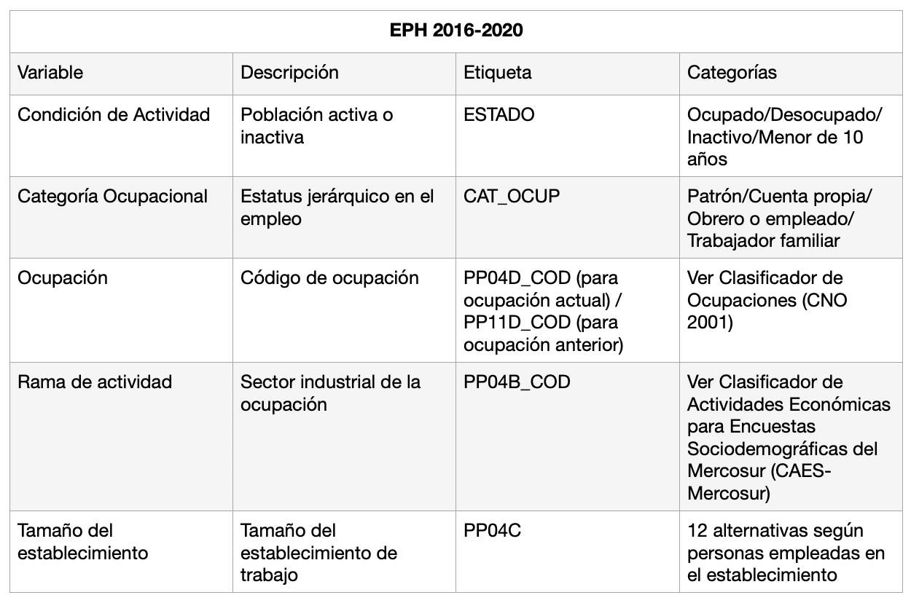
```
-->

```{r vars1, echo=FALSE, fig.cap= "Principales variables socio-ocupacionales de la EPH", fig.align='center', out.width = '80%', warning=FALSE, message=FALSE, eval = !knitr::is_html_output()}
variables_eph <- data.frame(c1 = c("Condición de actividad", "Categoría ocupacional",
                                   "Ocupación", "Rama de actividad", "Tamaño del establecimiento"),
                            c2 = c("Población activida o inactiva", 
                                   "Estatus jerárquico en el empleo", "Código de ocupación",
                                   "Sector industrial de la ocupación", 
                                   "Tamaño del establecimiento del trabajo"),
                            c3 = c("ESTADO", "CAT_OCUP", 
                                   "PP04D_COD (ocupación actual) / PP11D_COD (ocupación anterior)",
                                   "PP04B_COD (ocupación actual) / PP11B_COD (ocupación anterior)",
                                   "PP04C / PP04c_99"),
                            c4 = c("Ocupado / Desocupado / Inactivo / Menor de 10 años",
                                   "Patrón / Cuenta propia / Empleado / Trabajador familiar",
                                   "Ver Clasificador Nacional de Ocupaciones (CNO)", 
                                   "Ver Clasificador de Actividades Económicas para Encuestas Socio-demográficas del Mercosur (CAES - MERCOSUR)", "Numérica"))
                                   
variables_eph %>% 
  flextable() %>% 
  set_table_properties(width = 1, layout = "autofit") %>% 
  set_header_labels(c1 = "Variable", c2 = "Descripción", c3 = "Etiqueta", c4 = "Categorías") %>% 
  bold(part = "header") %>% 
  set_caption("Principales variables socio-ocupacionales de la EPH") %>% 
  add_footer_row(values = "Fuente: elaboración propia", colwidths = 4) %>% 
  fontsize(part = "all", size = 10) 

```


Ahora que sabemos cuál es la información que nuestras principales fuentes de datos contienen, describiremos de manera detallada cada una de ellas.

### Condición de actividad  

Las estadísticas de empleo distinguen dos grandes grupos de la población en edad laboral. El primero, es la población económicamente inactiva (**PNEA**), que incluye a todos aquellos que voluntariamente no trabajan o no trabajaban por pago o ganancia. El segundo es la población económicamente activa (**PEA**), que agrupa a aquellos que sí trabajan o trabajaban por pago o ganancia, como así también a aquellos que no tienen o tenían trabajo pero se encuentran o encontraban buscando activamente un empleo. Es decir, que en esta construcción los investigadores asumieron que la pérdida de empleo y la incapacidad de encontrar empleo representaba una falla en los mecanismos de asignación de los mercados de trabajo. En base a estos conceptos, los investigadores construyen las tasas de actividad, desempleo y empleo. El volumen, estructura y características de la **PEA**, en relación a sus características económicas, justifica su estudio para la demografía, la sociología y otras disciplinas.

La ONU define a la **condición de actividad** como aquello que “permite distinguir entre personas económicamente activas y no económicamente activas. El estado de actividad es la relación actual o habitual de cada persona con la actividad económica durante un período determinado" [@ONU1997, p. 6]. Para estudiarla es necesario obtener datos de las personas con edad de trabajo, es decir, aquellos definidos como en edad laboral, que en Argentina es entre 15 y 65 años.  

Si bien límite de edad suele no ser uniforme de acuerdo a la fuentes, esta variable comúnmente presenta las categorías de *ocupado*, *desocupado* e *inactivo*, nos permite un primer recorte de nuestro objeto de estudio. Como veremos más adelante, desde la **condición de actividad** podremos diferenciar a la población ocupada, desocupada, activa o inactiva. 

### Ocupación

Para todas aquellas líneas de investigación que reconocen en la división del trabajo el núcleo de la desigualdad social, la clasificación de las ocupaciones constituye la columna vertebral de muchas, sino de la mayoría de las indagaciones sobre estratificación social [@Crompton2008; @Barozet2007]. La **ocupación** compone un eje central de los estudios de mercados de trabajo y de la propia Sociología de las Ocupaciones. Su medición supone un conjunto de decisiones teóricas, metodológicas y operativas, que pocas veces tienen en los manuales la claridad y el espacio que merecen.

#### La Clasificación de Ocupaciones ^[Este texto está tomado parcialmente de @Sacco2016b]

Los sistemas clasificatorios de ocupaciones son herramientas que permiten ubicar las ocupaciones de los y las encuestadas en grupos pre-definidos de acuerdo a las definiciones de cada clasificador. Los clasificadores de ocupación difieren no sólo con respecto del nivel de detalle y títulos ocupacionales específicos incluidos, sino también con respecto a su lógica. Por ejemplo, algunas clasificaciones distinguen estados de empleo dentro de las ocupaciones y otras no lo hacen. Algunas están fuertemente orientadas a distinguir situaciones en la industria y otras no. Algunos clasificadores se adaptan a las características particulares de los mercados de trabajo y otras reproducen estructuras ocupacionales de los países desarrollados. Estas diferencias reflejan, en cierta medida, la estructura ocupacional de las sociedades, pero también la historia e intenciones de las instituciones que las han desarrollado.

A nivel general, se pueden apreciar estas definiciones en las discusiones plasmadas en la actualización que lleva a la **Clasificación Internacional Uniforme de Ocupaciones** (CIUO) [@Budlender2003; @Hoffmann1999], o bien, a nivel local, las discusiones y producciones en torno al **Clasificador Nacional de Ocupaciones**, previas a su implantación [@Elizalde1987; @INDEC1990; @INDEC1991] y posteriores [@Elizalde1993; @Torrado1993; @Torrado1993a]. Dada la complejidad intrínseca de la variable ocupación, así como de la exigencia explicativa que se le reclama, no es de extrañar que su medición y comparabilidad (a nivel transversal interno como a nivel regional e internacional) haya sido difícil de lograr. Diversas razones se dieron para esto.  

Las clasificaciones de ocupación tienden a diferir tanto a nivel nacional como en el tiempo. Cada sistema estadístico nacional busca establecer una clasificación que capte de la mejor forma posible las particularidades de la estructura ocupacional de su país, que, por definición, no está exenta de cambios, especialmente desde el punto de vista del desarrollo tecnológico. En segundo lugar, existe una amplia disparidad entre la lógica y el contenido de los clasificadores de ocupación al aplicarse al análisis de datos concretos; esto en parte muestra las diferencias en los intereses teóricos por detrás de los sistemas clasificatorios, pero también es resultado de la falta de coordinación tanto de la investigación social como de los procesos estadísticos planificados a largo plazo por las instituciones gubernamentales [@Ganzeboom1996].

#### La Clasificación Internacional Uniforme de Ocupaciones (CIUO) de la OIT

La **Organización Internacional del Trabajo** (OIT) de la ONU ha elaborado la **CIUO** por primera vez en 1958, con revisiones en 1968, 1988 y 2008 para tratar de solucionar estos problemas ([ver página web de la OIT](https://www.ilo.org/public/spanish/bureau/stat/isco/)). Uno de los principales objetivos de la **CIUO** es proporcionar a los INES (institutos nacionales estadísticos) un punto de partida para organizar sus clasificaciones nacionales. Sin embargo, estas revisiones periódicas de la OIT hacen necesaria a su vez otras revisiones dentro cada uno de los INES.

La **Clasificación Internacional Uniforme de Ocupaciones** (**CIUO**) es una clasificación de la Organización Internacional del Trabajo. Es una herramienta para organizar los empleos en grupos, según las tareas de cada empleo.

Existen varias versiones de la **CIUO**. La primera es la **CIUO-58**, y data del año 1957. La segunda es la **CIUO-68**, que fue adoptada en 1966. La tercera versión, la **CIUO-88**, fue adoptada por la Decimocuarta Conferencia Internacional de Estadísticos del Trabajo en 1987. La cuarta y última es de diciembre del 2007 y se conoce como la **CIUO-08**. Los principios básicos y la estructura de la clasificación se mantuvieron pero se mejoraron algunas áreas.

La **CIUO-08** ofrece 436 grupos ocupacionales organizados en una jerarquía de cuatro dígito, comenzando por el nivel más agregado que trae como resultado a 10 grupos principales, seguidos de 43 sub-grupos principales, 130 grupos menores y todo el resto son grupos unitarios [@OIT, 2012]. La versión más reciente de la CIUO ha incorporado algunos títulos ocupacionales que no estaban presente en las anteriores, por ejemplo, "ayudantes de cocina". La ventaja de esta estructura es que permite codificar ocupaciones con un nivel de detalle a cuatro dígitos, lo que significa que si buscamos mayor detalle, necesitaremos más cantidad de dígitos del código CIUO.

Los grupos principales a mayor nivel de agregación, es decir, a un dígito son:  
0 Ocupaciones de las Fuerzas Armadas  
1 Gerentes  
2 Profesionales  
3 Técnicos y Profesionales Asociados  
4 Trabajadores de Apoyo Administrativo  
5 Trabajadores de Servicios y Ventas  
6 Trabajadores calificados agrícolas, forestales y pesqueros  
7 Trabajadores artesanos y afines  
8 Operadores y ensambladores de planta y maquinaria  
9 Ocupaciones Elementales  

La mayor información sobre las ocupaciones está incluida en los siguientes grupos. Tomando los grupos principales ("Gerentes", con código 1000) se provee un ejemplo de un sub-grupo principal como es "Jefes ejecutivos, altos funcionarios y legisladores (11)”; un grupo menor como “Legisladores y Altos funcionarios (111)” y en el nivel de mayor detalle, tenemos al grupo unitario de “Oficiales de Alto Gobierno (1112)”. La estructura funciona como un set de cajas de diferente tamaño: las más pequeñas (grupos unitarios) están incluidas dentro de las más grandes y esto queda claro según el número de dígitos utilizado.

La característica por la cual se diferencian los grupos de la **CIUO-O8** es la calificación requerida para el trabajo. Por ejemplo, al diferenciar "Profesionales (2)" de "Técnicos y Profesionales Asociados (3)". Además, hay una separación entre quienes operan con máquinas y aquellos que no, en el caso de "Trabajadores artesanos y afines (7)" y "Operadores y ensambladores de planta y máquinaria (8)".

Si bien el mínimo común denominador de todas las clasificaciones son los títulos ocupacionales, la forma en la que se define la medición de la ocupación varía en cada clasificador, incluso desde la propia definición de ocupación. Por un lado, en la **CIUO-08**, “se entiende por ocupación, un conjunto de empleos cuyas principales tareas y cometidos se caracterizan por un alto grado de similitud”, y define al empleo como un “conjunto de tareas y cometidos desempeñados por una persona, o que se prevé que ésta desempeñe, para un empleador particular, incluido el empleo por cuenta propia” [@OIT2008]. Se trata de una definición vinculada a la clasificación de grupos de tareas y responsabilidades muy similares.

Para facilitar comparaciones entre naciones, las recomendaciones internacionales sugieren utilizar la clasificación de ocupaciones de acuerdo a normas de clasificación nacionales que puedan establecer su homologación con la última revisión de la **CIUO** mediante una doble codificación o mediante una correspondencia de los grupos detallados de la clasificación nacional con los de la clasificación de la OIT. Adicionalmente, especifican que los países deberían codificar los datos ocupacionales que hayan reunido al nivel más bajo posible que apoye la información recibida. Para facilitar una codificación detallada y exacta, sería útil que en el cuestionario se preguntara el título ocupacional de cada persona activa y se pidiera una breve descripción de las tareas y funciones realizadas en el empleo [@ONUOIT2010, pp. 179-180].

#### Clasificador Nacional de Ocupaciones (CNO) del INDEC Argentina

El **CNO (Clasificador Nacional de Ocupaciones)** es un sistema de clasificación de ocupaciones. Podemos definirlo como una herramienta que agrupa diferentes ocupaciones de acuerdo a un criterio preestablecido [@ChavezMolina.etal2020].

El **CNO-01** (definido actualmente como CNO-17) define a las ocupaciones, que son la “unidad de análisis" del clasificador, como la “forma concreta de la división singular del trabajo y de su sistema de relaciones dentro de las unidades productivas” y como “los procesos de trabajo parciales o individuales existentes en ellas” [@INDEC2005, pp. 16]. Esta definición de ocupación se distingue de la que provee la **CIUO**, siendo que ambas poseen marcos conceptuales diferentes, pero un mismo objetivo, clasificar ocupaciones. 

La estructura del **CNO-17** se compone de 5 dígitos, que contienen 4 dimensiones de análisis: 

*1° y 2° dígito: Carácter Ocupacional  
*3° dígito: Jerarquía Ocupacional  
*4° dígito: Tecnología Ocupacional  
*5° dígito: Calificación Ocupacional Carácter  

##### Carácter Ocupacional

Clasifica la ocupación en base al producto que se genera en el proceso de trabajo, más allá de la rama de actividad del establecimiento donde se realice la actividad laboral.

El primer dígito señala los 10 grandes grupos ocupacionales que van del 0 al 9. Esos grupos luego se desagregan con un segundo dígito en otros subgrupos de carácter más específico.

A continuación, presentamos los 10 grandes grupos ocupacionales de mayor nivel de agregación, es decir a un dígito de codificación. Además, mostramos un ejemplo de la clasificación a dos dígitos, dentro del primer grupo "Ocupaciones de dirección".

  0 Ocupaciones de dirección.  
	00 Funcionarios del poder ejecutivo nacional, provincial, municipal y/o departamental.  
	01 Funcionarios del poder legislativo nacional, provincial, municipal y/o departamental.  
	02 Funcionarios del poder judicial, federal, nacional, provincial, municipal y/o departamental.   
	03 Directivos de organismos, empresas e instituciones estatales.  
	04 Directivos de instituciones sociales.  
	05 Directivos de pequeñas y microempresas.  
	06 Directivos de medianas empresas privadas productoras de bienes y servicios.  
	07 Directivos de grandes empresas privadas productoras de bienes y servicios.  

1 Ocupaciones de gestión administrativa, de planificación, de control de gestión y jurídico-legal.  

2 Ocupaciones de gestión presupuestaria, contable y financiera.  

3 Ocupaciones de comercialización, de transporte, de almacenaje y de telecomunicaciones.  

4 Ocupaciones de servicios sociales básicos.  

5 Ocupaciones de servicios varios.  

6 Ocupaciones agropecuarias, forestales, de la pesca y de la caza.  

7 Ocupaciones de la producción extractiva, energética, de construcción e infraestructura.  

8 Ocupaciones de la producción artesanal, industrial y de reparación de bienes de consumo.

9 Ocupaciones auxiliares de la producción de bienes y de la prestación de servicios.  

##### Jerarquía Ocupacional 

Clasifica la ocupación según la jerarquía que ocupa en la organización del proceso de trabajo. Reconoce cuatro categorías que se traducen en los siguientes valores:

0. Dirección     
1. Cuenta propia   
2. Jefes  
3. Trabajadores asalariados Tecnología  

##### Tecnología Ocupacional

La tecnología ocupacional clasifica la ocupación de acuerdo al tipo de tecnología utilizada en el proceso de trabajo específico. Las categorías y valores para esta dimensión son las siguientes:

1. Sin operación de máquina  
2. Operación de maquinaria y equipos electromecánicos   
3. Operación de sistemas y equipos informatizados  

Debe realizarse la siguiente aclaración: en el caso de los directores, jefes y patrones, el valor siempre es 0 (cero). La dimensión de la tecnología ocupacional no es contemplada para estos casos por una cuestión de comparabilidad con el CNO-91.

##### Calificación Ocupacional

Clasifica la ocupación según la complejidad del proceso de trabajo específico, considerando los conocimientos y las competencias necesarias para su ejecución. Las categorías y valores para esta dimensión son:

1. Profesionales  
2. Técnicos  
3. Operativo  
4. No calificado  

Es importante realizar la distinción entre calificación de la ocupación y calificación requerida para la ocupación. La primera es la calificación del proceso de trabajo que involucra a dicha ocupación y la segunda es el nivel de formación necesario para acceder a cierta ocupación. En este caso, el 5º dígito del **CNO-17** hace referencia a la primera de las acepciones.

Ilustramos, con un ejemplo, la clasificación en su mayor nivel de desagregación, a 5 dígitos, mostrando en el siguiente cuadro realizado por Chávez Molina et al. [-@ChavezMolina.etal2020] el código ocupacional de los "Jefes de la producción industrial y artesanal con calificación profesional (80201)".


```{r, echo = F, warning = F, message = F, fig.cap = 'Jefes de la producción industrial y artesanal con calificación profesional (80201)', fig.width = 0.2, fig.height = 0.5, fig.asp=0.50, out.width = "80%", fig.align = "center", eval = knitr::is_html_output()}
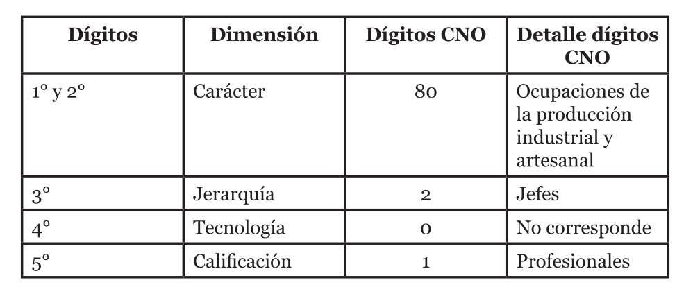
```

```{r, echo=FALSE, warning=FALSE, message=FALSE, eval = !knitr::is_html_output()}

cno_tabla <- data.frame(c1 = c("1° y 2°", "3°", "4°", "5°"),
                        c2 = c("Carácter", "Jerarquía", "Tecnología", "Calificación"),
                        c3 = c("80", "2", "0", "1"),
                        c4 = c("Ocupaciones de la producción industrial y artesanal", "Jefes", 
                               "No corresponde", "Profesionales")
)
   
cno_tabla %>% 
  flextable() %>% 
  set_table_properties(width = 1, layout = "autofit") %>% 
  set_header_labels(c1 = "Dígitos", c2 = "Dimensión", c3 = "Dígitos CNO", c4 = "Detalle dígitos") %>% 
  bold(part = "header") %>% 
  set_caption("CNO 80.2.0.1: Jefes de la producción industrial y artesanal con calificación profesional") %>% 
  add_footer_row(values = "Fuente: Chávez Molina et al. (2020)", colwidths = 4) %>% 
  fontsize(part = "all", size = 10)                            

```


Dentro del grupo 80201 se encuentran ocupaciones tales como "Jefe de planta industrial" y "Jefe de laboratorio". El primer dígito, señala al grupo 8, que define tareas vinculadas a la producción de bienes, ya sea industrial o artesanal. Incluyendo un mayor nivel de detalle a dos dígitos, el grupo 80, alude a ocupaciones relativas a la transformación de materias primas para la elaboración de bienes industriales o artesanales, tanto bienes finales como intermedios. El 3º dígito permite establecer que la ocupación se inserta en una posición de jefatura. Al 4º código de la tecnología siempre se le adjudica el valor de 0 en los casos de patrones, directores y jefes. Por último, el 5º dígito describe que esta ocupación presenta una calificación profesional.

#### Compatibilidad entre la CNO y la CIUO

Distinguiendo los censos modernos de población en Argentina -de 1960 a 2010-, el código ocupacional empleado en el censo de 1960 era compatible a nivel de 4 dígitos con la **CIUO** en su versión de 1958 mientras que en el censo de 1970 se utilizó la **CIUO-1968** a nivel de 3 dígitos. En el censo de 1980 la variable ocupación fue codificada por el Código Ocupacional (CO) que permitía homologar sus códigos a nivel de 1 o 2 dígitos en algunas ocupaciones con la **CIUO-68**.

En parte gracias a debates llevados a cabo durante el periodo intercensal 1980-1991, se propusieron procedimientos clasificatorios alternativos de codificación de esta variable en los censos de población llevados a cabo por el **INDEC**. Siguiendo las recomendaciones internacionales que sugerían a los institutos de estadística construir sus propios clasificadores para adaptarlos a las particularidades de los mercados de trabajo en cada país, el **CNO** fue elaborado por el **INDEC** actualizando el CO de la **EPH**, cuyas distintas versiones previas (con mayores niveles de agregación) fueron utilizadas desde la aplicación de la encuesta, a principios de la década del setenta. De esta forma, desde el censo de 1991 se aplicó el **CNO** sucesivamente en los censo del 2001 y 2010, en distintas versiones y a distintos niveles de apertura.

Esta estabilidad del clasificador ha posibilitado el desarrollo de una serie de investigaciones desde el **INDEC**, por ejemplo, los documentos de la Serie Estructura Ocupacional del Programa de Medición y Análisis de la Estructura Ocupacional, y su utilización en investigaciones académicas, realizadas con información proveniente de la **EPH** y la Encuesta Anual de Hogares Urbanos. Sin embargo, el clasificador no ha pasado a ser parte un insumo habitual para la generación de datos ocupacionales primarios por fuera del **INDEC**, limitando así su aceptación por fuera del Sistema Estadístico Nacional (SEN).

Con el **CNO** se contó por primera vez en la historia del SEN con el mismo sistema clasificatorio de las ocupaciones en tres relevamientos censales sucesivos y en la **EPH**. En las primeras versiones del **CNO** (o CO-EPH), su máxima apertura permitía un empalme con la **CIUO** a 2 dígitos, cuya homogeneización, si bien no perfecta, era razonablemente directa [@INDEC2000]. Una vez actualizando el sistema clasificatorio, la versión a 3 dígitos aplicada tanto en la encuesta como en el censo de 1991, los empalmes entre la **CIUO** se volvieron irrealizables más allá del segundo dígito [@INDEC1998]. Esto implicó niveles de comparabilidad con la **CIUO** limitados a mayor grado de des-agregación de la información.

El **CNO-91** empleó 3 dígitos para la codificación de ocupaciones, mientras que en el 2001 se utilizó una versión a 5 dígitos. Por su parte, la información recabada por el censo de 2010 sólo computó el nombre de la ocupación, sin preguntar por la tarea, lo que supuso codificar sólo al nivel de 1 dígito (carácter) del **CNO**, produciendo una ruptura de la serie comenzada en 1991 a mayores niveles de des-agregación.

No sólo se observó un cambio en la cantidad de dígitos de cada codificador aplicado, sino también en la información que cada uno otorga. Por ejemplo, si bien en el censo de 1980 sólo se codificó a un dígito, la propia estructura y lógica de la **CIUO** permite comparaciones con otros codificadores (dado que es un sistema clasificatorio muy dependiente de la calificación) mientras que en el 2010 el nivel de agregación no dice mucho más que una denominación, sin poder realizar diferenciación social interna alguna de cada una de ellas, tales como las que provee la calificación de las tareas.

##### Debates de clasificación  

Las modificaciones a nivel interno con el clasificador del censo de 1980 dieron lugar a encendidos debates sobre la conveniencia de modificar o no las nomenclaturas estadísticas. Uno de los argumentos de Torrado [-@Torrado1993a] fue que con el **CNO-91** (aplicado para el censo de 1991) las tareas que relevó el censo no fueron codificadas, perdiéndose de esta forma el dato sobre la ocupación y las tareas. El contra-argumento del equipo encargado de elaborar el **CNO-91** [@Elizalde1993] era que ningún sistema clasificatorio admitía contar con el dato sobre la ocupación recogido por el censo, sino que todos permiten reemplazarlo por la denominación del subgrupo al nivel menor de agregación en el que es clasificada.

Torrado [-@Torrado1993a] también objetaba que la aplicación del **CNO-91** producía una ruptura de comparabilidad con los nomencladores nacionales precedentes y con los nomencladores internacionales. A su vez, que el **CNO-91** requería para su codificación de información adicional a la ocupación mientras que la **CIUO** sólo requería la respuesta a la pregunta sobre “Ocupación principal” para poder asignar una ocupación individual a un grupo dado del nomenclador (es decir, el criterio organizador de la clasificación era unidimensional). El **CNO-91**, por el contrario, para la definición de sus categorías se requería información sobre variables económicas adicionales a la ocupación (tales como categoría ocupacional, rama de actividad, tamaño del establecimiento de los patrones). Esto implicó que la aplicación del **CNO**, en rigor, sólo fuera posible en el caso de fuentes que investiguen todas las variables adicionales a la ocupación (prácticamente, ninguna salvo la **EPH**). Significó además que en la utilización del **CNO** se introdujera complicaciones en las tareas de codificación en el censo, ya de por sí complejas con los nomencladores anteriores.

Torrado [-@Torrado1993a] sostenía que la aplicación de este sistema clasificatorio traería consigo un aumento considerable tanto de los costos de procesamiento del censo como de los inevitables errores de codificación y falta de oportunidad de las publicaciones de estos datos. Lo sucedido __a posteriori__ en el censo de 1991 y el de 2001 no hizo más que confirmar algunas de estas advertencias. En efecto, tanto en el censo de 1991 como en el censo de 2001, los tabulados y bases de datos publicados con esta información fueron de poco detalle (salvo en bases de datos no oficiales) y divulgadas relativamente con poca oportunidad y, por ende, de dudosa calidad, a pesar de que, por ejemplo, en la medición y clasificación de las ocupaciones en el censo de 2001, se utilizó, por primera vez, un sistema informático que permitió la codificación automática de más del 55% de las declaraciones sobre ocupación y en el que se codificaron el total de las declaraciones sobre esta variable relevadas por el censo. De hecho, ante la falta de recursos humanos, en el censo de 1991 las tareas de codificación de las ocupaciones fueron muestreadas.

Esto parece (a falta de publicaciones oficiales) no haber sucedido en el censo de 2010. Si bien el clasificador utilizado tanto en el censo 2001 como en el 2010 es el mismo, no fueron iguales las decisiones en lo que refiere al tratamiento y difusión de los datos. El nivel de apertura de las ocupaciones en el censo 2010 no es informativo acerca de las tareas, ya que el nombre de la ocupación sólo muestra el carácter ocupacional, vinculado con el objeto o servicio que produce el proceso de trabajo del que forma parte la ocupación clasificada. A pesar de que esta decisión política y técnica no guarde relación directa con el **CNO** como instrumento, conlleva implicancias indirectas particulares: otros sistemas clasificatorios a nivel de un dígito, por ejemplo la **CIUO**, si bien en escaso grado de detalle, remiten, en su nivel más agregado, tanto las tareas como a la calificación ocupacional. Adicionalmente, los censos de 1991 y 2001 mostraron distintos tipos de límites a la captación de la condición de actividad, por ende, afectando a todas las variables relativas a las características económicas de población.

La aplicación del **CNO** en el censo de 1991 introdujo no sólo un cambio en el sistema clasificatorio con respecto al utilizado sobre todo en 1980 (también en 1960 y 1970), sino que hubo variaciones en su definición, la forma de medición, el diseño de la cédula, la lectura y procesamiento posterior de la información. A diferencia del censo de 2001, el censo de 1980 y el censo de 1991 preguntaron directamente por la tarea y ocupación. En el 2001, en cambio, se dividió la pregunta en dos: por un lado, se indagó el nombre de la ocupación, y, por el otro, la tarea.

##### Métodos de correspondencia entre el CNO y la CIUO  

En los casos en los que se necesita realizar comparaciones entre información encontrada en distintas encuestas nacionales o con relevamientos internacionales, es necesario trabajar con un esquema clasificatorio de la ocupación que sea común. En este sentido, internacionalmente, la **CIUO** (en sus distintas versiones) funciona como "lenguaje común" en términos de la medición ocupacional. Una de las recomendaciones de la **OIT**, además de la construcción de instrumentos de medición ocupacional propios para cada situación nacional, es la elaboración de equivalencias entre el clasificador nacional y la **CIUO**. 

De este modo a partir de la información brindada por **INDEC** [@INDEC2018b; @ChavezMolina.etal2020] es posible realizar esta conversión a nivel de dos dígitos de la **CIUO**. Siguiendo la metodología propuesta por el organismo estadístico, la mayor parte de los códigos del CNO presentan su equivalencia a dos dígitos de la **CIUO**, mientras que para algunos códigos específicos es necesario recurrir a la variable **rama de actividad** para poder hallar la correspondencia.

Para una propuesta mejorada de la metodología de **INDEC**, junto con las sintaxis para `SPSS`, `R` y `STATA`, puede consultarse @ChavezMolina.etal2020.

### Rama de Actividad

La **Rama de Actividad** describe al sector industrial al que pertenece el establecimiento dentro del cual la persona ejerce o ejerció su empleo. Es decir, la unidad productiva en la cual las personas trabajan. A diferencia de otras variables económicas o socio-ocupacionales, la **rama de actividad** permite realizar diferenciaciones horizontales, no jerárquicas, a partir de la inserción de los trabajadores en las unidades productivas.

Tanto en la **EPH** como en el censo, se ha utilizado la codificación disponible según la “Clasificación Industrial Internacional Uniforme de Actividades Económicas” (**CIIU**) de las Naciones Unidas [-@ONU2009a]. Para 1991, 2001 y 2010 esta variable no presenta modificaciones sustanciales por lo que, en términos generales, los datos disponibles, son comparables.

En el censo de 1980, fue codificada según la “Clasificación Industrial Internacional Uniforme de Actividades Económicas” (**CIIU**) de las Naciones Unidas (Revisión 2-1968), hasta el nivel de ramas específicas (dos dígitos). Para 1991 y 2001 esta variable no presentó modificaciones sustanciales. Más información puede encontrarse en este [link](https://www.indec.gob.ar/micro_sitios/clanae/default.asp).

En la **EPH** entre 1974, su primera onda, hasta 1980 inclusive, se han utilizado los tres primeros dígitos de la **CIIU**, Revisión 2, aunque la codificación original consta de hasta 5 dígitos a su nivel más detallado. A partir del año 1997, se ha utilizado la “Clasificación Nacional de Actividades Económicas” (ClaNAE-97) con un detalle a cinco dígitos. Más tarde, desde 2011, la **EPH** distingue las ramas de actividad según la “Clasificación de Actividades Económicas para Encuestas Sociodemográficas del Mercosur” (**CAES Mercosur 1.0**), utilizando los 5 dígitos del código. Así mismo, esta última versión del CAES es totalmente compatible con el **CIIU** en su revisión 4. En la Tabla \@ref(fig:caes10) se observa un ejemplo de la CAES:

<!--
```{r fig.cap= "Ejemplo clasificación de Actividades Profesionales, Científicas y Técnicas - CAES 1.0 [@INDEC2011d]", fig.align='center', out.width = '80%', echo=FALSE, eval = knitr::is_html_output()}
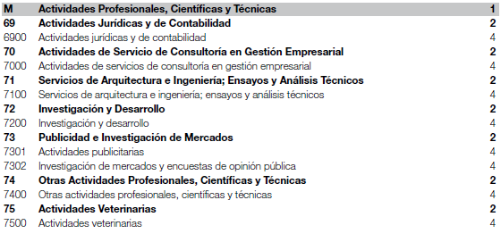
```
-->

```{r caes10, fig.cap= "Ejemplo clasificación de Actividades Profesionales, Científicas y Técnicas - CAES 1.0 [@INDEC2011d]", fig.align='center', out.width = '80%', echo=FALSE, eval = knitr::is_html_output()}

caes_tabla <- data.frame(c1 = c("M", "69",	"6900",	"70",	"7000",	"71",	"7100",	"72",	"7200",
                                "73",	"7301",	"7302",	"74",	"7400",	"75",	"7500"),
                         c2 = c("ACTIVIDADES PROFESIONALES, CIENTÍFICAS Y TÉCNICAS",	
                                "ACTIVIDADES JURÍDICAS Y DE CONTABILIDAD",	
                                "Actividades jurídicas y de contabilidad",
                                "ACTIVIDADES DE SERVICIO DE CONSULTORÍA EN GESTIÓN EMPRESARIAL",
                                "Actividades de servicios de consultoría en gestión empresarial",
                                "SERVICIOS DE ARQUITECTURA E INGENIERÍA; ENSAYOS Y ANÁLISIS TÉCNICOS",
                                "Servicios de arquitectura e ingeniería; ensayos y análisis técnicos",
                                "INVESTIGACIÓN Y DESARROLLO",
                                "Investigación y desarrollo",
                                "PUBLICIDAD E INVESTIGACIÓN DE MERCADOS",
                                "Actividades publicitarias",
                                "Investigación de mercados y encuestas de opinión pública",
                                "OTRAS ACTIVIDADES PROFESIONALES, CIENTÍFICAS Y TÉCNICAS",
                                "Otras actividades profesionales, científicas y técnicas",
                                "ACTIVIDADES VETERINARIAS",
                                "Actividades veterinarias"),
                         c3 = c("1", "2", "4", "2", "4", "2", "4", "2", "4", "2", "4", "4", "2",
                                "4", "2", "4")
)

caes_tabla %>% 
  flextable() %>% 
  set_table_properties(width = 1, layout = "autofit") %>% 
  set_header_labels(c1 = "Código", c2 = "Descripción", c3 = "Cantidad de dígitos") %>% 
  bold(part = "header") %>% 
  set_caption("Ejemplo clasificación de Actividades Profesionales, Científicas y Técnicas - CAES 1.0") %>%   add_footer_row(values = "Fuente: INDEC (2011)", colwidths = 3) %>% 
  fontsize(part = "all", size = 10)                            
```

En la siguiente Tabla \@ref(fig:caes2) podemos ver todas las clasificaciones que se han ido implementando para codificar las ramas de actividad económica.

```{r fig.cap= "Clasificadores de la rama de actividad", fig.align='center', out.width = '80%', echo=FALSE, eval = knitr::is_html_output()}
knitr::include_graphics("imagenes/t4_u4.png")
```


```{r caes2, echo=FALSE, warning=FALSE, message=FALSE, eval = !knitr::is_html_output()}

caes_tabla2 <- data.frame(c1 = c("CIIU Revisión 2", "CIIU Revisión 3", "CAES Mercosur (CIIU Revisión 3)",
                                 "ClaNAE-97", "CAES 2000 Mercosur (CIIU Revisión 4)",
                                 "CAES - Mercosur 1.0 Versión Argentina"),
                          c2 = c("1974-1989", "", "", "1997", "2000-2010", "2011-2020"),
                          c3 = c("1980", "1991", "2001", "", "2010", "")
)

caes_tabla2 %>% 
  flextable() %>% 
  set_table_properties(width = 1, layout = "autofit") %>% 
  set_header_labels(c1 = "Clasificación Rama de Actividad", c2 = "EPH", c3 = "Censos") %>% 
  bold(part = "header") %>% 
  set_caption("Clasificadores de la rama de actividad") %>%   
  add_footer_row(values = "Fuente: elaboración propia", colwidths = 3) %>% 
  fontsize(part = "all", size = 10)                            
```


### Categoría de Ocupación

Esta variable es de vital importancia para la construcción de esquemas de estratificación ya que permite discriminar a la población en función de su posicionamiento en las relaciones de producción y a partir del origen de sus ingresos. Por un lado diferencia a aquellos que compran fuerza de trabajo y son dueños o controladores de los medios de producción (**empleadores** o **patrones**), y aquellos que deben vender su fuerza de trabajo para recibir un salario (**asalariados** u **obreros**). Entre estas situaciones contrapuestas, nos encontramos con los **trabajadores por cuenta propia** o **independientes** que no venden su fuerza de trabajo a una única persona ni son empleadores de fuerza de trabajo ajena.

Otras situaciones que suele distinguir la **categoría ocupacional** es a los **trabajadores familiares no remunerados**.

### Sector de Actividad

Permite distinguir a la población trabajadora según si el establecimiento en el que realiza su actividad es estatal o privado. Algunas encuestas, a su vez, discriminan también al sector doméstico, las organizaciones no gubernamentales (ONGs) o a las cooperativas de trabajo.  

### Tamaño del Establecimiento

Esta variable se utiliza generalmente para realizar cortes dentro de la estratificación social que permitan observar procesos de heterogeneidad productiva o segmentación de mercados. Utilizando como línea de corte, generalmente, a los 5 o 10 ocupados, la variable permite discriminar a las micro-empresas de aquellos establecimientos medianos o grandes. Por otro lado, la variable de **tamaño del establecimiento** ha sido comúnmente señalada como *proxy* de nivel de productividad [@Tokman1987].

### Supervisión  

La **supervisión** del trabajo de otros es un indicador muy utilizado dentro del enfoque neo-marxista o neo-weberiano de las clases sociales, en donde se busca diferenciar aquellas posiciones "contradictorias" a partir de las cuales si bien se hace referencia a trabajadores asalariados, tienen poder de dirección (con mayores o menores niveles de autonomía) en el trabajo de otros.

En algunas encuestas está dimensión es relevada directamente, acompañada de otras preguntas que pueden recabar información sobre la cantidad de personas supervisadas o las características de dicha actividad de supervisión. En la **EPH**, una aproximación a dicha cuestión puede realizarse a través de la variable **ocupación** medida a través del **CNO**. El tercer dígito de dicho código, que permite establecer la *jerarquía ocupacional* posibilita diferenciar a aquellas ocupaciones de ejecución directa de las de jefatura. Estas últimas implican aquellos trabajos en donde se organiza, supervisa y controlan procesos y personas comprometidas en su ejecución.

## Explorando las variables socio-ocupacionales en la EPH {#eph4} 

Paquetes que utilizaremos en esta sección:
```{r, message=FALSE, warning=FALSE}
library(tidyverse)
library(eph)
library(foreign)
```

En este apartado aplicaremos lo aprendido en punto anterior y exploraremos las distintas variables revisadas a partir de la **EPH**. Lo que nos interesa es identificarlas, saber qué nombre tienen y como se presentan sus categorías. Al mismo tiempo, revisaremos algunas de las cuestiones aprendidas en el [Capítulo 3](#fuentes). Aprovecharemos a utilizar la base del segundo trimestre de la **EPH** de 2015, ya que en la misma, excepcionalmente, la ocupación fue codificada tanto a partir del **CNO-01** como de la **CIUO-08**. De esta forma, por un lado descargaremos a través del paquete __```eph```__ y añadiremos la variable de ocupación descargando la información adicional desde la página de **INDEC**.

En primer lugar descargamos la base: 

```{r, message=FALSE, warning=FALSE}
eph_ind_215 <- get_microdata(year = 2015, trimester = 2, type = "individual")
```

Como la codificación de la variable ocupación a partir de la **CIUO** se encuentra en un archivo aparte, debemos acceder al sitio de INDEC para descargarlo.

```{r fig.cap= "Ejemplo clasificación de Actividades Profesionales, Científicas y Técnicas - CAES 1.0 [@INDEC2011d]", fig.align='center', out.width = '80%', echo=FALSE}
knitr::include_graphics("imagenes/indec_ciuo.png")
```

Luego de descargado el archivo, descomprimiremos el ```.rar``` y utilizaremos el archivo `eph_ciuo_215.dbf`. A continuación abriremos dicho archivo y "pegaremos" la variable **PP04D_CIUO** en la base **eph_ind_215**. Utilizaremos las variables **CODUSU** (identificador de vivienda), **NRO_HOGAR** (identificador del hogar) y **COMPONENTE** (identificador de miembro del hogar) como ID para emparejar ambas bases. 

```{r, message=FALSE, warning=FALSE}
library(foreign)
eph_ciuo_215 <- read.dbf("bases/eph_ciuo_215.dbf") #carga de base CIUO
eph_ciuo_215 <- eph_ciuo_215 %>% 
	select(CODUSU, NRO_HOGAR, COMPONENTE, PP04D_CIUO) #selecciono las variables que necesito retener

eph_ind_215 <- eph_ind_215 %>% 
	left_join(eph_ciuo_215, by = c("CODUSU", "NRO_HOGAR", "COMPONENTE")) #Pego la variable CIUO a la base eph_ind_215

```

Ahora podemos etiquetar la base utilizando el comando ```organize_labels``` del paquete __```eph```__:

```{r, message=FALSE, warning=FALSE}
eph_ind_215 <- organize_labels(eph_ind_215, type = "individual")

eph_ind_215$CODUSU <- as.character(eph_ind_215$CODUSU) #Es necesario convertir a "character" para futuras operaciones. Esto se hace porque el comando "organize_labels" le cambia el formato a la variables.
```

¡Listo! La base está preparada para ser explorada.  

### Condición de actividad  

En la **EPH** la variable que mide la **condición de actividad** puede ser encontrada bajo el nombre "ESTADO". Exploraremos las distintas categorías y frecuencias de casos que presenta para dicho trimestre. 

```{r, message=FALSE, warning=FALSE}
table(eph_ind_215$ESTADO)
```

Como puede observarse las categorías son *entrevista individual no realizada*, *ocupado*, *desocupado*, *inactivo* y *menor de 10 años*. En el caso de que pretendamos seleccionar únicamente a la población económicamente activa, deberemos filtrar las categorías 1 (ocupado) y 2 (desocupado). En este caso nos quedaríamos con 25848 registros.

```{r, message=FALSE, warning=FALSE}
eph_2015_PEA <- eph_ind_215 %>% 
	filter(ESTADO == 1 | ESTADO == 2)

nrow(eph_2015_PEA)
```

### Ocupación

Como presentaremos en la próxima unidad, la ocupación es la variable central en la construcción de esquemas de estratificación y clases sociales. En el caso de la EPH, los censos (posteriores a 1991) y las diversas encuestas que produce el **INDEC**, en las que se releva información ocupacional, suelen codificar dicha variable a través del **CNO**.

La **EPH** recaba la ocupación tanto para la población ocupada como desocupada, relevando para este último grupo el dato de la última ocupación realizada, en el caso que hubiera existido. Mientras que el primer dato se guarda en la variable *PP04D_COD*, la última ocupación de los desocupados puede encontrarse en la variable *PP11D_COD*. Con el comando ```table``` podemos visualizar todos los códigos existentes en la base y su frecuencia absoluta.

```{r, message=FALSE, warning=FALSE}
table(eph_ind_215$PP04D_COD)
```

Por otro lado, el paquete __```eph```__ mediante la función ```organize_CNO``` nos agrega 4 columnas a la base en donde se clasifica cada componente del CNO: carácter, jerarquía, tecnología y calificación ocupacional. A continuación revisamos dicho comando y solicitaremos las frecuencias, por ejemplo, de la calificación.

```{r, message=FALSE, warning=FALSE}
eph_ind_215 <- organize_cno(base = eph_ind_215)

table(eph_ind_215$CALIFICACION)
```

Por su parte en la variable *PP04D_CIUO* encontraremos a la ocupación codificada según el **CIUO**.  

```{r, message=FALSE, warning=FALSE}
table(eph_ind_215$PP04D_CIUO)
```

A través del paquete __```modest```__ y el comando ```mfv``` (most frequent value) calcularemos la moda de dichas variables, es decir, la ocupación más repetida en el relevamiento.  

```{r, message=FALSE, warning=FALSE}
modeest::mfv(eph_ind_215$PP04D_CIUO, na.rm = TRUE)
```

El código 4110 designa a los **oficinistas generales**

### Rama de actividad  

Al igual que para el caso de la ocupación, la rama de actividad es computada tanto para la población ocupada como la desocupada. En los relevamientos previos a 2011 y posteriores a 2016, en el primer caso acudimos a la variable *PP04B_COD* mientras que en el segundo a la *PP11B_COD*. Para los relevamiento entre 2011 y 2015, dichas variables fueron nombradas sin el sufijo *_COD* y con el sufijo *_CAES*. 

Echamos un vistazo a la distribución de la población ocupada según la rama de actividad.

```{r, message=FALSE, warning=FALSE}
table(eph_ind_215$PP04B_CAES)
```

Del mismo modo que con la ocupación, el paquete __```eph```__ mediante la función ```organize_CAES``` nos agrega 8 columnas a la base en donde se clasifican distintas cuestiones: versión de la CAES, código de sección y división, etiqueta de sección y división y clasificación de ramas de actividad agregadas. A continuación revisamos dicho comando y solicitaremos las frecuencias de las ramas agregadas.

```{r, message=FALSE, warning=FALSE}
eph_ind_215$PP04B_COD <- as.character(eph_ind_215$PP04B_COD) #esta linea de comando corrige un error derivado del auto-etiquetamiento de las categorías.
eph_ind_215 <- organize_caes(base = eph_ind_215)

table(eph_ind_215$caes_eph_label)
```

### Categoría de ocupación  

La categoría de ocupación es una variable que también es de vital importancia en la construcción de clasificaciones. La misma puede encontrarse bajo el nombre de *CAT_OCUP*. A continuación exploramos sus categorías:

```{r, message=FALSE, warning=FALSE}
table(eph_ind_215$CAT_OCUP)
```

### Sector de actividad  

En la **EPH** el sector de actividad puede encontrarse en la variable *PP04A*.

```{r, message=FALSE, warning=FALSE}
table(eph_ind_215$PP04A)
```

### Tamaño del establecimiento  

La medición del tamaño del establecimiento se encuentra distribuida en dos variables: *PP04C* y *PP04C99*. La primera permite captar en forma detallada el tamaño del establecimiento donde trabaja la persona en diferentes rangos, mientras que la segunda permite recuperar, mediante una clasificación más acotada, aquel dato que en la primera variable figuraba como "Ns/Nc". A continuación exploramos ambas variables en forma cruzada.

```{r, message=FALSE, warning=FALSE}
table(eph_ind_215$PP04C, eph_ind_215$PP04C99)
```

Al igual que en el caso de la ocupación y la rama de actividad, para aquellas personas desocupadas que han trabajado alguna vez en el pasado, el tamaño del establecimiento puede ser identificado en las variables *PP11C* y *PP11C99*.

### Supervisión 

Si bien la supervisión no es una variable medida directamente en la **EPH**, podemos aproximarnos a dicha noción a través del **CNO**. En su tercer dígito mide la jerarquía ocupacional. Sin embargo, para extraer dicha información es necesario "partir" el código ocupacional, reteniendo el tercer dígito. A través de __```R```__, realizaremos la operación utilizando la función ```str_sub``` del paquete __```stringr```__, indicando que dígitos queremos retener. En este caso debemos señalar que queremos retener únicamente el tercer dígito (que empiece en el 3 y termine en el 3) y se lo asignaremos a una nueva variable llamada "cno_jerarquia".

```{r, message=FALSE, warning=FALSE}
eph_ind_215$cno_jerarquia <- str_sub(eph_ind_215$PP04D_COD, start = 3, end = 3)

eph_ind_215 %>% 
	filter(cno_jerarquia == 2) %>% 
	nrow()
```
Conociendo que el código 2 es el que hace referencia a la jefatura, si filtramos los resultados podemos decir que existen 619 casos que supervisan las tareas de otras personas.  

```{r, message=FALSE, warning=FALSE, include=FALSE}
rm(eph_ciuo_215)
```

<!--chapter:end:caps/04U.Rmd-->

# Los Nomencladores de clases sociales {#clases5}

Este capítulo tiene como propósito presentar los diversos abordajes teórico-empíricos más utilizados en el estudio de la estratificación social, a nivel internacional y nacional, fundamentalmente desde una mirada operacional.

Presentados ya los principales enfoque teóricos en el [capítulo 2](#estructura1), en esta sección se focaliza en las operaciones que se realizan desde el punto de vista metodológico, siguiendo criterios teóricos, para hacer posible la medición de estratos y clases sociales definidas en términos conceptuales. Para esto revisaremos algunas de las propuestas más utilizadas.

Estas preguntas guian el capítulo:  
- ¿Qué enfoques teóricos sobre las clases sociales fueron operacionalizados empíricamente?  
- ¿Qué diferencias presentan dichos enfoques?  
- ¿Qué cuestiones aportan los enfoques nacionales?  
- ¿Cómo se operacionalizan los esquemas presentados?  
- ¿Cuáles son las limitaciones que presentan las fuentes de datos nacionales en la aplicación de dichos esquemas?  
- ¿Sobre cuáles unidades de análisis podemos trabajar en el estudio de las clases sociales?  

Al finalizar el capítulo se espera que los lectores puedan:

1. Identificar las semejanzas y diferencias específicas que presenta cada nomenclador de clases propuesto por los autores aquí revisados. 
2. Conocer cuáles son las principales variables que sustentan a cada esquema.
3. Adquirir la práctica en la operacionalización de variables complejas como la clase social.
4. Establecer críticamente qué esquema utilizar según el marco teórico propuesto.

Para una mayor comprensión del capítulo recomendamos la lectura de los siguientes documentos: 

Clemenceau, L., Fernández Melián, M. C., y Rodríguez de la Fuente, J. [-@Clemenceau.etal2016]. Análisis de esquemas de clasificación social basados en la ocupación desde una perspectiva teórica-metodológica comparada. Documentos de Jóvenes Investigadores IIGG, 44.

Francés García, F. J. [-@FrancesGarcia2009]. Elementos para el estudio de la estratificación social en las sociedades avanzadas: Estrategias operativas. Revista Obets, 3.  

Torrado, S. [-@Torrado1998d]. La medición empírica de las clases sociales. En Familia y diferenciación social. Buenos Aires: Eudeba.

Sacco, N. [-@Sacco2019]. Estructura social de la Argentina, 1976-2011. Trabajo y sociedad, (32), 25–51, (Anexo metodológico).

Carabaña, J. [-@Carabana1997]. Esquemas y estructuras. Revista crítica de ciências sociais, (49), 67-91. 

Barozet, E. [-@Barozet2007]. La variable ocupación en los estudios de estratificación social.

Sautu, R., Dalle, P., Otero, M. P., y Rodríguez, S. [-@Sautu.etal2007]. La construcción de un esquema de clases a partir de datos secundarios. (Documento de Cátedra II. 4). Metodología de la Investigación Social II, Cátedra Sautu, Facultad de Ciencias Sociales-UBA.  

Rodríguez de la Fuente, J. J. [-@RodriguezdelaFuente2020]. Del origen de clase a las condiciones de vida actuales. Movilidad social y bienestar material en la Ciudad de Buenos Aires (2004-2015). Buenos Aires: Teseo Press. (Capítulo 2. Diseño Metodológico)

## De las clases en el papel a las clases en la computadora {#computadora}

### Operacionalizando el concepto de clase 

El proceso de *operacionalización* implica el pasaje de conceptos teórico-abstractos a indicadores empíricos, es decir, la transformación de un fenómeno no observable o latente, en observable [@DAncona1996]. Bourdieu [-@Bourdieu1990], en referencia a la conceptualización científica de las clases sociales, denominó a este proceso como la construcción de clases "en el papel", en tanto funcionan como *constructos* que son agrupaciones probables fundadas en la posición que los individuos presentan en el espacio social. De este modo, las clases son construcciones analíticas pero bien fundadas en la realidad ya que proporcionan una explicación más completa del mayor número de diferencias observadas entre los agentes [@Bourdieu1990, pp. 130].

Estas clases-constructos no son clases equiparables a las que podemos percibir y comprender como existentes en la realidad social, aunque presenten probabilidades de serlo. Ejemplificando, si nuestro esquema de clasificación nos indica que un individuo asalariado y administrativo de un organismo estatal, forma parte de la "clase media", eso no significa que esa categoría de clase tenga una relación directa con lo que en la realidad los propios individuos identifican como clase media (que de por sí presenta una gran heterogeneidad), ni con lo que las propias teorías pueden entender como "clase media" .

Las clases sociales son una parte de lo que normalmente conceptualizamos como "estructura social". En tanto parte, el proceso de operacionalización, es decir, de separación de aspectos que suelen estar integrados (tales como la clase, el género, los vínculos sociales, la acción política, entre otros), implica una abstracción y un recorte realizado sobre la realidad, pero que permite un acercamiento a la comprensión de la misma:

> Como hemos visto, los esquemas de clase son en realidad el producto de la disolución de las estructuras sociales. La fórmula para su producción podría ser algo como lo que sigue: tómense estructuras cuyos elementos son individuos, roles o acciones cualesquiera, rómpase las relaciones que haya entre sus miembros de modo que estos queden flotando libremente y sométase el magma resultante a centrifugación hasta que se haya reunido los elementos homogéneos. Una vez terminado el proceso, calcúlense los porcentajes. Se obtiene así una descripción de la estructura social [@Carabana1997, pp. 85].

Resumiendo, si la estructura de clases es un aspecto de la estructura social, los esquemas de medición de clase son una aproximación al estudio de las mismas. Aunque se construyen a partir de la teoría, no deben entenderse como "puentes directos" entre ambos ámbitos, sino más bien como constructos estadísticos elaborados por los investigadores para aproximarse a la realidad a partir de los datos.  

### Clases, grupos, estratos ¿Qué medimos cuando analizamos la estructura social?  

Es común intercambiar los conceptos cuando nos referimos al estudio de agregados poblacionales que conforman la estructura social: a veces las llamamos clases, otras veces estratos, grupos, sectores, entre otras nominaciones. Sin embargo, más allá de la intercambiabilidad de algunos términos, cada concepto corresponde a una tradición teórica y, por ende, cada concepto pone el eje en un aspecto de la realidad. Mientras que la estratificación alude en mayor medida a la idea de jerarquía y distancia entre los componentes de la misma, la idea de clase referencia a las relaciones y mutua dependencia que se establece entre los agrupamientos. Sin embargo, la mayor parte de estos enfoques, en términos operativos, se centran en la **ocupación** como principal variable desde donde construir clasificaciones [@FrancesGarcia2009; @Barozet2007], tal como hemos estudiado en el [Capítulo 5](#ocupacion).

Las bifurcaciones en la construcción de las clasificaciones comienzan a partir de los distintos criterios y decisiones llevadas adelante por los investigadores para observar a los grupos sociales [@FrancesGarcia2009, pp. 49-502]. Podemos citar, al menos, los siguientes aspectos a tener en cuenta:  

- *Elección de las medidas*: es decir, si los agrupamientos se mostraran como medidas continuas o categóricas. Mientras que el primer tipo apunta a una concepción de la estructura en tanto _continumm_, en la que las distintas posiciones se diferencian en función de su distancia, el segundo aspecto, que es característico de los enfoques de clase, hace referencia a una realidad social fragmentada en grupos que adquieren su identidad a partir de su relación con los demás grupos.  

- *Naturaleza de la información*: aquí aludimos a referentes objetivos o subjetivos. En el primer caso, son indicadores tales como la ocupación, los ingresos, el nivel educativo, etc. En cambio, los principales indicadores subjetivos de estratificación se asocian a las valoraciones subjetivas que los individuos hacen sobre las ocupaciones, que permiten la construcción de escalas de prestigio o estatus social.

- *Objeto de la medición*: finalmente, nos referimos a lo que realmente queremos medir a través de las herramientas elaboradas. Por un lado encontramos escalas que pretenden medir el prestigio o el estatus, otras que intentar medir la clase social y, por último, la posición socioeconómica. Cada una presentará una naturaleza distinta y apuntará a aspectos teóricos diferenciados y hasta enfrentados. 

## Enfoques operacionalizables de clases y estratos sociales {#clases6} 

En el [capítulo 2](#estructura1) repasamos brevemente algunas de las teorías más importantes en el campo del estudio de las clases y la estratificación social. En este apartado nos enfocaremos en el proceso que dichos investigadores atravesaron para llevar las clases de la teoría a los papeles (o bien, a la computadora). De esta forma, nos preguntamos: 

- ¿Qué decisiones han tenido que tomar?
- ¿Qué limitaciones han encontrado en el pasaje de la teoría a lo empírico?
- ¿Qué variables utilizaron para llevar a cabo dicho trabajo? ¿Cómo las combinaron?
- ¿Qué limitaciones presentan las propuestas en función de las fuentes de datos disponibles en Argentina?  

Como veremos el trabajo de desentrañar las decisiones que llevaron adelante los investigadores en la elaboración de esquemas y escalas de estratificación social no siempre es una tarea sencilla, y depende en gran medida de las huellas y directrices que los propios autores han dejado en sus trabajos acerca de cómo generar dichos constructos. Algunos han elaborado anexos, trabajos o publicaciones específicas en donde han señalado cómo construir dichos instrumentos. Otros, en cambio, han sido más ambiguos en sus formulaciones metodológicas, generando que aquellos interesados en la utilización de sus enfoques elaboren esquemas aproximados.

En este sentido, proponemos un repaso de las principales decisiones, criterios y características que asumen las clasificaciones más utilizadas tanto a nivel internacional como nacional en el estudio de las clases y la estratificación social. Vale decir que esta revisión lejos está de ser exhaustiva de todos los enfoques, por esta razón, hacia el final de este apartado listaremos algunas referencias para quien desee explorar en otros formatos clasificatorios.  

### Esquemas internacionales  

#### Esquema EGP  

El esquema EGP [@Erikson.etal1979] es uno de los más utilizados, tanto en términos internacionales como regionales, para el estudio de la estructura de clases como de la movilidad social. John Goldthorpe fue quien se encargó de popularizarlo a través de sus investigaciones, llegando a ser utilizado, a partir de una adaptación, por la *European Statistical Office* como clasificación oficial (*European Socio-economic Classification*) ^[[https://doi.org/10.1080/14616690701336518](https://doi.org/10.1080/14616690701336518)].  

Según el autor, el esquema no debe considerarse como un mapa definitivo de la estructura de clases, sino como un instrumento de trabajo que puede sufrir cambios y modificaciones. En la construcción del mismo, intervinieron tanto ideas teóricas como consideraciones prácticas que dependieron del contexto en el que tuvo origen, de los propósitos y de la naturaleza de la información sobre la que sería aplicado [@Erikson1992, pp. 32].  

En referencia a los criterios operacionales que implica la construcción del esquema, se consideran [@Mendez.Gayo2007, pp. 146]:  
1. la propiedad de los medios de producción,  
2. la existencia y número de empleados (para aquellos que no son asalariados),  
3. la distinción no manual – manual – agrícola, y  
4. el tipo de relación de empleo (de servicios o relación contractual).  

En el siguiente esquema se detallan los principales criterios de clasificación y la asignación de las clases.  

```{r fig.cap= "Derivación del esquema de clases EGP. Fuente: Erikson y Goldthorpe (1992)", fig.align='center', out.width = '80%', echo=FALSE, eval = knitr::is_html_output()}
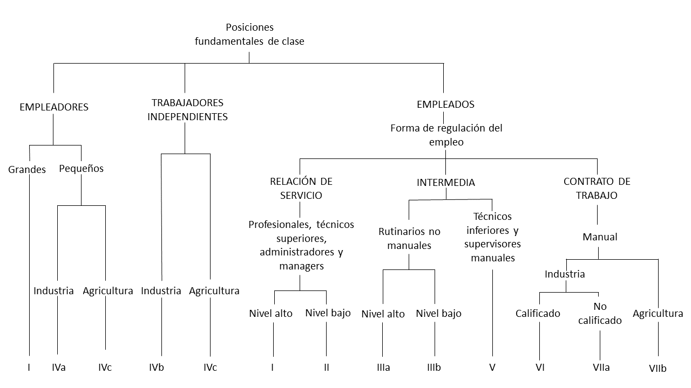
```

De esta forma, la primera gran división ocurre a nivel de relaciones de producción, diferenciando entre empleadores (*employers*), trabajadores autónomos (*self-employed workers*) y empleados (*employees*). Para el caso de los empleadores se diferencia además según si presentan empresas grandes o pequeñas, así como por su rama de actividad (industria o agricultura), al igual que en los trabajadores autónomos. La operacionalización se complica al desagregar el mundo asalariado. Aquí interviene el criterio del tipo de **relaciones de empleo**.  

La **relación de servicio** da lugar a lo que el autor denomina “clase de servicios” y que esta conformada por empleados profesionales, administradores y directivos. Los contratos suelen pautarse a largo tiempo y el modo de intercambio empleador-empleado suele ser difuso, en el sentido que no sólo actúa el salario como forma de pago, sino que también ciertos elementos prospectivos (aumentos, seguros sociales, pensiones, etc.) que garantizan la estabilidad y el sostenimiento del empleo. El empleado “de servicios” obtiene autonomía y discrecionalidad, dependiendo su rendimiento del “acuerdo moral” que existe con el empleador y no de sanciones externas. En contraposición, la relación basada en el **contrato de trabajo**, remite a lo que en términos agregados puede entenderse como “clase obrera”. A diferencia de la relación de servicio, los contratos suelen ser de menor término y se realiza un intercambio de dinero por esfuerzo, calculado en función de las horas trabajadas. La discrecionalidad y autonomía suelen ser bajas, ya que el rendimiento del trabajador está atado a una mayor supervisión sobre el mismo y a condicionamientos externos en forma de sanciones. En medio de ambos tipos ideales de relaciones, se encuentran las formas mixtas que dan lugar a las clases intermedias.  

Por otro lado, las clases (identificadas en el gráfico anterior a partir de números romanos) pueden clasificarse de distintos modos, en función de cuán desagregada se desee presentar la información (Tabla \@ref(fig:egp1)). A nivel de mayor desagregación, el esquema cuenta con 11 clases, sin embargo los autores han trabajado con colapsamientos de 7, 5 y 3 clases.  

```{r fig.cap= "Esquema de clases EGP. Fuente: Erikson y Goldthorpe (1992)", fig.align='center', out.width = '80%', echo=FALSE, eval = knitr::is_html_output()}
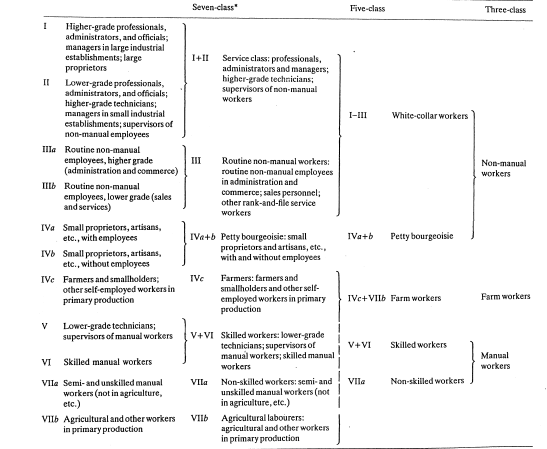
```

```{r egp1, echo=FALSE, fig.cap= "Esquema de clases EGP. Fuente: Erikson y Goldthorpe (1992)", warning=FALSE, message=FALSE, eval = !knitr::is_html_output()}
egp1 <- data.frame(c1 = c("I. Profesionales, administradores y oficiales de alto nivel; Directivos de grandes establecimientos industriales; Propietarios de grandes empresas", 
                          "II. Profesionales, administradores y oficiales de bajo nivel; Directivos de pequeños establecimientos industriales; Supervisores de trabajadores no manuales", 
                          "IIIa. Empleados de rutina no manuales de alto nivel (administración y comercio)",
                          "IIIb. Empleados de rutina no manual de bajo nivel (ventas y servicios)",
                          "IVa. Pequeños propietarios, artesanos con empleados",
                          "IVb. Pequeños propietarios, artesanos sin empleados",
                          "IVc. Agricultores, arrendatarios y otros trabajadores cuenta propia en el sector agrícola",
                          "V. Técnicos de nivel inferior, supervisores de trabajos manuales",
                          "VI. Trabajadores manuales calificados",
                          "VIIa. Trabajadores manuales semicalificados y no calificados",
                          "VIIb. Trabajadores agrícolas"),
                   c2 = c("Clase de servicio (I + II)", 
                          "Clase de servicio (I + II)",
                          "Trabajadores de rutina no manuales (IIIa + IIIb)",
                          "Trabajadores de rutina no manuales (IIIa + IIIb)",
                          "Pequeña burguesía (IVa + IVb)",
                          "Pequeña burguesía (IVa + IVb)",
                          "Agricultores y arrendatarios (IVc)",
                          "Trabajadores calificados (V + VI)",
                          "Trabajadores calificados (V + VI)",
                          "Trabajadores no calificados (VIIa)",
                          "Trabajadores agrícolas (VIIb)"),
                   c3 = c("Trabajadores de cuello blanco (I + II + III)",
                          "Trabajadores de cuello blanco (I + II + III)",
                          "Trabajadores de cuello blanco (I + II + III)",
                          "Trabajadores de cuello blanco (I + II + III)",
                          "Pequeña burguesía (IVa + IVb)",
                          "Pequeña burguesía (IVa + IVb)",
                          "Trabajadores agrícolas (IVc + VIIb)",
                          "Trabajadores calificados (V + VI)",
                          "Trabajadores calificados (V + VI)",
                          "Trabajadores no calificados (VIIa)",
                          "Trabajadores no calificados (VIIa)")
)

                                   
egp1 %>% 
  flextable() %>% 
  set_table_properties(width = 1, layout = "autofit") %>% 
  set_header_labels(c1 = "11 clases", c2 = "7 clases", c3 = "5 clases") %>% 
  bold(part = "header") %>% 
  merge_v(j = c("c2", "c3")) %>%
  align(part = "header", align = "center") %>% 
  set_caption("Esquema de clases EGP") %>% 
  add_footer_row(values = "Fuente: Erikson y Goldthorpe (1992)", colwidths = 3) %>% 
  fontsize(part = "all", size = 10)

```


Si bien existe bibliografía [@Erikson1992; @Rose.Harrison2007] en la que se señalan algunos indicios sobre cómo operacionalizar el esquema EGP, no hay una forma directa y unívoca de realizarlo. Goldthorpe y Heath [-@Goldthorpe.Heath1992] han realizado el ejercicio de operacionalización del mismo, pero para ser utilizado con la clasificación estandarizada de ocupaciones inglesa, que se diferencia tanto de la CIUO-88 como de la CIUO-08. A continuación mostramos una página de dicho trabajo donde se aprecia, en la primera columna, la clasificación ocupacional utilizada, mientras que en las siguientes se observan las otras variables utilizadas: carácter manual / no manual de la ocupación y categoría ocupacional (*employment status*). Cada celda representa una posible posición de clase, derivada de la combinación de categorías. Los números dan cuenta de a qué clase apunta cada combinación. 

```{r fig.cap= "Tabla de operacionalización del esquema EGP original. Fuente: Goldthorpe y Heath (1992)", fig.align='center', out.width = '80%', echo=FALSE}
knitr::include_graphics("imagenes/clasificacion_egp.png")
```

Comúnmente, los investigadores interesados en utilizar la clasificación han partido de una adaptación realizada por Ganzeboom para SPSS ^[[http://www.harryganzeboom.nl/isco88/index.htm](http://www.harryganzeboom.nl/isco88/index.htm)], a partir del clasificador ocupacional CIUO-88. Existe un paquete para **```R```** llamado ```ocuppar```, que retoma la propuesta de Ganzeboom para ser utilizada bajo dicho programa. En el apartado siguiente, a modo de ejemplo retomaremos dicha propuesta de operacionalización.  

#### Esquema de Wright  

Como hemos señalado en el [capítulo 2](#estructura1), Wright ha presentado dos propuestas operacionalizables de clases, desde un enfoque neo-marxista: uno basado en las posiciones de las relaciones de clase y otro de las explotaciones múltiples. En este caso presentaremos los principales criterios abordados por el autor para el desarrollo de la segunda propuesta ^[La propuesta de operacionalización del enfoque de posiciones contradictorias puede encontrarse en Wright [-@Wright1979].  

Influenciado por el marxismo analítico, Wright identificó cuatro tipos de bienes de explotación posibles de ser relevamos empíricamente, y que se traducen en los diferentes tipos de derechos y poderes (recursos tangibles e intangibles) que tienen los sujetos en las relaciones de producción [@Wright2005]:  
1. **Fuerza de trabajo** (explotación feudal),  
2. Los **medios de producción** (explotación capitalista),  
3. Los **bienes de organización** (explotación estatal) y  
4. Las **cualificaciones** (explotación socialista)   

De este modo, la combinación de esos cuatro tipos de bienes de explotación, permiten la generación de 12 posiciones de clase, tal como se observa en el siguiente gráfico:

```{r fig.cap= "Tipología de las posiciones de clase en la sociedad capitalista. Wright (1994)", fig.align='center', out.width = '80%', echo=FALSE, eval = knitr::is_html_output()}
knitr::include_graphics("imagenes/wright1.png")
```


```{r fig.cap= "Tipología de las posiciones de clase en la sociedad capitalista. Wright (1994)", fig.align='center', out.width = '80%', echo=FALSE, eval = !knitr::is_html_output()}
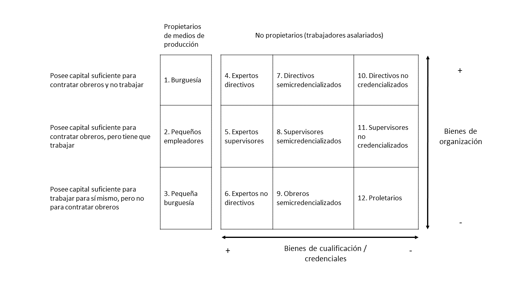
```


Ahora bien, ¿Cómo llega Wright a operacionalizar dicho esquema? En este sentido, el autor es bastante franco y sincero ya que explicita todas sus decisiones y limitaciones, señalando que de este modo "los que lo deseen puedan repetir los resultados que aquí hemos presentado, y hará también que nuestras decisiones operacionales queden lo más abiertas posibles a la crítica" [@Wright1994b]. Esto es de vital importancia en el campo científico, en donde la posibilidad de reproducir los resultados realizados en distintos contextos de investigación.  

Es necesario aclarar que para abordar la estructura de clases desde el enfoque propuesto por Wright se torna crucial realizar un relevamiento que recabe ciertos indicadores específicos vinculados directamente con el enfoque teórico del que parte el autor ^[Una revisión de los items relevados por Wright para la construcción de sus indicadores específicos que constituyen su tipología de clases, pueden encontrarse en Wright [-@Wright1994b, pp. 331-345]]. En este sentido, el proceso de operacionalización, si lo pensamos en términos inversos, es decir, desde los indicadores (variables brutas) a la variable que mide el sistema de clases, puede ser pensado del siguiente modo:  

```{r fig.cap= "Pasos globales en la construcción de la tipología de clases. Wright (1994)", fig.align='center', out.width = '80%', echo=FALSE, eval = knitr::is_html_output()}
knitr::include_graphics("imagenes/wright2.png")
```


```{r fig.cap= "Pasos globales en la construcción de la tipología de clases. Wright (1994)", fig.align='center', out.width = '80%', echo=FALSE, eval = !knitr::is_html_output()}
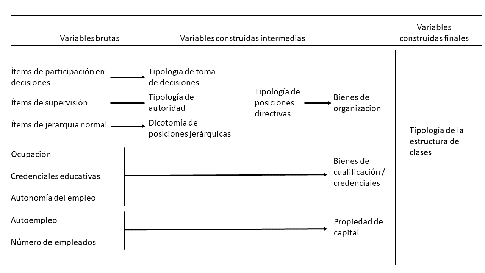
```

Por ejemplo, tomando una de las dimensiones más complejas a ser medidas como los **bienes de organización**, el autor construye dos tipologías (de toma de decisiones y de autoridad) y una categoría dicotómica de posiciones jerárquicas que derivan luego en una tipología de posiciones directivas, Tabla \@ref(fig:wright3). 

```{r fig.cap= "Construcción tipología bienes de organización. Wright (1994)", fig.align='center', out.width = '80%', echo=FALSE, eval = knitr::is_html_output()}
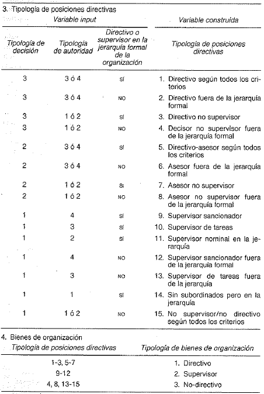
```

```{r wright3, echo=FALSE, fig.cap = "Tipología de posiciones directivas", warning=FALSE, message=FALSE, eval = !knitr::is_html_output()}
wright3 <- data.frame(c1 = c("3", "3", "3", "3", "2", "2", "2", "2", "1", "1",
                          "1", "1", "1", "1", "1"),
                      c2  = c("3 o 4", "3 o 4", "1 o 2", "1 o 2", "3 o 4", "3 o 4",
                          "1 o 2", "1 o 2", "4", "3", "2", "4", "3", "1", "1 o 2"),
                      c3 = c("Sí", "No", "Sí", "No", "Sí", "No", "Sí", "No", "Sí", "Sí", "Sí", "No", "No", "Sí", "No"),
                      c4 = c("1. Directivo según todos los criterios",
                          "2. Directivo fuera de la jerarquía formal",
                          "3. Directivo no supervisor",
                          "4. Decisor no supervisor fuera de jerarquía formal",
                          "5. Directivo-asesor según todos los critarios",
                          "6. Asesor fuera de la jerarquía formal",
                          "7. Asesor no supervisor",
                          "8. Asesor no supervisor fuera de la jerarquía formal",
                          "9. Supervisor sancionador",
                          "10. Supervisor de tareas",
                          "11. Supervisor nominal en la jerarquía",
                          "12. Supervisor sancionador fuera de la jerarquía formal",
                          "13. Supervisor de tareas fuera de la jerarquía",
                          "14. Sin subordinados pero en la jerarquía",
                          "15. No supervisor / no directivo según todos los criterios"))

                                   
wright3 %>% 
  flextable() %>% 
  set_table_properties(width = 1, layout = "autofit") %>%
  set_header_labels(c1 = "Tipología de decisión", c2 ="Tipología de decisión", 
                    c3 = "Directivo o supervisor en la jerarquía formal de la organización",
                    c4 = "Tipología de posiciones directivas") %>% 
  add_header_row(values = c("Variable input", "Variable construida"), colwidths = c(3, 1)) %>% 
  bold(part = "header") %>% 
  align(part = "header", align = "center") %>%
  align(part = "body", j = c("c1", "c2", "c3"), align = "center") %>% 
  set_caption("Tipología de posiciones directivas") %>% 
  add_footer_row(values = "Fuente: Wright (1994)", colwidths = 4) %>% 
  fontsize(part = "all", size = 10)

```

```{r, echo=FALSE, warning=FALSE, message=FALSE, eval = !knitr::is_html_output()}
wright4 <- data.frame(c1 = c("1-3; 5-7", "9-12", "4-8; 13-15"),
                      c2 = c("1. Directivo", "2. Supervisor", "3. No-directivo"))

wright4 %>% 
  flextable() %>% 
  set_table_properties(width = 1, layout = "autofit") %>%
  set_header_labels(c1 = "Tipología de posiciones directivas", 
                    c2 = "Tipología de bienes de organización") %>% 
  bold(part = "header") %>% 
  align(part = "all", align = "center") %>%
  set_caption("Bienes de organización") %>% 
  add_footer_row(values = "Fuente: Wright (1994)", colwidths = 2) %>% 
  fontsize(part = "all", size = 10)
```

Finalmente la tipología de bienes de organización, permite discriminar a las personas en función de si son directivos, supervisores o no-directivos. Como pudimos ver, para llegar a esa tipología, distintas operaciones complejas debieron realizarse desde los indicadores relevados hasta la construcción de tipologías intermedias.

#### Propuestas gradacionales 

Los enfoques de tipo gradacional son tributarios del paradigma estructural-funcionalista que ha orientado a las ciencias sociales durante gran parte de la mitad del siglo XX. Dichas propuestas sostienen básicamente que partiendo de las características atributivas (ingresos, estatus, prestigio), los individuos son posicionados en un *continuum* en el que las fronteras de clase se tornan difusas. A diferencia de los enfoques (neo)marxistas o (neo)weberianos, estas propuestas de medición ponen el eje en el carácter jerárquico de las ocupaciones, principalmente en función de la importancia de las mismas en relación al conjunto del sistema social, el prestigio y las recompensas materiales que se derivan de las posiciones ocupadas [@Ossowski2003; @Wright1979; @Parsons1954].

En términos operacionales, estas gradaciones pueden constituirse de forma simple o sintética en función de cuantas variables intervengan en su determinación. Asimismo, los aspectos a medir pueden tener una naturaleza objetiva o subjetiva [@CachonRodriguez1989]. Sin embargo, su utilización en estudios internacionales, no sólo se explica por su fundamentación teórica, sino también por las ventajas metodológicas que su utilización implica. Por un lado, son escalas de medición con un gran nivel de estandarización, por lo que pueden ser utilizadas a partir de la información socio-ocupacional relevada en todos los países. Por el otro, su carácter continuo garantiza la aplicabilidad de diversas técnicas frecuentemente utilizadas como regresiones lineales, *path analysis* o análisis factoriales.  

De esta forma, si bien existe un número importante de enfoques gradacionales de ocupación, señalaremos brevemente dos de los más relevantes: la Standard International Occupational Prestige Scale (SIOPS) de Treiman y el Internacional Socio-Economic Index (ISEI) de Treiman, Ganzeboom y de Graaf [@Bergman.Joye2001; @FrancesGarcia2009]. Ambos toman a la ocupación como el indicador principal del posicionamiento en la jerarquía social, pero mientras uno mide el prestigio de las ocupaciones, el otro cuantifica el estatus socioeconómico de las mismas.

El primero de estos (SIOPS), hace referencia a las clásicas escalas de prestigio ocupacional que, basadas en indicadores subjetivos, relevaron el grado de aprobación y respeto que presentaba un set de ocupaciones para las distintas personas. Según Treiman, los puntajes de prestigio obtenidos eran similares entre distintos sectores poblacionales (ricos o pobres, jóvenes o viejos) y entre distintos países del mundo. El prestigo, de este modo, era un proxy válido de la importancia funcional que las ocupaciones presentaban en la sociedad. En términos operativos, dicha escala recopila las puntuaciones medias de prestigio de aproximadamente 60 países, utilizando como base la CIUO-68. A continuación presentamos, a modo de ejemplo, las puntuaciones de 20 ocupaciones seleccionadas, entre las 509 rankeadas en total [@Treiman1977].  

```{r fig.cap= "Puntajes estandard ordenados de 20 ocupaciones seleccionadas a partir de la escala SIOPS. Treiman(1977)", fig.align='center', out.width = '80%', echo=FALSE, eval = knitr::is_html_output()}
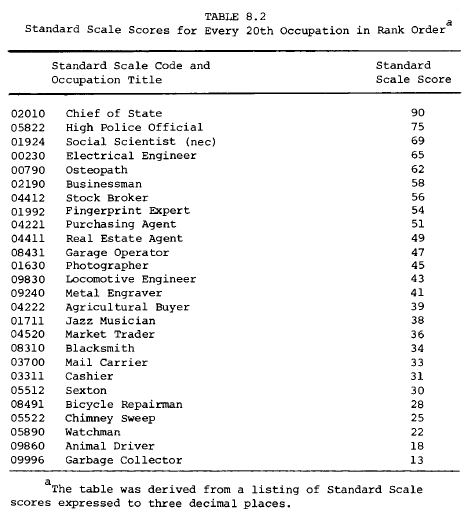
```

```{r, echo=FALSE, warning=FALSE, message=FALSE, eval = !knitr::is_html_output()}
siops <- data.frame(c1 = c("Jefe de Estado", "Oficial de policía de alto grado", "Científico social",
                           "Ingeniero eléctrico", "Osteópata", "Empresario", "Corredor de bolsa",
                           "Experto en huellas dactilares", "Agente de ventas", "Agente inmobiliario",
                           "Operador de garage", "Fotógrafo", "Ingeniero en locomotoras",
                           "Grabador de metales", "Contratista agrícola", "Músico de Jazz",
                           "Comerciante", "Herrero", "Cartero", "Cajero", "Sacristán", 
                           "Reparador de bicicletas", "Deshollinador", "Sereno", 
                           "Transportista de animales", "Recolector de residuos"),
                    c2 = c("90", "75", "69", "65", "62", "58", "56", "54", "51", "49", "47", "45", "43",
                           "41", "39", "38", "36", "34", "33", "31", "30", "28", "25", "22", "18", "13"))

                                   
siops %>% 
  flextable() %>% 
  set_table_properties(width = .5, layout = "autofit") %>%
  set_header_labels(c1 = "Ocupación", c2 = "Puntaje estandard") %>% 
  bold(part = "header") %>% 
  align(part = "header", j = "c2", align = "center") %>%
  align(part = "body", j = "c2", align = "center") %>% 
  set_caption("Puntajes estandard ordenados de 20 ocupaciones seleccionadas a partir de la escala SIOPS") %>% 
  add_footer_row(values = "Fuente: Treiman (1997)", colwidths = 2) %>% 
  fontsize(part = "all", size = 10)

```

Como puede observarse dentro de las ocupaciones más prestigiosas se encuentran la de "jefe de estado" y "alto oficial de policía", mientras que las de menos puntaje están el "recolector de basura" y el "transportista de animales".  

La otra familia de escalas continuas de ocupación pueden representarse a partir del **ISEI**. En tanto índice socioeconómico, es construido a partir de información objetiva, específicamente de la suma ponderada de información de ingresos y del nivel educativo. Una primera versión de los índices elaborados con este método es el *Socio-Economic Index* (SEI) elaborado por Duncan en 1961 sobre la estructura ocupacional de Estados Unidos [@Blau.Duncan1967; @Duncan.Hodge1963]. En particular, el **SEI** se construía a partir de un análisis de regresión en el que se consideraba el prestigio ocupacional de 45 ocupaciones de 1949 como variable dependiente y los ingresos medios y el nivel educativo como variables independientes, controlando por la edad. De este modo, con los resultados de la ecuación se podían estimar los puntajes de estatus de todo el rango de ocupaciones de la fuerza de trabajo. Para su construcción, Duncan utilizó los títulos de prestigio ocupacional presentes en el estudio sobre prestigio (NORC) de 1947 de North-Hatt y el censo de Estados Unidos de 1950. En la Tabla \@ref(tab:sei) se resumen algunas de las ocupaciones que conforman el **SEI** y su puntaje estimado.

```{r fig.cap= "Ranking ocupaciones según escala SEI. Blau y Duncan (1967)", fig.align='center', out.width = '50%', echo=FALSE, eval = knitr::is_html_output()}
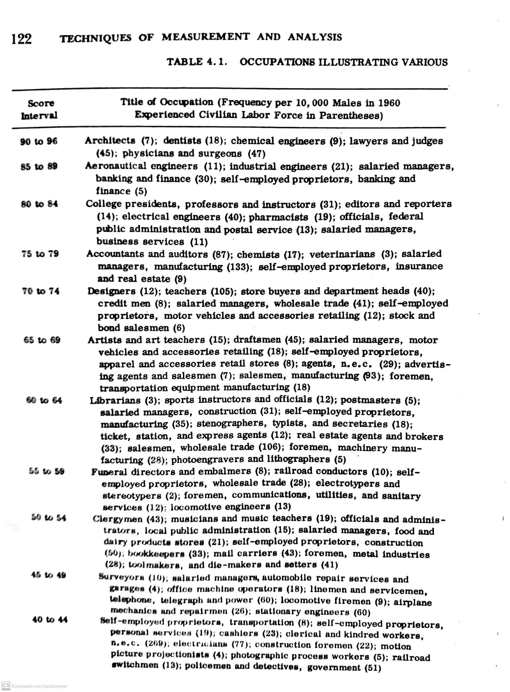
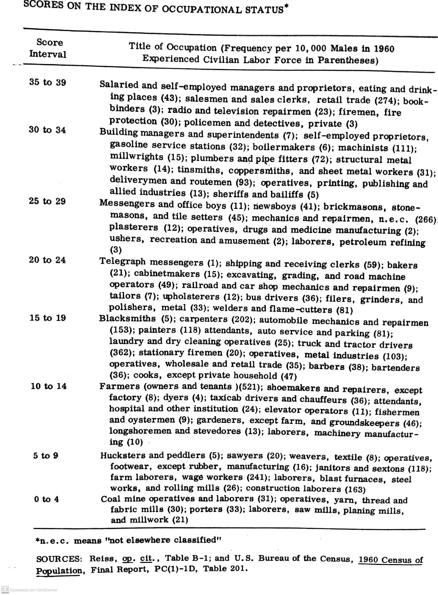
```


```{r sei, echo=FALSE, warning=FALSE, message=FALSE, eval = !knitr::is_html_output()}
sei <- data.frame(c1 = c("90-96", "85-89", "80-84", "75-79", "70-74", "65-69", "60-64", "55-59",
                         "50-54", "45-49", "40-44", "35-39", "30-34", "25-29", "20-24", "15-19",
                         "10-14", "5-9", "0-4"),
                  c2 = c("Arquitectos, dentistas, ingenieros químicos", 
                         "Ingenieros aeronáuticos,ingenieros industriales, gerentes de bancos",
                         "Profesores universitarios, editores y reporteros, ingenieros eléctricos",
                         "Contadores y auditores, químicos, veterinarios",
                         "Diseñadores, maestros, jefes de departamento",
                         "Artistas y maestros de arte, dibujantes, gerentes de ventas de vehículos",
                         "Bibliotecarios, instructores de deportes, administradores de correo",
                         "Directores de funerarias y embalsamadores, conductor ferroviario, propietario de tiendas",
                         "Clérigos, músicos y maestros de música, oficiales y admistradores públicos",
                         "Topógrafos, gerentes de talleres de automóviles, operadores de maquinarias de oficina",
                         "Propietario de transporte, cajeros, electricistas",
                         "Vendedores de comercio, encuadernadores, reparadores de TV y radio",
                         "Administradores de edificios, propietarios de gasolinerías, caldereros",
                         "Mensajeros, albañiles, yeseros",
                         "Mensajeros telegráficos, panaderos, choferes de autobuses",
                         "Herreros, carpinteros, pintores",
                         "Agricultores, zapateros, tintoreros",
                         "Vendedores ambulantes, conserjes, trabajadores de la construcción",
                         "Trabajadores de minas, porteros, trabajadores de molino"))
                                   
sei %>% 
  flextable() %>% 
  set_table_properties(width = 1, layout = "autofit") %>%
  set_header_labels(c1 = "Intervalo de puntaje", c2 = "Ocupaciones de ejemplo") %>% 
  bold(part = "header") %>%
  align(part = "all", j = "c1", align = "center") %>% 
  set_caption("Ranking ocupaciones según escala SEI. Ejemplos.") %>% 
  add_footer_row(values = "Fuente: elaboración propia en base a Blau y Duncan (1967)", colwidths = 2) %>% 
  fontsize(part = "all", size = 10)

```

Posteriormente, Ganzeboom, Treiman y de Graaf [-@Ganzeboom.etal1992] modificaron la ecuación de cálculo del SEI, considerando los efectos directos e indirectos de la educación, la edad y la ocupación sobre los ingresos, para elaborar el nuevo índice internacional. Asimismo, la construcción del **ISEI** implicó el uso 31 fuentes de información de 16 países entre 1968 y 1982. A diferencia de Duncan, estos autores no tuvieron en cuenta al prestigio de las ocupaciones durante la construcción del índice, que fue actualizado en dos ocasiones posteriormente. En la Tabla \@ref(tab:isei), se muestran los puntajes obtenidos a mayor y menor nivel de agregación para las primeras ocupaciones de la CIUO-68.

```{r fig.cap= "Puntajes del ISEI de las primeras ocupaciones de la CIUO. Ganzeboom, Treiman y de Graaf (1992)", fig.align='center', out.width = '80%', echo=FALSE, eval = knitr::is_html_output()}
knitr::include_graphics("imagenes/isei.png")
```


```{r isei, echo=FALSE, fig.cap= "Puntajes del ISEI de las primeras ocupaciones de la CIUO. Ganzeboom, Treiman y de Graaf (1992)", warning=FALSE, message=FALSE, eval = !knitr::is_html_output()}
isei <- data.frame(c1 = c("0/1000", "0100", "0100", "0120", "0130", "0140", "0200", "0210", "0220",
                         "0230", "0240", "0250", "0260", "0270", "0280", "0290", "0300",
                         "0310", "0320", "0330", "0340"),
                  c2 = c("Profesionales, técnicos y trabajadores relacionados",
                         "CIENTÍFICOS DE LA FÍSICA Y TÉCNICOS RELACIONADOS",
                         "Químicos", 
                         "Físicos",
                         "Otros científicos físicos",
                         "Técnicos en ciencias de la física",
                         "ARQUITECTOS E INGENIEROS",
                         "Arquitectos",
                         "Ingenieros civiles",
                         "Ingenieros eléctricos y electrónicos",
                         "Ingenieros mecánicos",
                         "Ingenieros químicos",
                         "Metalúrgicos",
                         "Ingenieros en minas",
                         "Ingenieros industriales",
                         "Otros ingenieros",
                         "TÉCNICOS - INGENIEROS",
                         "Topógrafos",
                         "Dibujantes",
                         "Técnicos en ingeniería civil",
                         "Técnicos en ingeniería electrónica y eléctrica"),
                  c3 = c("67", "", "", "", "", "", "", "", "", "", "", "", "", "", "", "", "", "", "",
                         "", ""),
                  c4 = c("", "62", "", "", "", "", "71", "", "", "", "", "", "", "", "", "", "53", "", 
                         "", "", ""),
                  c5 = c("", "", "73", "79", "79", "47", "", "77", "73", "69", "68", "73", "70", "65",
                         "65", "76", "", "58", "53", "50", "48"))
                                   
isei %>% 
  flextable() %>% 
  set_table_properties(width = 1, layout = "autofit") %>%
  set_header_labels(c1 = "", c2 = "Nombre de las ocupaciones", c3 = "Gran grupo", c4 = "Grupo menor",
                    c5 = "Grupo unitario") %>% 
  bold(part = "header") %>%
  bold(i = 1) %>% 
  align(part = "all", j = c("c3", "c4", "c5"), align = "center") %>% 
  set_caption("Puntajes del ISEI de las primeras ocupaciones de la CIUO-68 (selección de casos).") %>% 
  add_footer_row(values = "Fuente: elaboración propia en base a Ganzeboom, Treiman y de Graaf (1992)",
                 colwidths = 5) %>% 
  fontsize(part = "all", size = 10)

```


Al igual que en el caso del esquema EGP, en la página de Harry Ganzeboom ^[[http://www.harryganzeboom.nl/isco08/](http://www.harryganzeboom.nl/isco08/)] puede encontrarse información y las sintaxis para SPSS de clasificación del ISEI y SIOPS partiendo de la CIUO-88. El paquete **```ocuppar```** para ```R``` también permite su construcción automática.  

### Esquemas nacionales

#### Propuesta de Germani

Gino Germani, además de ser reconocido como uno de los fundadores de la sociología académica argentina, fue uno de los pioneros en el estudio de las clases sociales a partir de información censal y de encuestas de hogares. Tal como señala Murmis [@Germani.etal2010] su enfoque ecléctico, estuvo influenciado tanto por la escuela marxista como por la funcionalista y por los estudios norteamericanos de estratificación social vinculados al análisis estadístico.  

Centrándonos en sus libros y artículos más importantes [@Germani1955; @Germani1963; @Germani2010] si bien su aproximación empírica a la cuestión se baso en el uso de esquemas de clases sociales, también ha utilizado escalas de nivel socio-económico (relevando diversos aspectos objetivos de la posición de los individuos) y escalas de prestigio. Sin embargo, aquí haremos un breve repaso de su propuesta de operacionalización de las clases sociales.

Para el autor, las clases sociales presentaban tres características centrales:

* Eran formas de agrupación que tenían un rol central en el funcionamiento y organización de las sociedades;

* no eran meras nominaciones científicas, sino que tenían una existencia sociológica real;

* No podían explicarse únicamente a través de la información ocupacional, sino que deberían considerarse aspectos psicosociales y ligados al "tipo de existencia" de los individuos, aunque existan limitaciones en los datos para abordar dicha dimensión.

Asimismo, Germani señaló que su propuesta de operacionalización podía ser modificada y adaptada en el tiempo ya que era en vano buscar una discriminación neta de dichos agrupamientos debido a la complejidad de combinaciones entre criterios estructurales y psicosociales. Las clases, entonces, se definían a partir de un criterio espacial y probabilístico, es decir, como “zonas de la estructura social en la que cierta combinación de criterios se da con mayor frecuencia estadística” [@Germani1955, pp. 143].

Respecto al esquema de clasificación propuesto por el autor, el mismo recurre a “la convencional clasificación tripartita” de clase alta, media y popular [-@Germani1955, pp. 146]. La clase alta, debido a su bajo peso poblacional, es incluida dentro de las clases medias. Asimismo, tanto las clases populares como las clases medias son desagregadas según sector de actividad (sector urbano y sector rural) y de acuerdo a su estatus ocupacional (trabajadores dependientes e independientes) [-@Germani1955, pp. 146-147]. La frontera entre ambas clases se basaba en la distinción manual / no manual del trabajo, existiendo una amplia heterogeneidad dentro de cada agregado (Tabla \@ref(tab:germani)).

```{r fig.cap= "Esquema de clases de Gino Germani (Germani, 1955)", fig.align='center', out.width = '80%', echo=FALSE, eval = knitr::is_html_output()}
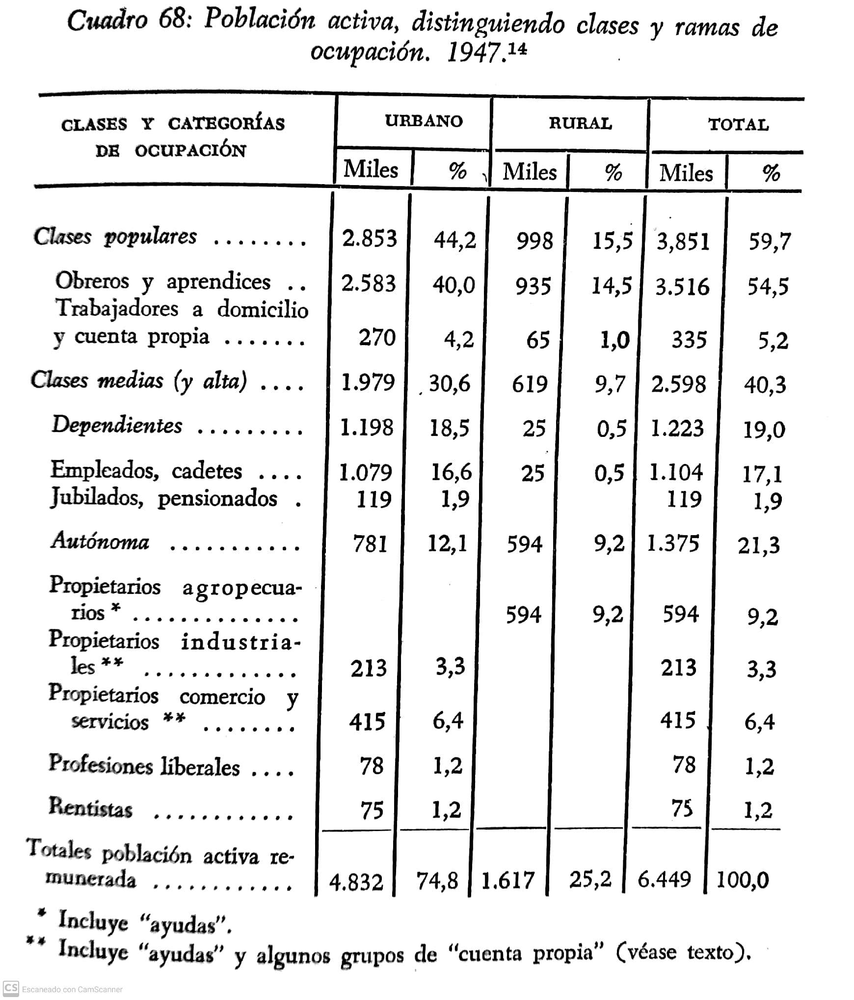
```

```{r fig.cap= "Esquema de clases de Gino Germani (Germani, 1963)", fig.align='center', out.width = '80%', echo=FALSE, eval = knitr::is_html_output()}
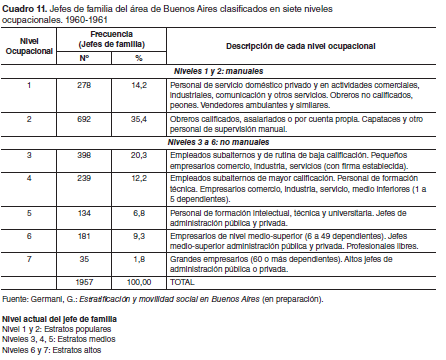
```

```{r germani,fig.cap= "Esquema de clases de Gino Germani (Germani, 1963)", echo=FALSE, warning=FALSE, message=FALSE, eval = !knitr::is_html_output()}
germani <- data.frame(c1 = c("Obreros y aprendices", "Trabajadores a domicilio y cuenta propia",
                      "DEPENDIENTES", "Empleados, cadetes", "Jubilados, pensionados",
                      "AUTÓNOMOS", "Propietarios agropecuarios", "Propietarios industriales",
                      "Propietarios comercio y servicios", "Profesionales liberales", "Rentistas"),
                      c2 = c("Clases Populares", "Clases Populares", 
                             "Clases medias (y alta)", "Clases medias (y alta)", 
                             "Clases medias (y alta)", "Clases medias (y alta)", 
                             "Clases medias (y alta)", "Clases medias (y alta)",
                             "Clases medias (y alta)", "Clases medias (y alta)",
                             "Clases medias (y alta)")
                      )
                                   
germani %>% 
  flextable() %>% 
  set_table_properties(width = .5, layout = "autofit") %>%
  set_header_labels(c1 = "Categorías de ocupación", c2 = "Clases sociales") %>% 
  bold(part = "header") %>%
  merge_v(j = "c2") %>%
  hline(i = 2, border = officer::fp_border(color = "black")) %>% 
  set_caption("Esquema de clases de Gino Germani (1955)") %>% 
  add_footer_row(values = "Fuente: elaboración propia en base a Germani (1955)",
                 colwidths = 2) %>% 
  fontsize(part = "all", size = 10)

```

#### Propuesta de Torrado  

En tanto continuadora de la tradición inaugurada por Germani, Susana Torrado aportó un formato de medición específico para el análisis de la estructura de clases argentina. La propuesta de la autora tiene, al menos dos versiones operacionalizables: una primigenia, producto de su trabajo en colaboración con de Ipola [@Ipola1976] y una versión posterior, más acabada, que constituyó la base de su obra “Estructura social de la Argentina” [@Torrado1992] y que fue resultado de diversas intentos de clasificación [@CFI1988; @Torrado.Rofman1988].  

En palabras de la autora, su propuesta de esquema de clases mantenía un compromiso con tres de los principales enfoques de estratificación existentes: el “funcionalista”, que tiende a ofrecer una visión jerárquica de la estructura; el “materialista”, que define a las clases en función a las relaciones de producción y el “estadístico” o “pragmático” que hace hincapié en la utilización de categorías homogéneas que permitan comparabilidad de la información estadística [@Torrado1998d].

Torrado acude a cinco variables que conformarán lo que podríamos denominar como el “esqueleto” de las clases sociales:  

* la ocupación;  
* la categoría ocupacional;
* el sector de actividad;
* el tamaño del establecimiento y  
* la rama de actividad.  

Particularmente la ocupación, captada a partir de la CIUO-68, es re-clasificada para conformar nueve grupos de ocupación (GO) (Tabla \@ref(tab:torrado1)): 1) Empresarios, directores de empresas y funcionarios públicos superiores; 2) Propietarios de establecimientos; 3) Profesionales en función específica; 4) Técnicos, docentes y supervisores; 5) Empleados y vendedores; 6) Trabajadores especializados; 7) Trabajadores no especializados; 8) Empleados domésticos y 9) Sin especificar.  

```{r fig.cap= "Cruce de variables socio-ocupacionales y generación de estratos socales (Torrado, 1998)", fig.align='center', out.width = '80%', echo=FALSE, eval = knitr::is_html_output()}
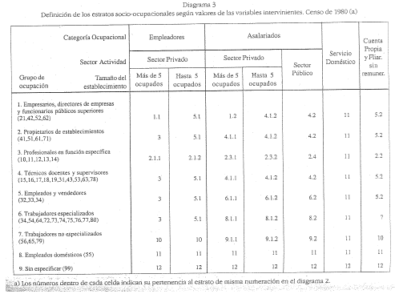
```

```{r torrado1, fig.cap= "Cruce de variables socio-ocupacionales y generación de estratos socales (Torrado, 1998)", echo=FALSE, warning=FALSE, message=FALSE, eval = !knitr::is_html_output()}
torrado1 <- data.frame(c1 = c("Grupo de ocupación",
                              "Grupo de ocupación",
                              "Grupo de ocupación",
                              "1. Empresarios, directores de empresas y funcionarios públicos superiores",
                              "2. Propietarios de establecimientos",
                              "3. Profesionales en función específica",
                              "4. Técnicos, docentes y supervisores",
                              "5. Empleados y vendedores",
                              "6. Trabajadores especializados",
                              "7. Trabajadores no especializados",
                              "8. Empleados domésticos",
                              "9. Sin especificar"),
                       c2 = c("Empleadores", "Sector privado", "Más de 5 ocupados",
                              "1.1", "3", "2.1.1", "3", "3", "3", "10", "11", "12"),
                       c3 = c("Empleadores", "Sector privado", "Hasta 5 ocupados",
                              "5.1", "5.1", "2.1.2", "5.1", "5.1", "5.1", "10", "11", "12"),
                       c4 = c("Asalariados", "Sector privado", "Más de 5 ocupados",
                              "1.2", "4.1.1", "2.3.1", "4.1.1", "6.1.1", "8.1.1", "9.1.1", "11", "12"),
                       c5 = c("Asalariados", "Sector privado", "Hasta 5 ocupados",
                              "4.1.2", "4.1.2", "2.3.2", "4.1.2", "6.1.2", "8.1.2", "9.1.2", "11", "12"),
                       c6 = c("Asalariados", "Sector público", "Sector público",
                              "4.2", "4.2", "2.4", "4.2", "6.2", "8.2", "9.2", "11", "12"),
                       c7 = c("Servicio doméstico", "Servicio doméstico", "Servicio doméstico",
                              "11", "11", "11", "11", "11", "11", "11", "11", "12"),
                       c8 = c("Cuenta propia y familiar sin remuneración",
                              "Cuenta propia y familiar sin remuneración", 
                              "Cuenta propia y familiar sin remuneración", 
                              "5.2", "5.2", "2.2", "5.2", "5.2", "7", "10", "11", "12"))
                      
                                   
torrado1 %>% 
  flextable() %>% 
  set_table_properties(width = 1, layout = "autofit") %>%
  delete_part(part = "header") %>%
  merge_v(j = 1:8) %>% 
  merge_h(i = 1) %>% 
  align(i = 1:3, align = "center") %>% 
  align(j = 2:8, align = "center") %>% 
  bold(i = 1:3) %>% 
  set_caption("Cruce de variables socio-ocupacionales y generación de estratos socales") %>% 
  add_footer_row(values = "Fuente: elaboración propia en base a Torrado (1998)",
                 colwidths = 8) %>% 
  fontsize(part = "all", size = 10) %>% 
  border(part = "body", border = officer::fp_border(color = "black"))

```

De este modo, del entrecruzamiento de las distintas variables se genera una estratificación socio-ocupacional que presentamos a continuación (Tabla \@ref(tab:torrado2)), y que da lugar al clasificador de la **Condición Socio-Ocupacional** (CSO) en su versión desagregada.  

```{r, fig.cap= "Nomenclador de la Condición Socio-Ocupacional desagregado (Torrado, 1998)", fig.align='center', out.width = '80%', echo=FALSE, eval = knitr::is_html_output()}
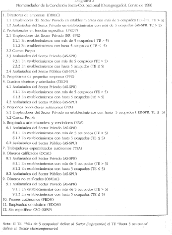
```

```{r torrado2, fig.cap= "Nomenclador de la Condición Socio-Ocupacional desagregado (Torrado, 1998)", echo=FALSE, warning=FALSE, message=FALSE, eval = !knitr::is_html_output()}
torrado2 <- data.frame(c1 = c("1", "1.1", "1.2", "2", "2.1", "2.1.1", "2.1.2", "2.2", "2.3", "2.3.1",
                              "2.3.2", "2.4", "3", "4", "4.1", "4.1.1", "4.1.2", "4.2", "5", "5.1",
                              "5.2", "6", "6.1", "6.1.1", "6.1.2", "6.2", "7", "8", "8.1", "8.1.1", "8.1.2",
                              "8.2", "9", "9.1", "9.1.1", "9.1.2", "9.2", "10", "11", "12"),
                       c2 = c("DIRECTORES DE EMPRESAS", 
                              "Empleadores del sector privado en establecimientos con más de cinco ocupados",
                              "Asalariados del sector privado en establecimientos con más de cinco ocupados",
                              "PROFESIONALES EN FUNCIÓN ESPECÍFICA",
                              "Empleadores del sector privado",
                              "En establecimientos con más de cinco ocupados",
                              "En establecimientos con hasta cinco ocupados",
                              "Cuenta propia",
                              "Asalariados del sector privado",
                              "En establecimientos con más de cinco ocupados",
                              "En establecimientos con hasta cinco ocupados",
                              "Asalariados del sector público",
                              "PROPIETARIOS DE PEQUEÑAS EMPRESAS",
                              "CUADROS TÉCNICOS Y ASIMILADOS",
                              "Asalariados del sector privado",
                              "En establecimientos con más de cinco ocupados",
                              "En establecimientos con hasta cinco ocupados",
                              "Asalariados del sector público",
                              "PEQUEÑOS PRODUCTORES AUTÓNOMOS",
                              "Empleadores del sector privado en establecimientos con hasta cinco ocupados",
                              "Cuenta propia",
                              "EMPLEADOS ADMINISTRATIVOS Y VENDEDORES",
                              "Asalariados del sector privado",
                              "En establecimientos con más de cinco ocupados",
                              "En establecimientos con hasta cinco ocupados",
                              "Asalariados del sector público",
                              "TRABAJADORES ESPECIALIZADOS AUTÓNOMOS",
                              "OBREROS CALIFICADOS",
                              "Asalariados del sector privado",
                              "En establecimientos con más de cinco ocupados",
                              "En establecimientos con hasta cinco ocupados",
                              "Asalariados del sector público",
                              "OBREROS NO CALIFICADOS",
                              "Asalariados del sector privado",
                              "En establecimientos con más de cinco ocupados",
                              "En establecimientos con hasta cinco ocupados",
                              "Asalariados del sector público",
                              "PEONES AUTÓNOMOS",
                              "EMPLEADOS DOMÉSTICOS",
                              "SIN ESPECIFICAR CSO"),
                       c3 = c("DIREC", "DIREC (ER - SPR. TE>5)", "DIREC (AS - SPR. TE>5)", "PROF",
                              "PROF (ER – SPR)", "PROF (ER- SPR. >5)", "PROF (ER- SPR. <=5)",
                              "PROF (CP)", "PROF (AS-SPR)", "PROF (AS- SPR. >5)", "PROF (AS- SPR. <=5)",
                              "PROF (AS- SPU)", "PPE", "TECN", "TECN (AS-SPR)", "TECN (AS -SPR. TE>5)",
                              "TECN (AS -SPR. TE<=5)", "TECN (AS -SPU)", "PPA", "PPA (ER - SPR. TE <=5)",
                              "PPA (CP)", "EAV", "EAV (AS-SPR)", "EAV (AS - SPR. TE>5)", 
                              "EAV (AS - SPR. TE<=5)", "EAV (AS - SPU)", "TEA", "OCAL", "OCAL (AS – SPR)",
                              "OCAL (AS - SPR. TE>5)", "OCAL (AS - SPR. TE<=5)", "OCAL (AS - SPU)",
                              "ONCAL", "ONCAL (AS – SPR)", "ONCAL (AS - SPR. TE>5)", 
                              "ONCAL (AS - SPR. TE<=5)", "ONCAL (AS - SPU)", "TMARG", "EDOM", "SESP"))

                      
                                   
torrado2 %>% 
  flextable() %>% 
  set_table_properties(width = .7, layout = "autofit") %>%
  set_header_labels(c1 = "Nº identificador", c2 = "Estrato socio-ocupacional", c3 = "Siglas") %>% 
  bold(part = "header") %>%
  align(part = "header", align = "center") %>% 
  align(j = c("c1", "c3"), align = "center") %>% 
  set_caption("Nomenclador de la Condición Socio-Ocupacional desagregado") %>% 
  add_footer_row(values = "Fuente: Torrado (1998)",
                 colwidths = 3) %>% 
  fontsize(part = "all", size = 8)

```

En su versión agregada el nomenclador discrimina once estratos socio-ocupacionales, mientras que en su versión desagregada, dichos estratos son subdivididos en función del sector de actividad y la categoría ocupacional. Mientras que la ocupación, la categoría ocupacional y el tamaño del establecimiento, permiten establecer diferenciaciones verticales en la estratificación (formando, según la autora, capas sociales), la rama y el sector de actividad, permite diferenciar a los estratos en términos horizontales, es decir, en fracciones de clase. Finalmente, el nomenclador puede ser agregado en tres clases sociales (Tabla \@ref(tab: torrado3)), definidas por la autora como clase alta, media y obrera, terminologías que “se relacionan más con la forma simbólica en que dichos colectivos existen en la cultura política argentina, que con una adhesión más explícita a algunas de las incontables teorizaciones existentes (…)” [@Torrado1998d, pp. 236].

```{r, fig.cap= "Sistema clasificatorio de la clase social (Torrado, 1998)", fig.align='center', out.width = '80%', echo=FALSE, eval = knitr::is_html_output()}
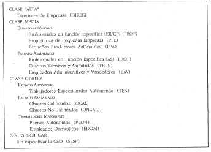
```

```{r torrado3, fig.cap= "Sistema clasificatorio de la clase social (Torrado, 1998)", echo=FALSE, warning=FALSE, message=FALSE, eval = !knitr::is_html_output()}
torrado3 <- data.frame(c1 = c("Clase alta", "Clase media", "Clase media", "Clase media",
                              "Clase media", "Clase media", "Clase media", "Clase obrera", "Clase obrera",
                              "Clase obrera", "Clase obrera", "Clase obrera"),
                       c2 = c("-", "Autónomos", "Autónomos", "Autónomos", "Asalariados", "Asalariados",
                              "Asalariados", "Autónomos", "Asalariados", "Asalariados", "Marginales",
                              "Marginales"),
                       c3 = c("Directores de empresa", "Profesionales en función específica",
                              "Propietarios de pequeñas empresas", "Pequeños productores autónomos",
                              "Profesionales en función específica", "Cuadros técnicos y asimilados",
                              "Empleados administrativos y vendedores", 
                              "Trabajadores especializados autónomos", "Obreros calificados",
                              "Obreros no calificados", "Peones autónomos", "Empleados domésticos"))
                      
                                   
torrado3 %>% 
  flextable() %>% 
  set_table_properties(width = .7, layout = "autofit") %>%
  set_header_labels(c1 = "Clase social", c2 = "Estratos sociales", c3 = "Estratos sociales") %>% 
  merge_v(j = 1:2) %>% 
  merge_h(i = 1) %>% 
  align(part = "header", align = "center") %>% 
  align(j = 1:2, align = "center") %>% 
  bold(part = "header") %>% 
  set_caption("Sistema clasificatorio de la clase social") %>% 
  add_footer_row(values = "Fuente: elaboración propia en base a Torrado (1998)",
                 colwidths = 3) %>% 
  fontsize(part = "all", size = 10) %>% 
  border(part = c("header"), border = officer::fp_border(color = "black")) %>% 
  border(part = c("body"), border = officer::fp_border(color = "black"))

```

## Operacionalización paso a paso {#operacion1}

Paquetes que utilizaremos en este subcapítulo:
```{r, message=FALSE, warning=FALSE}
library(tidyverse)
library(car)
library(summarytools)
```

En este apartado practicaremos el método de operacionalización tradicional. Usando como referencia el texto de "La medición empírica de las clases sociales" [@Torrado1998d], seguiremos los pasos de la autora para llegar en primer lugar a un nomenclador de la Condición Socio-Ocupacional (CSO) y posteriormente a un sistema de clases sociales de 3 clases que puede ser subdividido en estratos.  
Como hemos dicho la transformación de un concepto complejo como el de "clase social" a un esquema empírico que permita su medición, implica una serie de pasos en los que es necesario prestar atención y ser sumamente ordenado. Los pasos a seguir serán los siguientes:  
1. Presentaremos la propuesta de la autora, en la que señala como a partir de distintas combinaciones entre categorías de las variables consideradas surgen posiciones socio-ocupacionales.  

2. Transformaremos y crearemos algunas variables de la **EPH** necesarias para la construcción del esquema.  

3. Presentaremos el código para la construcción del nomenclador CSO.  

4. Crearemos el sistema clasificatorio de clases sociales y lo probaremos.  

### Punto de partida  

Como hemos señalado la autora parte de 5 variables para la construcción de su esquema de clases: la ocupación (agrupada en grupos ocupacionales), la categoría ocupacional, el sector de actividad, el tamaño del establecimiento y la rama de actividad (que no utilizaremos en este caso). A continuación presentamos la Tabla \@ref(tab:torrado4) de doble entrada que da lugar a las posiciones del nomenclador [@Torrado1998d, pp. 232], que ya hemos revisado en el apartado anterior:  

```{r fig.cap= "Cruce de variables socio-ocupacionales y generación de estratos socales", fig.align='center', out.width = '80%', echo=FALSE, eval = knitr::is_html_output()}
knitr::include_graphics("imagenes/torrado_cso.png")
```

```{r torrado4, fig.cap= "Cruce de variables socio-ocupacionales y generación de estratos socales", echo=FALSE, warning=FALSE, message=FALSE, eval = !knitr::is_html_output()}
torrado4 <- data.frame(c1 = c("Grupo de ocupación",
                              "Grupo de ocupación",
                              "Grupo de ocupación",
                              "1. Empresarios, directores de empresas y funcionarios públicos superiores",
                              "2. Propietarios de establecimientos",
                              "3. Profesionales en función específica",
                              "4. Técnicos, docentes y supervisores",
                              "5. Empleados y vendedores",
                              "6. Trabajadores especializados",
                              "7. Trabajadores no especializados",
                              "8. Empleados domésticos",
                              "9. Sin especificar"),
                       c2 = c("Empleadores", "Sector privado", "Más de 5 ocupados",
                              "1.1", "3", "2.1.1", "3", "3", "3", "10", "11", "12"),
                       c3 = c("Empleadores", "Sector privado", "Hasta 5 ocupados",
                              "5.1", "5.1", "2.1.2", "5.1", "5.1", "5.1", "10", "11", "12"),
                       c4 = c("Asalariados", "Sector privado", "Más de 5 ocupados",
                              "1.2", "4.1.1", "2.3.1", "4.1.1", "6.1.1", "8.1.1", "9.1.1", "11", "12"),
                       c5 = c("Asalariados", "Sector privado", "Hasta 5 ocupados",
                              "4.1.2", "4.1.2", "2.3.2", "4.1.2", "6.1.2", "8.1.2", "9.1.2", "11", "12"),
                       c6 = c("Asalariados", "Sector público", "Sector público",
                              "1.1*", "4.2", "2.4", "4.2", "6.2", "8.2", "9.2", "11", "12"),
                       c7 = c("Servicio doméstico", "Servicio doméstico", "Servicio doméstico",
                              "11", "11", "11", "11", "11", "11", "11", "11", "12"),
                       c8 = c("Cuenta propia y familiar sin remuneración",
                              "Cuenta propia y familiar sin remuneración", 
                              "Cuenta propia y familiar sin remuneración", 
                              "5.2", "5.2", "2.2", "5.2", "5.2", "7", "10", "11", "12"))
                      
                                   
torrado4 %>% 
  flextable() %>% 
  set_table_properties(width = 1, layout = "autofit") %>%
  delete_part(part = "header") %>%
  merge_v(j = 1:8) %>% 
  merge_h(i = 1) %>% 
  align(i = 1:3, align = "center") %>% 
  align(j = 2:8, align = "center") %>% 
  bold(i = 1:3) %>% 
  set_caption("Cruce de variables socio-ocupacionales y generación de estratos socales") %>% 
  add_footer_row(values = "* Modificación respecto a la propuesta de Torrado \nFuente: elaboración propia en base a Torrado (1998)",
                 colwidths = 8) %>% 
  fontsize(part = "all", size = 10) %>% 
  border(part = "body", border = officer::fp_border(color = "black"))

```

La tarea fundamental es ir elaborando un código que permita "ubicar" a las personas de la base de datos en cada una de las celdas. Dicha tabla es una buena _ayuda-memoria_ para saber que casos fueron ya clasificados a medida que vamos armando el código, y conocer que situaciones nos faltaría clasificar. Como toda variable, el **CSO** debe ser exhaustivo (contemplar todas las posiciones posibles) y excluyente (un caso no puede tomar dos posiciones distintas).  

### Acondicionando la base  

En este caso, seguiremos utilizando la base de la **EPH** del segundo trimestre de 2015.  

En primer lugar vamos a descomponer los dígitos del **CNO**, ya que la variable _PP04D_COD_ será la que nos proporcionará la información ocupacional. La descomposición la realizaremos fundamentalmente para trabajar separadamente con el _carácter ocupacional_ y la _calificación de la tarea_. Para ello utilizaremos la función _str_sub_ del paquete ´stringr´ (se encuentra en el `tidyverse`), que nos permite "partir" variables de cadena según lo solicitemos. Por último convertimos dichas variables a tipo numérica, ya que realizaremos operaciones lógicas que así lo requieren.

```{r, message=FALSE, warning=FALSE}
eph_ind_215$cno12 <- str_sub(eph_ind_215$PP04D_COD, 1, 2) #señala que parta de la posición 1 hasta 2 del código
eph_ind_215$cno3 <- str_sub(eph_ind_215$PP04D_COD, 3, 3) #señala que parta de la posición 3 a la 3 del código
eph_ind_215$cno4 <- str_sub(eph_ind_215$PP04D_COD, 4, 4)
eph_ind_215$cno5 <- str_sub(eph_ind_215$PP04D_COD, 5, 5)

eph_ind_215$cno12 <- as.numeric(eph_ind_215$cno12)
eph_ind_215$cno3 <- as.numeric(eph_ind_215$cno3)
eph_ind_215$cno4 <- as.numeric(eph_ind_215$cno4)
eph_ind_215$cno5 <- as.numeric(eph_ind_215$cno5)
```

El segundo paso será crear una variable que permita agrupar a las ocupaciones del mismo modo que lo hizo Torrado (primera columna del gráfico anterior). Para esto generaremos la variable _grupo de ocupación_ (**GO**), que, en nuestro caso, no es más que una agrupamiento entre el _carácter ocupacional_ (dos primeros dígitos del **CNO**) y la _calificación de la tarea_ (quinto dígito del **CNO**).

A través de la función *case_when* del paquete `dplyr` podremos asignarle un valor a la variable _go_ en la medida que se cumplan determinadas condiciones. Para quienes trabajan con **`SPSS`**, dicha función es similar al `IF`. Por otro lado, a través de la función `mutate` crearemos la nueva variable _go_.  

```{r, message=FALSE, warning=FALSE, tidy=TRUE, tidy.opts=list(width.cutoff=60)}
eph_ind_215$go <- NA

eph_ind_215 <- eph_ind_215 %>%  
  mutate(go = case_when((cno12 >= 0 & cno12 <=4) | (cno12 == 7) ~ 1,
                        
                        (cno12 >= 5 & cno12 <=6) ~ 2,
                        
                        (cno5 == 1) & ((cno12 >= 10 & cno12 <= 20) | 
                        (cno12 == 32) | (cno12 >= 34 & cno12 <= 40) |
                        (cno12 >= 42 & cno12 <= 47) | (cno12 >= 49 & cno12 <= 54) | 
                        (cno12 >= 60 & cno12 <= 64) | (cno12 >= 70 & cno12 <= 92)) ~ 3,
                        
                        (cno5 > 4) & (cno12 == 11 | cno12 == 42 | cno12 == 43 | 
                        cno12 == 50 | cno12 == 70 | cno12 == 81 | cno12 == 91) ~ 3,
                        
                        (cno5 == 2) & ((cno12 >= 10 & cno12 <= 32) | (cno12 >= 34 & cno12 <= 54) | 
                        (cno12 >= 56 & cno12 <= 92)) ~ 4,
                        
                        (cno5 == 1) & ((cno12 == 30 | cno12 == 31 | cno12 == 41 | cno12 == 48) | 
                        (cno12 >= 56 & cno12 <= 58) | (cno12 == 65)) ~ 4,
                        
                        (cno5 == 3) & (cno12 == 40 | cno12 == 42 | cno12 == 43 | cno12 == 45 | 
                        cno12 == 91) ~ 4,
                        
                        (cno5 == 4) & (cno12 == 42 | cno12 == 43 | cno12 == 45) ~ 4,
                        
                        (cno5 > 4) & (cno12 == 40 | cno12 == 41 | cno12 == 44 | cno12 == 45 | 
                        cno12 == 46 | cno12 == 51 | cno12 == 92) ~ 4,
                        
                        (cno5 == 3) & ((cno12 >= 10 & cno12 <= 32) | (cno12 == 35) | (cno12 == 41) | 
                        (cno12 == 54) | (cno12 == 81)) ~ 5,
                        
                        (cno5 == 4) & ((cno12 >= 10 & cno12 <= 11) | (cno12 >= 30 & cno12 <= 32) | 
                        (cno12 == 35)) ~ 5,
                        
                        (cno5 > 4) & ((cno12 == 10) | (cno12 >= 20 & cno12 <= 32) | (cno12 == 35)) ~ 5,
                        
                        (cno5 == 1 | cno5 == 2) & (cno12 == 55) ~ 6,
                        
                        (cno5 == 3) & ((cno12 == 34) | (cno12 == 36) | (cno12 == 44) | 
                        (cno12 >= 46 & cno12 <= 53) | (cno12 >= 55 & cno12 <= 80) | 
                        (cno12 == 82) | (cno12 == 90) | (cno12 == 92)) ~ 6,
                        
                        (cno5 == 4) & ((cno12 == 44) | (cno12 == 49) | (cno12 == 53) | (cno12 == 57)) ~ 6,
                        
                        (cno5 > 4) & ((cno12 == 34) | (cno12 >= 47 & cno12 <= 49) | (cno12 >= 52 & cno12 <= 54) | (cno12 >= 57 & cno12 <= 65) | (cno12 >= 71 & cno12 <= 80) | (cno12 >= 82 & cno12 <= 90)) ~ 6,
                        
                        (cno12 == 33)	~ 7,
                        
                        (cno5 == 4 | cno5 == 9) & ((cno12 == 20) | (cno12 == 34) | 
                        (cno12 >= 36 & cno12 <= 41) | (cno12 >= 46 & cno12 <= 48) |
                        (cno12 >= 50 & cno12 <= 52) | (cno12 == 54) | (cno12 == 56) | 
                        (cno12 >= 58 & cno12 <= 92)) ~ 7,
                        
                        (cno5 >= 4) & (cno12 == 55) ~ 8
                        
                        ,(cno12 == 99) | (is.na(cno12)) ~ 9))

```

Para poder hacer un primer chequeo de la variable que creamos crearemos la misma en formato _factor_ y la etiquetaremos. Esto lo hacemos solo en términos ilustrativos, ya que no usaremos la varible posteriormente. Los casos "sin especificar" corresponden fundamentalmente a personas inactivas y desocupadas.  

```{r, message=FALSE, warning=FALSE}
eph_ind_215$go_f <- factor(eph_ind_215$go, labels=c("Empresarios, directores de empresas y funcionarios públicos superiores",
                                          "Propietarios de establecimientos",
                                          "Profesionales en función específica",
                                          "Técnicos, docentes y supervisores",
                                          "Empleados y vendedores",
                                          "Trabajadores especializados",
                                          "Trabajadores no especializados",
                                          "Empleados domesticos",
                                          "Sin especificar"))

table(eph_ind_215$go_f)
```

En tercer lugar, necesitaremos recodificar dos variables más: el _sector de actividad_ y el _tamaño del establecimiento_. En el primer caso, juntaremos la categoría "de otro tipo" al sector privado. De esta forma el valor 1 sera asumido por el "sector privado" y el 2 por el "sector público". Para ello utilizamos la función *recode* del paquete `car`, que es similar a la función *recode* en **`SPSS`**. Para el caso del tamaño del establecimiento separaremos a los casos que trabajan en establecimientos de menos de 5 trabajadores inclusive y aquellos de más de 5. Para ello nos basaremos tanto en la variable _PP04C_, que mide directamente el tamaño, y la variable _PP04C99_, que lo mide cuando la anterior variable no es respondida (revisar el diseño de registro de la **EPH** para mayor comprensión de como se preguntan dichos indicadores). El valor 1 representa las empresas de menos de 5 trabajadores inclusive y el valor 2 las de más de 5 trabajadores.  

```{r, message=FALSE, warning=FALSE}
eph_ind_215 <- eph_ind_215 %>% 
	mutate(sector_act = car::recode(eph_ind_215$PP04A, "1=2; 2:3=1")) 

eph_ind_215 <- eph_ind_215 %>% 
  mutate(tamano = case_when((PP04C > 0 & PP04C <= 5) | (PP04C == 99 & PP04C99 == 1) ~ 1,
                            (PP04C > 5 & PP04C < 99) | (PP04C == 99 & PP04C99 >= 2) ~ 2,
                            PP04C == 0 | PP04C99 == 0 ~ NA_real_
                            )) 
```

### Creación CSO desagregado  

Con las variables necesarias ya creadas y/o recodificadas, podemos empezar a "llenar los casilleros" del cuadro anteriormente presentado. Lo que haremos es asignar a cada celda una posición en el **CSO** desagregado, en función de la combinación entre categorías de las variables.  

A modo de ejemplo vamos mostrar como llenaríamos los casilleros de la primera fila, columna primera y segunda, es decir, directores y gerentes de empresas que son empleadores de empresas privadas de grandes establecimientos, por un lado, y de pequeños establecimientos, por el otro. En el primer caso, tres condiciones deben cumplirse, que el _GO_ sea 1, que la _categoría ocupacional_ sea "empleador" (valor 1) y que el _tamaño del establecimiento_ sea mayor a 5 (valor 2). En el segundo caso, los criterios para el _GO_ y la _categoría ocupacional_ serán similares salvo que el _tamaño del establecimiento_ será de menos de 5 ocupados (valor 1).  

A continuación, mostramos el código completo para la construcción del **CSO** desagregado.

```{r, message=FALSE, warning=FALSE}
eph_ind_215 <- eph_ind_215 %>% 
  mutate(cso_desag = case_when(go==1 & CAT_OCUP==1 & tamano==2 ~ 1, 
                               go==1 & CAT_OCUP==1 & tamano==1 ~ 13, 
                               go==1 & CAT_OCUP==3 & sector_act==1 & tamano==2 ~ 2, 
                               go==1 & CAT_OCUP==3 & sector_act==1 & is.na(tamano) ~ 2, 
                               go==1 & CAT_OCUP==3 & sector_act==1 & tamano==1 ~ 11, 
                               go==1 & CAT_OCUP==3 & sector_act==2 ~ 1,
                               go==1 & CAT_OCUP==2 ~ 14,
                               go==1 & CAT_OCUP==4 ~ 14,
                               go==1 & CAT_OCUP==NA ~ 14,
                               
                               go==2 & CAT_OCUP==1 & tamano==2 ~ 9,
                               go==2 & CAT_OCUP==1 & tamano==1	~ 13,
                               go==2 & CAT_OCUP==3 & sector_act==1 & tamano==2 ~ 10,
                               go==2 & CAT_OCUP==3 & sector_act==1 & is.na(tamano) ~ 10,
                               go==2 & CAT_OCUP==3 & sector_act==1 & tamano==1	~ 11,
                               go==2 & CAT_OCUP==3 & sector_act==2	~ 12,
                               go==2 & CAT_OCUP==2	~ 14,
                               go==2 & CAT_OCUP==4	~ 14,
                               go==2 & CAT_OCUP==NA 	~ 14,
         
                               go==3 & CAT_OCUP==1 & tamano==2 ~ 3,
                               go==3 & CAT_OCUP==1 & tamano==1 ~ 4,
                               go==3 & CAT_OCUP==3 & sector_act==1 & tamano==2 ~ 6,
                               go==3 & CAT_OCUP==3 & sector_act==1 & is.na(tamano) ~ 6,
                               go==3 & CAT_OCUP==3 & sector_act==1 & tamano==1 	~ 7,
                               go==3 & CAT_OCUP==3 & sector_act==2 ~ 8,
                               go==3 & CAT_OCUP==2 ~ 5,
                               go==3 & CAT_OCUP==4 ~ 5,
                               go==3 & CAT_OCUP==NA ~ 5,
         
                               go==4 & CAT_OCUP==1 & tamano==2	~ 9,	
                               go==4 & CAT_OCUP==1 & tamano==1	~ 13,	
                               go==4 & CAT_OCUP==3 & sector_act==1 & tamano==2	~ 10,	
                               go==4 & CAT_OCUP==3 & sector_act==1 & is.na(tamano)	~ 10,	
                               go==4 & CAT_OCUP==3 & sector_act==1 & tamano==1	~ 11,	
                               go==4 & CAT_OCUP==3 & sector_act==2 ~ 12,
                               go==4 & CAT_OCUP==2	~ 14,	
                               go==4 & CAT_OCUP==4	~ 14,	
                               go==4 & CAT_OCUP== NA ~ 14,
         
                               go==5 & CAT_OCUP==1 & tamano==2 ~ 9,
                               go==5 & CAT_OCUP==1 & tamano==1 ~ 13,
                               go==5 & CAT_OCUP==3 & sector_act==1 & tamano==2 ~ 15,
                               go==5 & CAT_OCUP==3 & sector_act==1 & is.na(tamano) ~ 15,
                               go==5 & CAT_OCUP==3 & sector_act==1 & tamano==1 ~ 16,
                               go==5 & CAT_OCUP==3 & sector_act==2	~ 17,
                               go==5 & CAT_OCUP==2  ~ 14,
                               go==5 & CAT_OCUP==4 ~ 14,
                               go==5 & CAT_OCUP== NA ~ 14,
         
                               go==6 & CAT_OCUP==1 & tamano==2	~ 9,
                               go==6 & CAT_OCUP==1 & tamano==1	~ 13,
                               go==6 & CAT_OCUP==3 & sector_act==1 & tamano==2 ~ 19,
                               go==6 & CAT_OCUP==3 & sector_act==1 & is.na(tamano) 	~ 19,
                               go==6 & CAT_OCUP==3 & sector_act==1 & tamano==1 ~ 20,
                               go==6 & CAT_OCUP==3 & sector_act==2 ~ 21,
                               go==6 & CAT_OCUP==2  ~ 18,
                               go==6 & CAT_OCUP==4	~ 18,
                               go==6 & CAT_OCUP== NA	~ 18,
         
                               go==7 & CAT_OCUP==1 & tamano==2	~ 25,
                               go==7 & CAT_OCUP==1 & tamano==1	~ 25,
                               go==7 & CAT_OCUP==3 & sector_act==1 & tamano==2	~ 22,
                               go==7 & CAT_OCUP==3 & sector_act==1 & is.na(tamano) ~ 22,
                               go==7 & CAT_OCUP==3 & sector_act==1 & tamano==1	~ 23,
                               go==7 & CAT_OCUP==3 & sector_act==2	~ 24,
                               go==7 & CAT_OCUP==4	~ 25,
                               go==7 & CAT_OCUP==2	~ 25,
                               go==7 & CAT_OCUP== NA	~ 25,
                              
                            go==8 ~ 26,
                            go==9	~ 27))

```

Hasta aquí ya tenemos construido el **CSO** desagregado, que si bien permite una discriminación más precisa de la situación socio-ocupacional de las personas, sus 27 categorías dificultan la síntesis y el cruce con otras variables. En la Tabla \@ref(tab:torrado5), indicamos el código y la nomenclatura original que la autora asigna a cada posición en el texto [@Torrado1998d, pp. 226], el código que le asignamos nosotros para el uso en la sintaxis y la recodificación del **CSO** agregado que será revisado en la próxima sección.  

```{r, fig.cap = "Asignación de códigos al CSO desagregado", echo=FALSE, warning=FALSE, message=FALSE}
torrado5 <- data.frame(c1 = c(1:27),
                       c2 = c("1.1", "1.2", "2.1.1", "2.1.2", "2.2", "2.3.1", "2.3.2",
                              "2.4", "3", "4.1.1", "4.1.2", "4.2", "5.1", "5.2", 
                              "6.1.1", "6.1.2", "6.2", "7", "8.1.1", "8.1.2", "8.2",
                              "9.1.1", "9.1.2", "9.2", "10", "11", "12"),
                       c3 = c("DIREC (ER - SPR. TE>5)", "DIREC (AS - SPR. TE>5)",
                              "PROF (ER- SPR. >5)", "PROF (ER- SPR. <=5)",
                              "PROF (CP)", "PROF (AS- SPR. >5)", 
                              "PROF (AS- SPR. <=5)", "PROF (AS- SPU)", "PPE", 
                              "TECN (AS -SPR. TE>5)", "TECN (AS -SPR. TE<=5)", "TECN (AS -SPU)",
                              "PPA (ER - SPR. TE <=5)", "PPA (CP)", "EAV (AS - SPR. TE>5)",
                              "EAV (AS - SPR. TE<=5)", "EAV (AS - SPU)", "TEA", 
                              "OCAL (AS - SPR. TE>5)", "OCAL (AS - SPR. TE<=5)", 
                              "OCAL (AS - SPU)", "ONCAL (AS - SPR. TE>5)", "ONCAL (AS - SPR. TE<=5)",
                              "ONCAL (AS - SPU)", "TMARG", "EDOM", "Sin especificar CSO"),
                       c4 = c("1", "1", "2", "2", "2", "2", "2", "2", "3", "4", "4", "4", "5",
                              "5", "6", "6", "6", "7", "8", "8", "8", "9", "9", "9", "10", "11",
                              "12"))
                      
                                   
torrado5 %>% 
  flextable() %>% 
  set_table_properties(width = .7, layout = "autofit") %>%
  set_header_labels(c1 = "Nº sintaxis", c2 = "Nº real", c3 = "CSO desagregado", 
                    c4 = "CSO agregado") %>% 
  merge_v(j = 4) %>% 
  align(part = "all", align = "center") %>% 
  bold(part = "header") %>% 
  set_caption("Asignación de códigos al CSO desagregado") %>% 
  add_footer_row(values = "Fuente: elaboración propia en base a Torrado (1998)",
                 colwidths = 4) %>% 
  fontsize(part = "all", size = 10) %>% 
  fontsize(part = "footer", size = 9) %>% 
  border(part = c("header"), border = officer::fp_border(color = "black")) %>% 
  border(part = c("body"), border = officer::fp_border(color = "black"))

```


### Creación del CSO agregado  

Con el **CSO** desagregado construido, ya estamos en condiciones de colapsarlo y generar un **CSO** agregado, que permite una mejor aplicación para el análisis de la estructura social e indagar aspectos a un menor nivel de agregación del que se logra con una clasificación de clases sociales. En la Tabla \@ref(tab:torrado5) previo pudimos observar como los estratos son agregados hasta formar 12 grupos (uno de carácter residual, en este caso lo damos como valor perdido).  

En el siguiente _script_ elaboramos la variable _cso_agg_ que guarda bajo formato numérico los grupos agregados del **CSO** y una variable de tipo factor (*css_agg_factor*) que nos permite trabajar con los grupos etiquetados. Finalmente, observaremos como se distribuye la población según el **CSO** agregado.  

```{r, message=FALSE, warning=FALSE}
eph_ind_215 <- eph_ind_215 %>% 
  mutate(cso_agg = case_when(cso_desag <=2 ~ 1,
                             cso_desag >=3 & cso_desag <=8 ~ 2,
                             cso_desag ==9 ~ 3,
                             cso_desag >=10 & cso_desag <=12 ~ 4,
                             cso_desag >=13 & cso_desag <=14 ~ 5,
                             cso_desag >=15 & cso_desag <=17 ~ 6,
                             cso_desag ==18 ~ 7,
                             cso_desag >=19 & cso_desag <=21 ~ 8,
                             cso_desag >=22 & cso_desag <=24 ~ 9,
                             cso_desag ==25 ~ 10,
                             cso_desag ==26 ~ 11,
                             cso_desag ==27 | is.na(cso_desag) ~ NA_real_))

eph_ind_215$cso_agg_factor <- factor(eph_ind_215$cso_agg, labels = c("DIREC", 
                                                                "PROF", 
                                                                "PPE", 
                                                                "TECN", 
                                                                "PPA", 
                                                                "EAV",  
                                                                "TEA", 
                                                                "OCAL", 
                                                                "ONCAL", 
                                                                "TMARG", 
                                                                "EDOM")) 
table(eph_ind_215$cso_agg_factor)
```


### Creación esquema de clase  

Por último ya estamos en condiciones de elaborar el sistema de clases que la autora propone [@Torrado1998d, pp. 235]. Vamos a realizar dos versiones, una de 6 categorías (*clase6*) y otra de 3 (*clase3*). En cada caso, generaremos un variable factor, que nos permitirá el etiquetamiento y el mejor tratamiento de la variable.  

```{r, message=FALSE, warning=FALSE}
eph_ind_215 <- eph_ind_215 %>% 
  mutate(clase6 = case_when(cso_agg == 1 ~ 1,
  													(cso_agg == 2 & CAT_OCUP == 2) | cso_agg == 3 | cso_agg == 5 ~ 2,
  													(cso_agg == 2 & CAT_OCUP >= 3) | cso_agg == 4 | cso_agg == 6 ~ 3,
  													cso_agg == 7 ~ 4,
  													cso_agg == 8 | cso_agg == 9 ~ 5,
  													cso_agg == 10 | cso_agg == 11 ~ 6))

eph_ind_215$clase6_factor <- factor(eph_ind_215$clase6, labels = c("Clase alta",
																																	 "Clase media - autónoma",
																																	 "Clase media - asalariada",
																																	 "Clase obrera - autónoma",
																																	 "Clase obrera - asalariada",
																																	 "Clase obrera - trabajadores marginales"))  

eph_ind_215 <- eph_ind_215 %>% 
	mutate(clase3 = car::recode(eph_ind_215$clase6, "1=1; 2:3=2; 4:6=3")) 

eph_ind_215$clase3_factor <- factor(eph_ind_215$clase3, labels = c("Clase alta",
																																	 "Clase media",
																																	 "Clase obrera"))

```

Para calcular la distribución de frecuencias ponderadas de la población por clase social, presentamos dos procedimientos. Uno, que es el que veníamos utilizando, a través de los comandos _group_by_ y _tally_ del paquete `dplyr`, y otro a través de la función _freq_ del paquete `summarytools`. Este último nos devuelve una tabla similar al comando _tabulate_ de **`STATA`** o del análisis de frecuencias que realiza **`SPSS`**. Asimismo, nos permite señalar que variable se utilizara para ponderar los resultados.  

```{r, message=FALSE, warning=FALSE}
eph_ind_215 %>%
	filter(!is.na(clase6_factor)) %>% #quitamos los casos perdidos del análisis 
	group_by(clase6_factor) %>% 
	tally(PONDERA) %>% 
	mutate(porcentaje = round((n/sum(n))*100, digits = 2))

summarytools::freq(eph_ind_215$clase6_factor, weights = eph_ind_215$PONDERA, cumul = FALSE, report.nas = FALSE)

```

Como puede observarse, alcanzamos los mismos resultados, pero la función _freq_ es más rápida y sencilla de aplicar para analizar distribuciones de frecuencias. Existen varios paquetes para **`R`** que permiten la elaboración de tablas y análisis de frecuencia, y `summarytools` es una de las posibilidades. Si están interesados, les sugerimos que busquen y encuentren aquel paquete y funciones que les resulte más cómodo para hacer sus análisis. 

## Operacionalización automática {#operacion2} 

Paquetes que utilizaremos en este subcapítulo:
```{r, message=FALSE, warning=FALSE}
library(tidyverse)
library(occupar)
library(scales)
```

En este apartado aprenderemos otra forma de operacionalizar esquemas de clasificación social a través de **`R`**. Para ello utilizaremos el paquete `occupar`, que permite, entre sus distintas funciones:  

1. Convertir diferentes versiones de la CIUO ^[ISCO en inglés] (68, 88, 08).  

2. Creación de esquemas de clasificación (ISEI, SIOPS, EGP, ESeC) a partir de la CIUO.  

Las ventajas de la utilización de este tipo de operacionalización es que podemos ahorrarnos una cantidad importante de tiempo, ya que no tendremos que invertirlo en escribir líneas y líneas de código. Al mismo tiempo, como veremos, nos permitirá la creación de al menos dos esquemas que son internacionalmente utilizados. Como desventaja, dependemos de la interpretación que los autores del paquete hicieron del proceso de operacionalización. Recordemos que operacionalizar implica decisiones teórico-metodológicas en la selección de variables y la combinación de categorías para la construcción de nuevas categorías (en este caso estratos y clases). Es decir, no podremos fácilmente modificar la propuesta de operacionalización ni adaptarla a nuestros objetivos e intereses.  

Por ejemplo, el paquete no operacionaliza en forma correcta el esquema **EGP**, ya que asigna en forma errónea a los casos en algunas posiciones de clase. En el caso que se quiera utilizar dicho esquema, es recomendable recurrir a esquema **ESeC**, utilizado oficialmente en Europa, y que está basado en el **EGP**.

El paquete `occupar` esta basado en el proyecto implementado por **Harry Ganzeboom** de estandarización y armonización de medidas de posición de clase y estratificación ^[[http://www.harryganzeboom.nl/isco08/index.htm](http://www.harryganzeboom.nl/isco08/index.htm)]. El mismo también se encuentra disponible para ser utilizado con **`SPSS`**. A continuación vamos a explorar como operacionalizar la escala **ISEI** utilizando dicho paquete.  

Para instalar el paquete `occupar` es necesario tener instalado el paquete `devtools`. A continuación dejamos los pasos de instalación:

```{r, message=FALSE, warning=FALSE, eval=FALSE}
install.packages("devtools")
devtools::install_github("DiogoFerrari/occupar", dependencies=F)
```

### Operacionalizando la escala ISEI  

Recordemos que la escala ISEI no es un esquema discreto de clases sociales, sino que esta basado en un enfoque gradacional, en donde a cada ocupación se le otorga un puntaje, estandarizado internacionalmente, considerando como factores a la edad, la educación y la ocupación.  

Utilizaremos la misma base que venimos explorando: la **EPH** del segundo trimestre de 2015 con el agregado de la ocupación codificada en la **CIUO-08**. La función es relativamente sencilla, se llama `isco08toISEI08` y sólo debemos señalarle donde se encuentra la variable **CIUO**. A continuación solicitaremos un resumen de las principales medidas de tendencia central y de posición.  

```{r, message=FALSE, warning=FALSE}
eph_ind_215$isei <- isco08toISEI08(eph_ind_215$PP04D_CIUO)

summary(eph_ind_215$isei)

eph_ind_215 %>% 
	select(PP04D_CIUO, isei) %>% #selecciono las variables de ocupación
	filter(!is.na(isei)) %>%  #filtro los casos con valores perdidos
	head(n = 10)

```

La ocupación peor posicionada es la que presenta un valor de `11,56`, mientras que la mejor posicionada `88,96`. La ocupación que divide a la muestra en dos (mediana) tiene un valor de `30,78` y el promedio es `35,78`. <!--esto se puede armar con inlinecode-->

Por otro lado, pedimos también que nos muestren algunas correspondencias entre los valores de la codificación en CIUO y los puntajes del ISEI. Claramente los valores más bajos del ISEI, se corresponden con valores más bajos de la CIUO.  

```{r, message=FALSE, warning=FALSE, fig.cap= "Histograma de frecuencias la escala ISEI", fig.width= 6, fig.asp= 0.8}
eph_ind_215 %>% 
	ggplot(aes(x = isei, weight = PONDERA)) + 
	geom_histogram()+
  labs(y = "Frecuencia",
       caption = "Elaboración propia en base a EPH-INDEC 2015") +
  theme(plot.caption = element_text(size = 9, family = "times"),
        axis.title.x = element_blank(),
        axis.title.y = element_text(size = 10, family = "times"),
        axis.text.x = element_text(size = 10, family = "times"),
        axis.text.y = element_text(size = 10, family = "times")) +
	scale_x_continuous(breaks=seq(10, 90, 5)) #+
#	scale_y_continuous(labels = scales::comma, breaks = seq(0, 1500000, 100000))
```

El histograma nos muestra donde se concentran las personas según sus ocupaciones. De esta forma, la mayor parte de la población se encuentra entre el puntaje 15 y 43 de la escala. Por el contrario, las ocupaciones mejores puntadas tienen una menor proporción de personas.  

## Unidades de análisis y clases sociales {#unidades}  

### Breve discusión teórica^[Este apartado recupera algunos aspectos abordados en el capítulo 2 de @RodriguezdelaFuente2020]

Una vez construido empíricamente nuestro esquema de clases, es importante definir el universo de análisis a considerar, desde el punto de vista de la pertenencia de clase. Si bien está decisión es importante realizarla en etapas previas de la investigación, nos referimos a la importancia en la resolución metodológica de dicha cuestión. Hay varias formas de proceder, pero digamos que en primer lugar, es necesario establecer si nuestra población objetivo serán individuos u hogares. En el primer caso, como señala Torrado [-@Torrado1998d, pp. 236-237], sería necesario considerar a la PEA, mientras que en el segundo caso a algún indicador del hogar como puede ser la posición del jefe/a activo/a de los hogares particulares.  

La primera de estas opciones tiene la ventaja que permite una imagen más fiel de las características del sistema productivo al cual se está haciendo referencia, aunque sólo abarca a una población pequeña de la población. La consideración de los hogares, implica en este sentido, un aumento en la población analizada (por ejemplo, todos los hogares con jefe/a activo/a), a la vez que permite una mejor captación del conocimiento de la estructura social respecto a la medición de las condiciones de vida y comportamientos diversos, que únicamente pueden ser atribuidos a la esfera del hogar [@Torrado1998d, pp. 238]. En este sentido, cada unidad de análisis nos permiten observar fenómenos distintos de la realidad social y es decisión de los investigadores que camino seguir en función de los objetivos propuestos.

Un segundo aspecto a considerar es, parafraseando a Crompton [-@Crompton2008, pp. 124], “el problema de las mujeres”. Tanto al considerar como unidad de análisis a los individuos o a los hogares, los estudios de clases y movilidad social, han estado largamente dominados por enfoques que asignaban a las mujeres la misma posición que la del jefe de familia. Más allá de la larga discusión que abarcó gran parte de los años 80 y que mantiene sus repercusiones en la actualidad [@GomezRojas2011; @Riveiro2017], resulta totalmente sesgado tanto teórico como metodológicamente la subsunción de las situaciones de las mujeres a la de los varones. 

En este sentido, en forma resumida, cuatro enfoques se encuentran fundamentalmente en la bibliografía del análisis de clase para solucionar esta problemática [@FeitoAlonso1995b]. En primer lugar, puede citarse el enfoque **tradicional**, defendido en un primer momento por Goldthorpe [-@Goldthorpe1983], que sostiene que los hogares deben ser considerados como unidad de análisis, aunque debe ser la posición del varón jefe de familia quien le otorgue al grupo su posición de clase. En un segundo lugar podemos señalar el enfoque de **dominancia**, propuesto por Erikson [-@Erikson1984], que se basa en la determinación de la posición de clase del hogar a partir de la situación de clase del cónyuge cuya inserción sea más decisiva de cara a la determinación de intereses, patrones de consumo, condiciones de vivienda, etc. En términos simplificados, dicho enfoque, deriva la condición de clase del hogar de la posición mejor situada entre los cónyuges. Un tercer enfoque considera conjuntamente a la **posición de ambos cónyuges** para caracterizar al hogar. De lo que se trata es de generar una tipología de hogares que clasifique a los mismos en función de su carácter homogéneo (ambos cónyuges pertenecen a la misma clase) y heterogéneo (ambos cónyuges pertenecen a clases distintas). Dicho enfoque es subsidiario, principalmente, de la propuesta de Wright [-@Wright1992] al considerar las posiciones contradictorias (mediatas e inmediatas) dentro de la estructura de clases. Finalmente, un cuarto enfoque plantea la necesidad de considerar las posiciones de los **varones y mujeres de forma individual**, a partir de su propia situación de clase y sin tomar al hogar como unidad de análisis.  

### Opciones metodológicas

En esta sección vamos a explorar tres formas de abordar la estructura de clases a partir de la selección de distintas unidades de análisis: considerando a la **población ocupada**, considerando al hogar a través de la **jefatura** y considerando al hogar a través de la **dominancia**. Como señalamos, esta selección no es exhaustiva ni superadora. La elección de cada uno de los abordajes dependera de decisiones teórico-metodológicas.

En el primer caso, para considerar al universo de estudio de la población ocupada sólo necesitaremos filtrar nuestra base únicamente seleccionando a aquellos individuos que para la variable **ESTADO** se encuentran en condición de ocupados (1).

```{r, message=FALSE, warning=FALSE}
base_PO <- eph_ind_215 %>% 
  filter(ESTADO == 1) # Creamos una nueva base con el filtro de la población ocupada

summarytools::freq(base_PO$clase6_factor, weights = base_PO$PONDERA, justify = "center", cumul = FALSE)
```

De esta forma, observamos que la población ocupada asciende a `11.136.719`, considerando `63.766` valores perdidos, es decir, personas que no pudieron ser clasificadas bajo esquema empleado. Esta tabla nos brindaría una imagen de cómo que conforma la estructura de clases en la población ocupada.

Si en cambio lo que queremos observar es al universo de los hogares, utilizaremos las características económicas-laborales de uno de los miembros del hogar para caracterizar a toda la unidad. En el primer caso, nos basaremos en la **jefatura del hogar**. Para ello, filtraremos aquellos casos que sean jefe/a (1) en la variable **CH03**.

```{r, message=FALSE, warning=FALSE}
base_jefatura <- eph_ind_215 %>% 
  filter(CH03 == 1) # Nos quedamos únicamente con los/las jefe/as de hogar

summarytools::freq(base_jefatura$clase6_factor, weights = base_jefatura$PONDERA, justify = "center", cumul = FALSE)
```

Si comparamos con la tabla anterior, los valores han cambiado. Esto se debe a que pasamos de *considerar* individuos a considerar *hogares*. El número total de hogares es de `8.416.000` y los casos perdidos ascienden a `2.792.656`, grupo conformado por hogares con jefatura desocupada o inactiva.

Finalmente podemos considerar el enfoque de **dominancia**. Este es algo más complejo en su elaboración, ya que es necesario aplicar una serie de pasos. De este modo, definimos a la posición de clase social del hogar como aquella ocupada por el cónyuge que posee la posición más aventajada. En los casos de hogares no nucleares o con el núcleo incompleto (ausencia de uno de los cónyuges), se tomará directamente la clase del jefe/a. 

```{r, message=FALSE, warning=FALSE}

# 1) Selecciono solo a jefe/as y cónyuges
base_dominancia <- eph_ind_215 %>% 
  filter(CH03 == 1 | CH03 == 2)

# 2) Agrupando por vivienda (CODUSU) y hogar (NRO_HOGAR), creo una nueva variable que compute cual es la posición de clase más alta, que este caso es el valor más bajo (min), ya que las clases se ordenan de menor a mayor en las variables.
base_dominancia <- base_dominancia %>% 
  group_by(CODUSU, NRO_HOGAR) %>% 
  mutate(clase_dom = min(clase6, na.rm = TRUE)) 

# 3) Identifico qué cónyuge es el dominante. 
base_dominancia <- base_dominancia %>% 
  mutate(dom = case_when(clase6 == clase_dom ~ 1, # dominante
                         clase6 > clase_dom ~ 0)) # no dominante

# 4) Identifico a los hogares en el que los cónyuges comparten la dominancia, es decir, tienen la misma clase. Para eso sumo (dom_sum) dentro del hogar la variable "dom". Luego a partir de ese resultado puedo definir quien es el miembro dominante y otorgar la dominancia al jefe/a en el caso que ambos tengan la misma clase.
base_dominancia <-  base_dominancia %>% 
  group_by(CODUSU, NRO_HOGAR) %>% 
  mutate(dom_sum = sum(dom, na.rm = TRUE))

base_dominancia <- base_dominancia %>% 
  mutate(dominancia = case_when(dom == 1 & dom_sum == 1 ~ 1, #dominante
                         dom == 0 & dom_sum == 1 ~ 0, # no dominante
                         dom == 1 & dom_sum == 2 & CH03 == 1 ~ 1, # dominante por ser jefe de hogar
                         dom == 1 & dom_sum == 2 & CH03 == 2 ~ 0)) # no dominante por no ser jefe de hogar

# 5) Filtro la base con los "dominantes" y borro las variables intermedias que cree.
base_dominancia <- base_dominancia %>% 
  filter(dominancia == 1)

base_dominancia$dom <- NULL
base_dominancia$dom_sum <- NULL

summarytools::freq(base_dominancia$clase6_factor, weights = base_dominancia$PONDERA, justify = "center", cumul = FALSE)

```

En este caso, luego de aplicar las transformaciones, contamos con `6.059.233` hogares clasificados a partir de la posición dominante de uno de lo cónyuges. <!--también acá se puede hacer inline--> 

<!--chapter:end:caps/05U.Rmd-->

