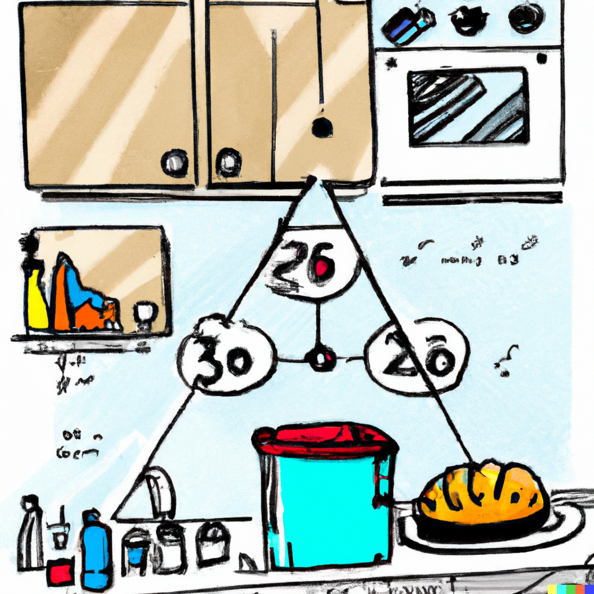

```{r gset, echo = FALSE, include = FALSE}
library(knitr)
library(ggplot2)
library(grDevices)
library(flextable)

knitr::opts_chunk$set(dev = "ragg_png")

knitr::opts_chunk$set(tidy.opts = list(width.cutoff = 80),tidy = TRUE, cache = FALSE, warning = FALSE, message = FALSE, fig.align = 'center', fig.topcaption = TRUE, options(scipen = 999, OutDec = "."), comment = NA)

#windowsFonts(times = windowsFont("Times New Roman"))

knitr::knit_hooks$set(inline = function(x)
  {if (!is.numeric(x)) {x}else{prettyNum(round(x, 2), big.mark = ".", decimal.mark = ",")}
  })


set_flextable_defaults(
  digits = 2, decimal.mark = ",", big.mark = ".", font.size = 9)

# automatically create a bib database for R packages
knitr::write_bib(c(
  .packages(), 'bookdown', 'knitr', 'rmarkdown', 'eph', 'occupar'
), 'bib/packages.bib')


```


# Prefacio {.unnumbered}

La literatura sobre las clases sociales en Argentina posee ya una larga tradición y una amplia gama de abordajes. La relevancia de este tema reside en las transformaciones recientes de la estructura social, pero también, en los desafíos, tanto teóricos como metodológicos, que el tema posee. Estudiantes, investigadores y profesionales, en fin, aquellos interesados en su estudio, se encuentran de forma frecuente con la paralizante tarea de afrontar la infinita literatura y discusión teórica sobre la cuestión, la construcción de información, o bien con el oscuro privilegio de acceso a ciertas bases de datos, en el caso de los estudios con datos cuantitativos secundarios; en definitiva, en la posibilidad de caer en las trampas de la ciencia cerrada o no-reproducible, todavía bastante frecuente.

A modo de aporte para cubrir parte de estos problemas, este manual, abierto a la comunidad para su consulta, ofrece a través de "recetas" prácticas situar a los lectores en la "cocina" de la investigación para el estudio de las clases sociales, en particular, en el abordaje de la problemática de la construcción y análisis estadístico de datos para su estudio en la Argentina contemporánea, con un enfoque global y de largo plazo, en base a datos cuantitativos secundarios.

Compartiendo información compilada y herramientas usualmente dispersas tanto en la literatura, como en bibliotecas o bases de datos de acceso exclusivo, este libro condensa algunas lecciones aprendidas y experiencias de investigación, apoyados en el lenguaje de programación **`R`** y con la interfaz **`RStudio`**. Siguiendo el criterio general de ciencia abierta y reproducible, **`R`** permite ejemplificar el procedimiento de gestión de bases de datos y de procesamientos estadísticos, ya que se trata de una poderosa herramienta para la estadística, presentación gráfica, y programación, utilizada por miles de usuarios. Pero a la vez, el uso de **`R`** puede ser desalentador. Por ello, en este libro ofrecemos soluciones de programación para problemas específicos.

Esta iniciativa se orientó, en ese sentido, al desarrollo de un conjunto básico de contenidos e instrumentos actualizados para la gestión de datos y análisis de las clases sociales. Este manual incluye su socialización en un formato también plano, y la presentación de herramientas computacionales que permiten apoyar la aplicación de los métodos presentados.

A partir del relevamiento, evaluación, ajuste y procesamiento, los lectores serán expuestos a los desafíos empíricos y metodológicos de encarar la construcción de datos en un campo de estudio donde no predomina información para largos períodos históricos que involucran a la población de hecho en Argentina. Utilizando principalmente como fuentes de datos a los censos de población modernos (1970-2010) pero, sobre todo, a la Encuesta Permanente de Hogares (1974-2020) del Instituto Nacional de Estadística y Censos (INDEC), en los capítulos que siguen se retoman algunos debates actuales sobre la estratificación social y la literatura sobre el tema, y sus vertientes en América Latina y Argentina, pero el manual enfatiza en el trabajo empírico con datos secundarios, la construcción de información, su análisis estadístico y sus posibilidades explicativas para interpretar cambios sociales recientes en Argentina, tanto desde un punto de vista global y regional, como también local.

El [Capítulo 1](#analisis1) retoma algunos de los debates y conceptos en torno al estudio de la desigualdad y de la estructura social. Ya que una gran cantidad de publicaciones se dedican a este tema, se decidió dejarlo como introducción general conceptual, para pasar a los capítulos enfocados en los datos. El [Capítulo 2](#fuentes) presenta las características generales de la Encuesta Permanente de Hogares (EPH), en tanto herramienta central para el estudio de la estructura de clases en Argentina, mientras que el [Capítulo 3](#fuentes2) ofrece algo similar pero con los censos de población. El [Capítulo 4](#ocupacion) se focaliza en "las variables económicas" de las fuentes descritas en los capítulos previos, y en el [Capítulo 5](#clases5) se presentan los diversos abordajes teórico-empíricos más utilizados para el estudio de la estratificación social, a nivel internacional y nacional, desde un abordaje operacional. El [Capítulo 6](#independiente) presenta a las clases sociales como uno de los factores estructuradores de la desigualdad social. El [Capítulo 7](#dependiente), en cambio, retoma una de las posibles aproximaciones al estudio de la estructura de clases en tanto variable dependiente. Dentro de este tipo de abordajes se interroga acerca de aquellos factores que explican, condicionan o intervienen en el proceso de formación y acción de las clases sociales. Finalmente, en el [Capítulo 8](#tiempo) se explora la dimensión temporal y la dimensión espacial, en tanto procesos sociales más importantes para evaluar los cambios que se producen en la estructura de clases y en la desigualdad. En el [Anexo](#anexo), se incluye una breve introducción a **`R`** y su interfaz **`RStudio`**, centrada en las funciones puntuales que permiten realizar los ejercicios de los capítulos. 

Al socializar este trabajo, el anhelo es construir una comunidad de usuarios y que la información derivada del material presentado pueda llegar a contribuir al desarrollo de futuras investigaciones en profundidad por parte de los interesados. Aprovechando las ventajas de la publicación en línea, este escrito mantiene un formato "vivo", que se irá modificando con el tiempo y, si se da la posibilidad de la interacción con sus lectores, sus aportes serán felizmente bienvenidos. Porque pretender un manual omnicomprensivo y acabado de la estructura social argentina es un objetivo bastante utópico dada la enormidad de la literatura sobre el tema.

Esperamos que les sea de utilidad.

Nicolás, José y Sofía  


>**¿Cómo citar este libro?**  
Sacco, Nicolás; José Rodríguez de la Fuente y Sofía Jaime (2022). *Libro de Cocina para el Análisis de las Clases Sociales en Argentina*. https://nsacco.github.io/clases-arg/  

<hr>

## Contacto con los autores {.unnumbered}

Nicolás Sacco -  <nsacco@psu.edu>

José Rodríguez de la Fuente <josedelafuente_86@hotmail.com>

Sofia Jaime – <sofiajaimemoschin@gmail.com>

<hr>

<a rel="license" href="http://creativecommons.org/licenses/by-nc-sa/4.0/"></a><br />Este obra está bajo una <a rel="license" href="http://creativecommons.org/licenses/by-nc-sa/4.0/">licencia de Creative Commons Reconocimiento-NoComercial-CompartirIgual 4.0 Internacional</a>.

# Agradecimientos {.unnumbered}

La idea de este manual fue tomando forma durante la pandemia de COVID-19 a mediados del año 2020, a partir de una invitación por parte de la [Universidad Nacional de Tres de Febrero (UNTreF)](https://untref.edu.ar) para elaborar un curso de posgrado, en particular, de Jorge Fernández Bussy, Director de la Maestría en Generación y Análisis de Información Estadística, en el marco del Ciclo de Seminarios y Cursos extracurriculares en Estadística y el Programa de Actualización Permanente de las Orientaciones de Estadísticas Económicas, Estadísticas Sociodemográficas y Estadísticas de Opinión y Mercado, en coordinación con la Secretaría de Extensión Universitaria y la Dirección de Posgrado. El curso "Taller de Análisis de la Estructura Social en la Argentina Contemporánea" fue ofrecido por les autores de este libro de formato a distancia híbrdo (a-sincrónico y sincrónico) durante el segundo semestre del 2020 y luego durante el primer semestre de 2021, en convenio con la Universidad Nacional de Formosa. Queremos por ello agradecer a Jorge y al personal de la UNTreF por todo su apoyo, quienes permitieron llevar a cabo con éxito esta experiencia. También de forma especial a les estudiantes que participaron durante esos tiempos tan difíciles, que con su trabajo y aportes fueron nuestra primera audiencia. Muchas gracias también a Gabriela Benza, Ezequiel Adamovsky y Eduardo Chávez Molina, quienes participaron como entrevistados especialistas del tema en un módulo del curso.
